---
## Author
author:
  name: Тойчубекова Асель Нурлановна
  degrees: DSc
  orcid: 0000-0002-0877-7063
  email: kulyabov-ds@rudn.ru
  affiliation:
    - name: Российский университет дружбы народов
      country: Российская Федерация
      postal-code: 117198
      city: Москва
      address: ул. Миклухо-Маклая, д. 6
## Title
title: Сетевые технологии
subtitle: Лабораторная работа №4
license: CC BY
date: today
date-format: "YYYY-MM-DD" # Example: 2025-09-06
---

# Информация

## Докладчик

:::::::::::::: {.columns align=center}
::: {.column width="70%"}

  * Тойчубекова Асель Нурлановна
  * Студент 3 курса
  * Факультет физико-математических и естественных наук
  * Российский университет дружбы народов им. П. Лумумбы
  * [1032235033@rudn.ru](1032235033@rudn.ru)

:::
::: {.column width="30%"}

:::
::::::::::::::

# Цель работы

## Цель работы

Целью данной лабораторной работы является установка и настройка GNS3 и сопутствующего программного обеспечения.

# Задание

## Задание

1. Установить GNS3-all-in-one, GNS3 VM, проверить корректность запуска.
2. Импортировать в GNS3 образ маршрутизатора FRR.
3. Импортировать в GNS3 образ маршрутизатора VyOS.

# Теоретическое введение

## Теоретическое введение

GNS3 (Graphical Network Simulator-3) — это программное обеспечение с открытым исходным кодом, предназначенное для эмуляции и моделирования компьютерных сетей. Оно широко используется для создания, настройки, тестирования и отладки как виртуальных, так и реальных сетевых топологий. С помощью GNS3 можно разрабатывать и проверять конфигурации без необходимости использовать физическое оборудование, что делает его удобным инструментом для обучения, подготовки к сертификациям и лабораторных исследований.

## Теоретическое введение

GNS3 поддерживает широкий спектр устройств — от маршрутизаторов и коммутаторов Cisco до виртуальных машин Linux, Docker-контейнеров и сетевых решений от различных производителей (например, HPE, Brocade, Cumulus Linux и др.). Список поддерживаемых устройств доступен в официальном каталоге GNS3 Marketplace.

## Теоретическое введение

В GNS3 реализованы два подхода к работе с сетевыми устройствами: эмуляция и моделирование.

При эмуляции запускается реальный образ операционной системы устройства (например, Cisco IOS), что позволяет полностью воспроизводить поведение физического оборудования.

При моделировании используется имитация функциональности устройства, разработанная внутри GNS3, например встроенные программные коммутаторы уровня 2, которые повторяют работу реальных устройств без необходимости загрузки их операционных систем.

## Теоретическое введение

Архитектура GNS3 состоит из двух основных компонентов:

- GNS3 All-in-One (GUI) — графический интерфейс пользователя, обеспечивающий создание и управление сетевыми топологиями.

- GNS3 Virtual Machine (VM) — серверная часть, выполняющая запуск и обработку сетевых устройств.

Работа GNS3 основана на взаимодействии этих двух компонентов. Серверная часть может располагаться как на локальной машине пользователя, так и на удалённой виртуальной среде. Наиболее удобным и производительным решением является использование локально установленной виртуальной машины GNS3, развёрнутой с помощью программ для виртуализации — VMware Workstation, VirtualBox или Hyper-V.

# Выполнение лабораторной работы

## Установка GNS3-all-in-one

Необходимо установить GNS3. Для этого перехожу в гитхаб https://github.com/GNS3/gns3-gui/releases и скачиваю установочный файл GNS3-2.2.33.1-all-in-one.exe.

## Установка GNS3-all-in-one

{width=50%} 

## Установка GNS3-all-in-one

Запустим установочный файл, запускается графическое окно по установке. Будем следовать указаниям,нажимая Next , принимая соглашение по лицензии, выбирая отображение названия каталога в стартовом меню.

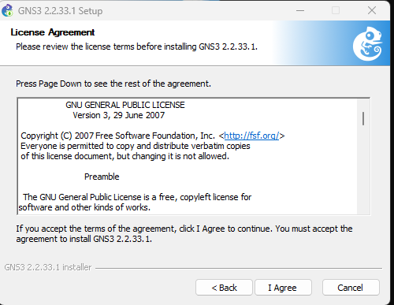{width=50%} 

## Установка GNS3-all-in-one

В процессе установки при выборе комплектации отметим MSVC Runtime (отмечено по умолчанию), GNS3-Desktop, GNS3-VM, Tools. Затем укажем расположение устанавливаемого пакета (можно оставить
выдаваемое по умолчанию). 

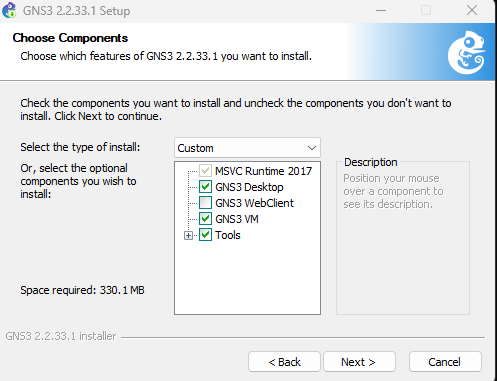{width=50%} 

## Установка GNS3-all-in-one

В следующем окне отмечаем тот тип виртуальной машины, VirtualBox. Затем нажимаем Inslall. 

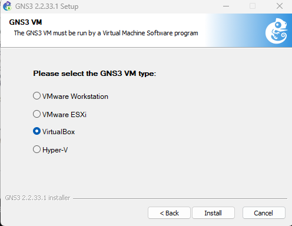{width=50%} 

## Установка GNS3-all-in-one

Начался процесс установки GNS3 и дополнительных пакетов. В конце процесса установки появится
окно с предложением запуска GNS3 после установки, следует снять галочку, нажать Finish.

## Установка GNS3 VM для VirtualBox

С гитхаба скачиваю архив GNS3 VM для VirtualBox той же версии что и  GNS3-all-in-one. 

{width=50%} 

## Установка GNS3 VM для VirtualBox

Перейдем в каталог, в который скачан архив с образом виртуальной машины GNS3.VM.VirtualBox.номер-версии.zip. Распакуем архив с образом.

{width=50%} 

## Установка GNS3 VM для VirtualBox

Запустим VirtualBox. Выберем меню Файл -> Импорт конфигураций... . Укажем месторасположение распакованного образа GNS3 VM.ova.

{width=50%} 

## Установка GNS3 VM для VirtualBox

В следующем окне в параметрах импорта выберете в политике MAC-адреса «Сгенерировать
новые MAC-адреса всех сетевых адаптеров». Далее нажимаем "Готово". 

{width=50%} 

## Установка GNS3 VM для VirtualBox

Уточним параметры настройки виртуальной машины GNS3 VM в VirtualBox. Для этого перейдем в настройки машины, если есть сообщения об обнаружении неправильных настроек, внесем исправления. Устанавливаем основную память как 2048МБ, а число процессоров 4ЦП. 

## Установка GNS3 VM для VirtualBox

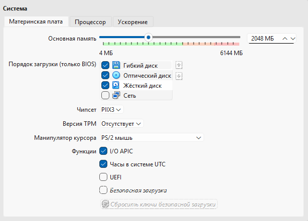{width=50%} 

## Установка GNS3 VM для VirtualBox

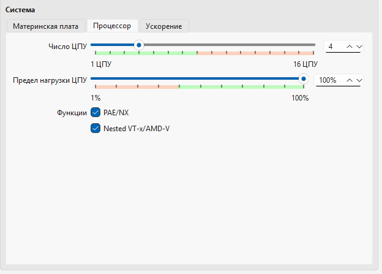{width=50%} 

## Установка GNS3 VM для VirtualBox

Также во вкладке Система настроим вложенную виртуализацию.Для этого нужно включить Nested VT-x/AMD-V.во вкладке процессора. Для включения вложенной виртуализации (изначально у нас нет возможности в графическом интерфейсе включить его) воспользуйтесь командной строкой терминала и введите команду: vboxmanage modifyvm "GNS3 VM" --nested-hw-virt on. 

## Установка GNS3 VM для VirtualBox

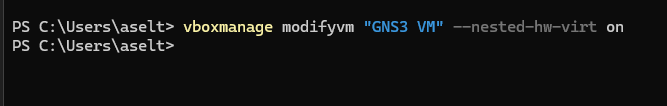{width=50%}  

## Установка GNS3 VM для VirtualBox

Настроем сетевой адаптер. Для этого в VirtualBox откроем настройки машины . Перейдем
к опции «Сеть» и во вкладке «Адаптер 1» тип подключения установим как «Виртуальный адаптер». В качестве имени мы выбираем VirtualBox Host-Only Ethernet Adapter. 

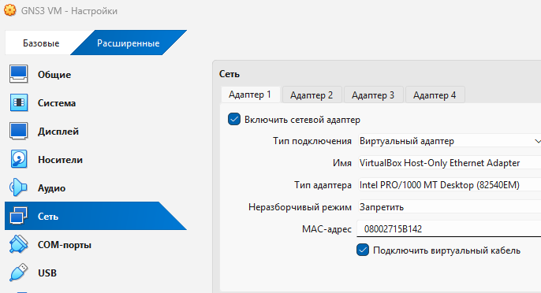{width=50%} 

## Установка GNS3 VM для VirtualBox

Перейдем в менеджер сетей в VirtualBox, чтобы удостоверится в корректности настройки сети и адаптера. Мы видим, что все корректно, чтобы создавалась подсеть и назначалась IP-адреса сетевым картам гостевых операционных систем.

{width=50%} 

## Установка GNS3 VM для VirtualBox

{width=50%} 

## Запуск экземпляра GNS3 в VirtualBox

Запустим GNS3 VM в VirtualBox.

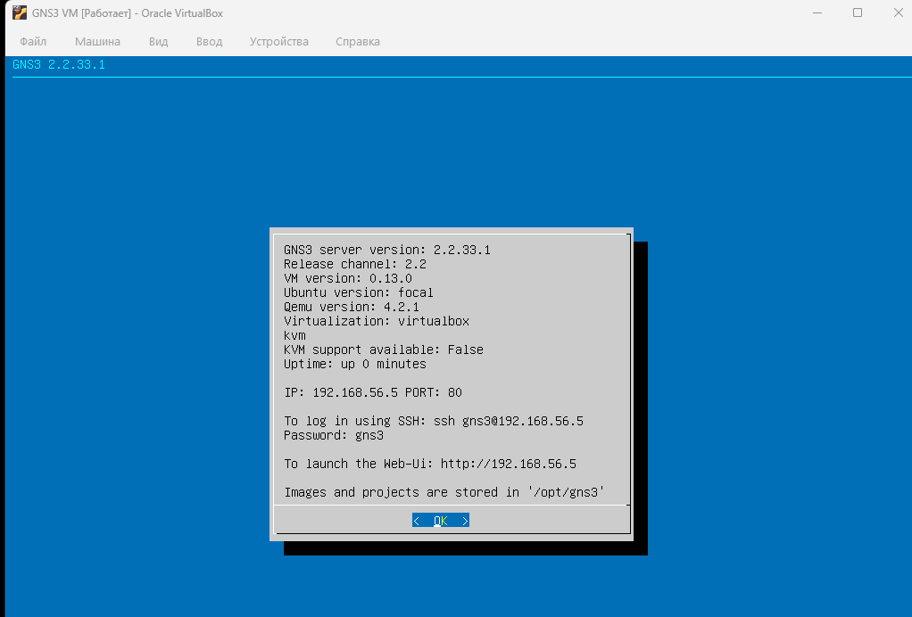{width=50%} 

## Запуск экземпляра GNS3 в VirtualBox

Затем в нашей основной операционной системе запустим приложение gns3. При первом запуске приложения gns3 запускается мастер настройки, в котором выбраем первый способ работы с gns3 — «Run appliance in a virtual machine» и нажимаем Next.

## Запуск экземпляра GNS3 в VirtualBox

{width=50%}  

## Запуск экземпляра GNS3 в VirtualBox

В следующем окне указываются настройки локального сервера. Путь к серверу и порт оставим без изменений. Выберем IP-адрес привязки хоста, находящегося в подсети VirtualBox, затем нажмем Next. 

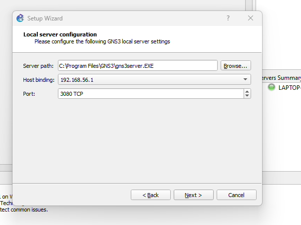{width=50%} 

## Запуск экземпляра GNS3 в VirtualBox

После успешного подсоединения появилось окно с итоговыми настройками, на котором нажмем Finish. 

{width=50%}  

## Запуск экземпляра GNS3 в VirtualBox

В дальнейшем можно настроить GNS3 по своему усмотрению, воспользовавшись меню Edit Preferences. В частности, можно выбрать светлую тему интерфейса (во вкладе General в разделе Interface style выбрать Legacy), а также изменить терминал с установленного по умолчанию xterm на KDE Konsole
(вкладка Console applications).

## Запуск экземпляра GNS3 в VirtualBox

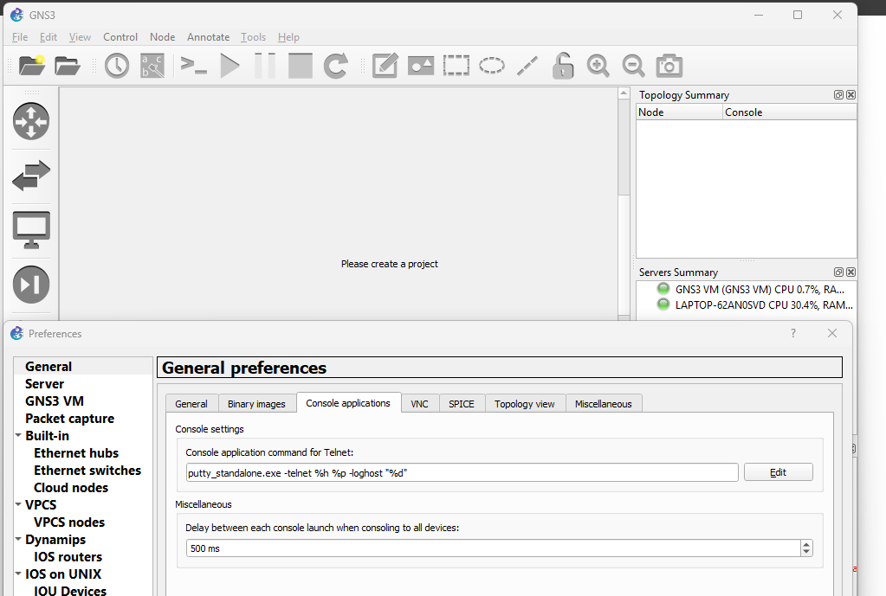{width=50%}  

## Выключение GNS3

Выключаем GNS3 через меню File Quit . При этом виртуальная машина GNS VM должна выключилась сама.

## Подключение образа оборудования в GNS3

Запустим VirtualBox, запустим GNS VM, затем запустим из основной ОС приложение gns3.

## Добавление образа маршрутизатора FRR

Добавим образ маршрутизатора (FRRouting). В рабочем пространстве GNS3 на левой боковой панели выберем просмотр маршрутизаторов (Browse Routers), затем нажмем на + New template. 

{width=50%}  

## Добавление образа маршрутизатора FRR

В открывшемся окне укажес рекомендуемое верхнее значение, а именно, устанавливать образ с GNS3-сервера, нажмем Next. 

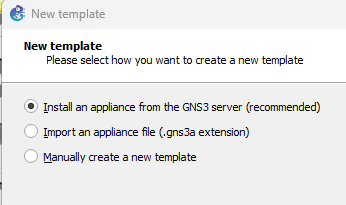{width=50%} 

## Добавление образа маршрутизатора FRR

В следующем окне выберем Routers и образ FRR (FRRouting), нажмием Install. 

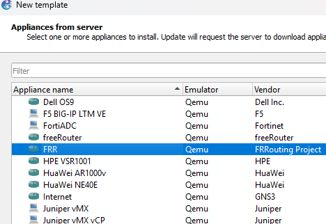{width=50%} 

## Добавление образа маршрутизатора FRR

В следующем окне укажем, что устанавливать образ следует на виртуальную машину GNS3 VM, нажмем Next.

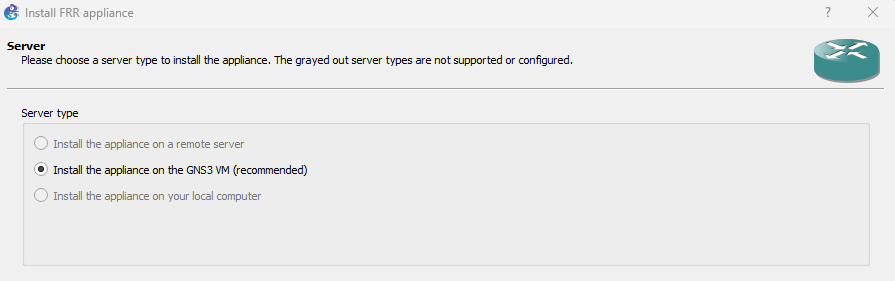{width=50%} 

## Добавление образа маршрутизатора FRR

Далее предлагается выбор эмулятора, оставим предложенное, нажмем Next.

{width=50%} 

## Добавление образа маршрутизатора FRR

В следующем окне предлагается перечень файлов для скачивания и последующей установки. Выберем наиболее актуальную версию и нажмите Download. После окончания скачивания импортиртируем образ, затем нажмем Next. 

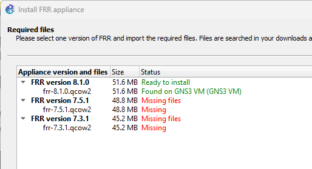{width=50%} 

## Добавление образа маршрутизатора FRR

На заключительном окне указывается краткая информация об устройстве, просмотрим её и нажмем Finish. 

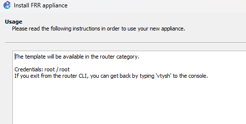{width=50%} 

## Добавление образа маршрутизатора FRR

В рабочем пространстве на левой панели в списке маршрутизаторов появился образ устройства FRR. Далее необходимо настроить образ маршрутизатора. Правой кнопкой мыши щёлкнем на образе устройства, в меню выберем Configure templat. В открывшемся окне во вкладке «General settings» в поле «On close» выбрем Send the shutdown signal (ACPI). 

## Добавление образа маршрутизатора FRR

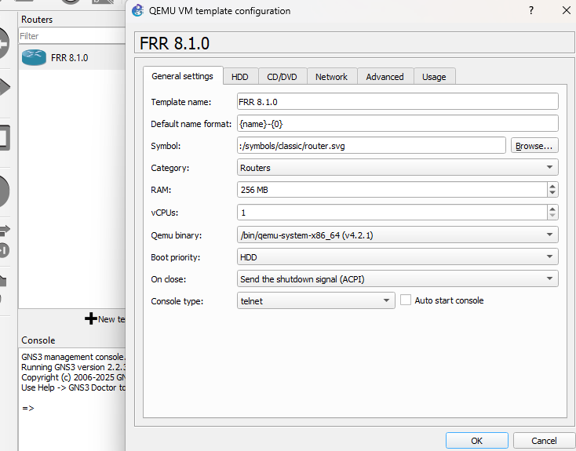{width=50%} 

## Добавление образа маршрутизатора FRR

Во вкладке «HDD» поставим галочку «Automatically create a config disk on HDD».

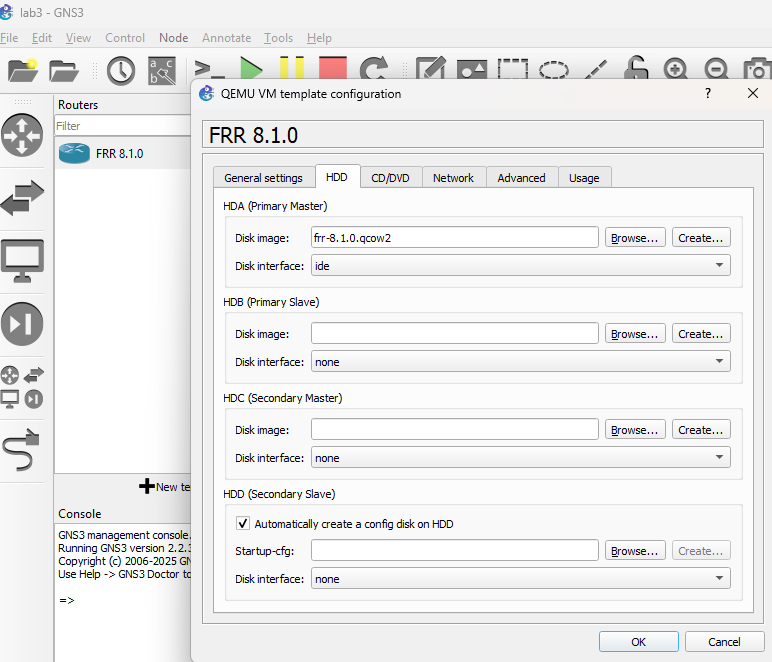{width=50%} 

## Добавление образа маршрутизатора VyOS

Как и в случае с добавлением образа FRR в рабочем пространстве GNS3 на левой боковой панели выберем просмотр маршрутизаторов (Browse Routers), затем нажмем на + New template.

В открывшемся окне укажем, что образ следует устанавливать с GNS3-сервера. 

{width=50%} 

## Добавление образа маршрутизатора VyOS

В следующем окне выберем Routers и образ VyOS, нажмем Install. 

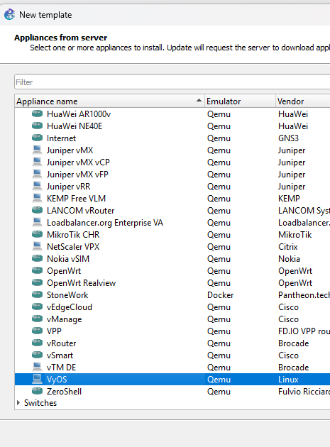{width=50%} 

## Добавление образа маршрутизатора VyOS

Далее укажем, что устанавливать образ следует на виртуальную машину GNS3 VM. 

{width=50%} 

## Добавление образа маршрутизатора VyOS

Далее предлагается выбор эмулятора, оставляем предложенное, нажимаем Next. 

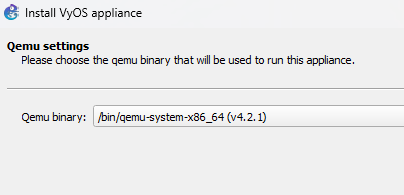{width=50%}  

## Добавление образа маршрутизатора VyOS

Далее идет в гитхаб и скачиваем оттуда образ и файл с расширением qcow2.

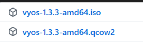{width=50%} 

## Добавление образа маршрутизатора VyOS

Далее нажимаю на кнопку create new version и вписываю туда новую версию образа VyOS. Далее туда же импортирую скаченные с гитхаба файлы.

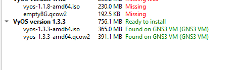{width=50%} 

## Добавление образа маршрутизатора VyOS

На заключительном окне указывается краткая информация об устройстве, просмотрим и нажмем Finish.

{width=50%} 

## Добавление образа маршрутизатора VyOS

Далее необходимо настроить образ маршрутизатора. Правой кнопкой мыши щёлкните на образе устройства, в меню выберем Configure template . В открывшемся окне во вкладке «General settings» в поле «On close» выбрем Send the shutdown signal (ACPI) .

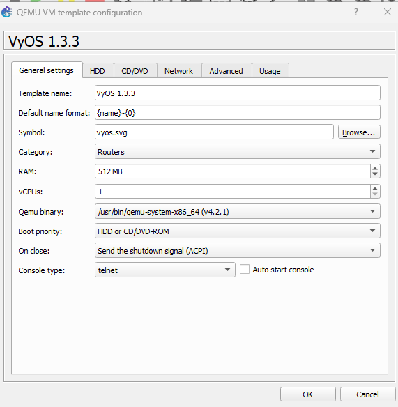{width=50%} 

## Добавление образа маршрутизатора VyOS

Во вкладке «HDD» поставим галочку «Automatically create a config disk on HDD». 

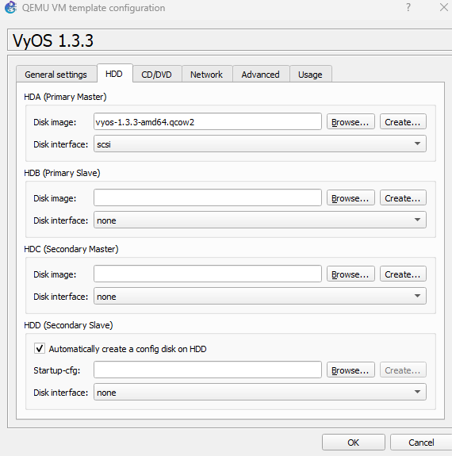{width=50%} 

## Добавление образа маршрутизатора VyOS

Также можно изменить отображаемый в GNS3 символ этого устройства: вкладка «General settings», поле «Symbol» и кнопка Browse... , в открывшемся окне выбрем Classic и иконку Router.

{width=50%} 

## Добавление образа маршрутизатора VyOS

И вот что у нас получается.

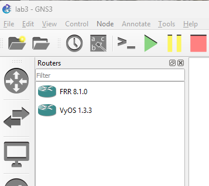{width=50%} 

# Выводы

## Выводы

В ходе выполнения лабораторной работы №4 я установила и настроила GNS3 и сопутствующее программного обеспечения.

