---
## Author
author:
  name: Тойчубекова Асель Нурлановна
  degrees: DSc
  orcid: 0000-0002-0877-7063
  email: kulyabov-ds@rudn.ru
  affiliation:
    - name: Российский университет дружбы народов
      country: Российская Федерация
      postal-code: 117198
      city: Москва
      address: ул. Миклухо-Маклая, д. 6

## Title
title: "Сетевые технологии"
subtitle: "Лабораторная работа №4"
license: "CC BY"
---

# Цель работы

Целью данной лабораторной работы является установка и настройка GNS3 и сопутствующего программного обеспечения.

# Задание

1. Установить GNS3-all-in-one, GNS3 VM, проверить корректность запуска.
2. Импортировать в GNS3 образ маршрутизатора FRR.
3. Импортировать в GNS3 образ маршрутизатора VyOS.

# Теоретическое введение

GNS3 (Graphical Network Simulator-3) — это программное обеспечение с открытым исходным кодом, предназначенное для эмуляции и моделирования компьютерных сетей. Оно широко используется для создания, настройки, тестирования и отладки как виртуальных, так и реальных сетевых топологий. С помощью GNS3 можно разрабатывать и проверять конфигурации без необходимости использовать физическое оборудование, что делает его удобным инструментом для обучения, подготовки к сертификациям и лабораторных исследований.

GNS3 поддерживает широкий спектр устройств — от маршрутизаторов и коммутаторов Cisco до виртуальных машин Linux, Docker-контейнеров и сетевых решений от различных производителей (например, HPE, Brocade, Cumulus Linux и др.). Список поддерживаемых устройств доступен в официальном каталоге GNS3 Marketplace.

В GNS3 реализованы два подхода к работе с сетевыми устройствами: эмуляция и моделирование.

При эмуляции запускается реальный образ операционной системы устройства (например, Cisco IOS), что позволяет полностью воспроизводить поведение физического оборудования.

При моделировании используется имитация функциональности устройства, разработанная внутри GNS3, например встроенные программные коммутаторы уровня 2, которые повторяют работу реальных устройств без необходимости загрузки их операционных систем.

Архитектура GNS3 состоит из двух основных компонентов:

- GNS3 All-in-One (GUI) — графический интерфейс пользователя, обеспечивающий создание и управление сетевыми топологиями.

- GNS3 Virtual Machine (VM) — серверная часть, выполняющая запуск и обработку сетевых устройств.

Работа GNS3 основана на взаимодействии этих двух компонентов. Серверная часть может располагаться как на локальной машине пользователя, так и на удалённой виртуальной среде. Наиболее удобным и производительным решением является использование локально установленной виртуальной машины GNS3, развёрнутой с помощью программ для виртуализации — VMware Workstation, VirtualBox или Hyper-V.

# Выполнение лабораторной работы

## Установка GNS3-all-in-one

Необходимо установить GNS3. Для этого перехожу в гитхаб https://github.com/GNS3/gns3-gui/releases и скачиваю установочный файл GNS3-2.2.33.1-all-in-one.exe ([рис. @fig-001]).

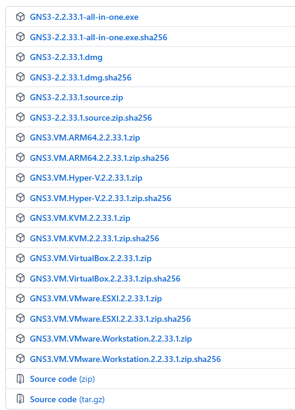{#fig-001 width=70%}

Запустим установочный файл, запускается графическое окно по установке. Будем следовать указаниям,нажимая Next , принимая соглашение по лицензии, выбирая отображение названия каталога в стартовом меню.([рис. @fig-002]).

{#fig-002 width=70%}

В процессе установки при выборе комплектации отметим MSVC Runtime (отмечено по умолчанию), GNS3-Desktop, GNS3-VM, Tools. Затем укажем расположение устанавливаемого пакета (можно оставить
выдаваемое по умолчанию). ([рис. @fig-003]).

{#fig-003 width=70%}

В следующем окне отмечаем тот тип виртуальной машины, VirtualBox. Затем нажимаем Inslall. ([рис. @fig-004]).

{#fig-004 width=70%}

Начался процесс установки GNS3 и дополнительных пакетов. В конце процесса установки появится
окно с предложением запуска GNS3 после установки, следует снять галочку, нажать Finish.

## Установка GNS3 VM для VirtualBox

С гитхаба скачиваю архив GNS3 VM для VirtualBox той же версии что и  GNS3-all-in-one. ([рис. @fig-005]).

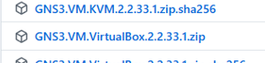{#fig-005 width=70%}

Перейдем в каталог, в который скачан архив с образом виртуальной машины GNS3.VM.VirtualBox.номер-версии.zip. Распакуем архив с образом. ([рис. @fig-006]).

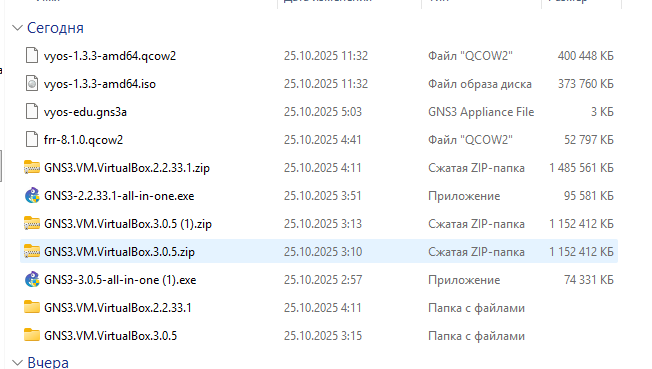{#fig-006 width=70%}

Запустим VirtualBox. Выберем меню Файл -> Импорт конфигураций... . Укажем месторасположение распакованного образа GNS3 VM.ova. ([рис. @fig-007]).

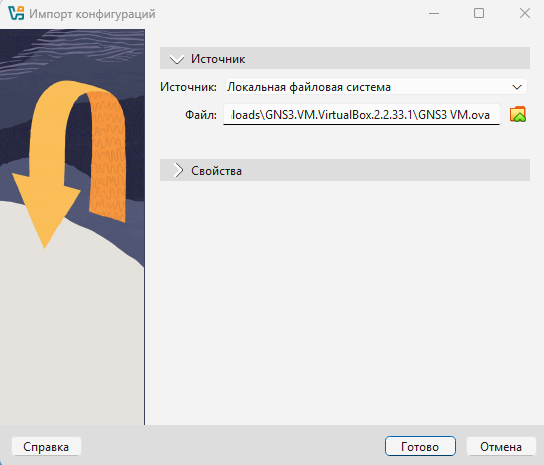{#fig-007 width=70%}

В следующем окне в параметрах импорта выберете в политике MAC-адреса «Сгенерировать
новые MAC-адреса всех сетевых адаптеров». Далее нажимаем "Готово". ([рис. @fig-008]).

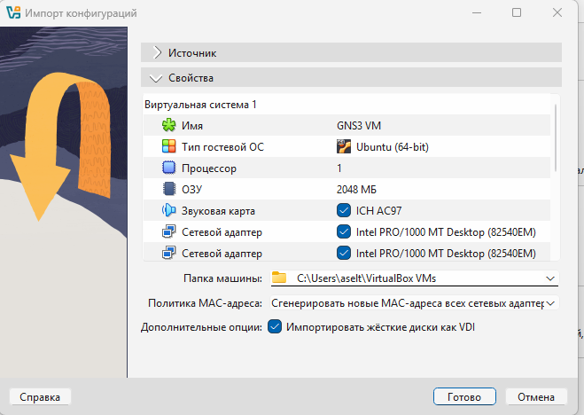{#fig-008 width=70%}

Уточним параметры настройки виртуальной машины GNS3 VM в VirtualBox. Для этого перейдем в настройки машины, если есть сообщения об обнаружении неправильных настроек, внесем исправления. Устанавливаем основную память как 2048МБ, а число процессоров 4ЦП. ([рис. @fig-009] и [рис. @fig-010]).

{#fig-009 width=70%}

{#fig-010 width=70%}

Также во вкладке Система настроим вложенную виртуализацию.Для этого нужно включить Nested VT-x/AMD-V. ([рис. @fig-010]). Для включения вложенной виртуализации (изначально у нас нет возможности в графическом интерфейсе включить его) воспользуйтесь командной строкой терминала и введите команду: vboxmanage modifyvm "GNS3 VM" --nested-hw-virt on. ([рис. @fig-011]).

{#fig-011 width=70%} 

Настроем сетевой адаптер. Для этого в VirtualBox откроем настройки машины . Перейдем
к опции «Сеть» и во вкладке «Адаптер 1» тип подключения установим как «Виртуальный адаптер». В качестве имени мы выбираем VirtualBox Host-Only Ethernet Adapter.  ([рис. @fig-012]).

{#fig-012 width=70%} 

Перейдем в менеджер сетей в VirtualBox, чтобы удостоверится в корректности настройки сети и адаптера. Мы видим, что все корректно, чтобы создавалась подсеть и назначалась IP-адреса сетевым картам гостевых операционных систем. ([рис. @fig-013] и [рис. @fig-014] ).

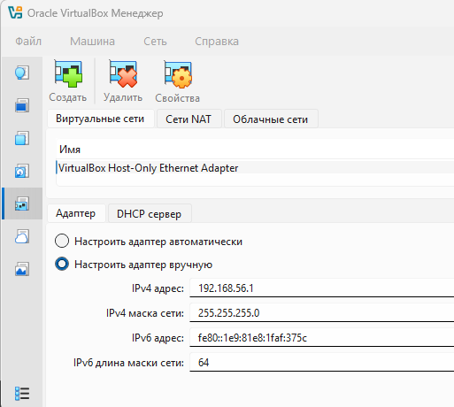{#fig-013 width=70%} 

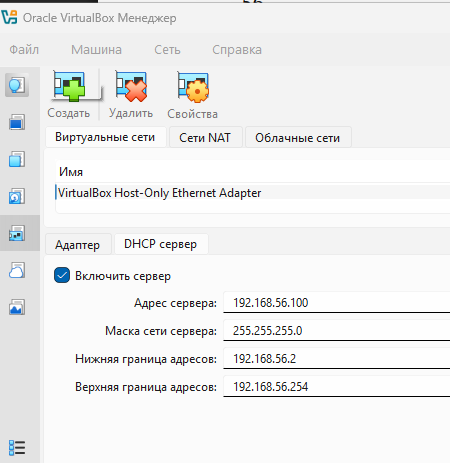{#fig-014 width=70%} 

## Запуск экземпляра GNS3 в VirtualBox

Запустим GNS3 VM в VirtualBox. ([рис. @fig-015]).

{#fig-015 width=70%} 

Затем в нашей основной операционной системе запустим приложение gns3. При первом запуске приложения gns3 запускается мастер настройки, в котором выбраем первый способ работы с gns3 — «Run appliance in a virtual machine» и нажимаем Next.([рис. @fig-016]).

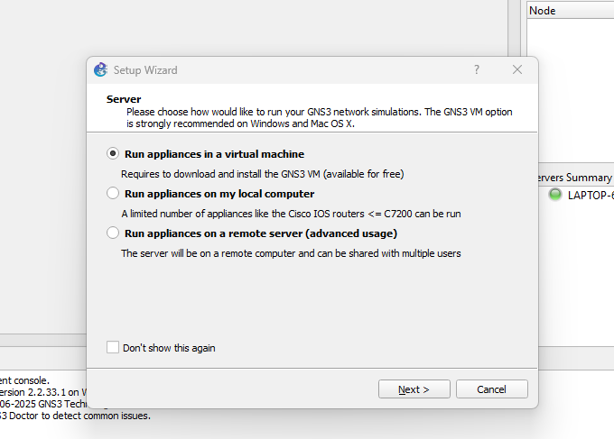{#fig-016 width=70%} 

В следующем окне указываются настройки локального сервера. Путь к серверу и порт оставим без изменений. Выберем IP-адрес привязки хоста, находящегося в подсети VirtualBox, затем нажмем Next. ([рис. @fig-017]).

{#fig-017 width=70%}  

После успешного подсоединения появилось окно с итоговыми настройками, на котором нажмем Finish. ([рис. @fig-018]).

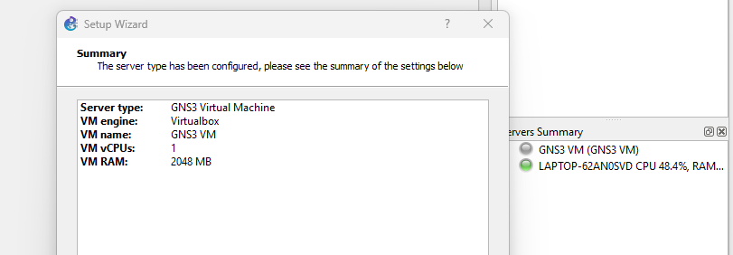{#fig-018 width=70%}  

В дальнейшем можно настроить GNS3 по своему усмотрению, воспользовавшись меню Edit Preferences. В частности, можно выбрать светлую тему интерфейса (во вкладе General в разделе Interface style выбрать Legacy), а также изменить терминал с установленного по умолчанию xterm на KDE Konsole
(вкладка Console applications). ([рис. @fig-019]).

{#fig-019 width=70%}  

## Выключение GNS3

Выключаем GNS3 через меню File Quit . При этом виртуальная машина GNS VM должна выключилась сама.

## Подключение образа оборудования в GNS3

Запустим VirtualBox, запустим GNS VM, затем запустим из основной ОС приложение gns3.

## Добавление образа маршрутизатора FRR

Добавим образ маршрутизатора (FRRouting). В рабочем пространстве GNS3 на левой боковой панели выберем просмотр маршрутизаторов (Browse Routers), затем нажмем на + New template. ([рис. @fig-020]).

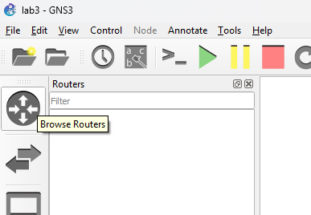{#fig-020 width=70%}  

В открывшемся окне укажес рекомендуемое верхнее значение, а именно, устанавливать образ с GNS3-сервера, нажмем Next. ([рис. @fig-021]).

{#fig-021 width=70%}  

В следующем окне выберем Routers и образ FRR (FRRouting), нажмием Install. ([рис. @fig-022]).

{#fig-022 width=70%} 

В следующем окне укажем, что устанавливать образ следует на виртуальную машину GNS3 VM, нажмем Next. ([рис. @fig-023]).

{#fig-023 width=70%}

Далее предлагается выбор эмулятора, оставим предложенное, нажмем Next. ([рис. @fig-024]).

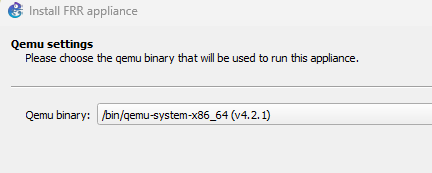{#fig-024 width=70%}

В следующем окне предлагается перечень файлов для скачивания и последующей установки. Выберем наиболее актуальную версию и нажмите Download. После окончания скачивания импортиртируем образ, затем нажмем Next. ([рис. @fig-025]).

{#fig-025 width=70%}

На заключительном окне указывается краткая информация об устройстве, просмотрим её и нажмем Finish. ([рис. @fig-026]).

{#fig-026 width=70%}

В рабочем пространстве на левой панели в списке маршрутизаторов появился образ устройства FRR. Далее необходимо настроить образ маршрутизатора. Правой кнопкой мыши щёлкнем на образе устройства, в меню выберем Configure templat. В открывшемся окне во вкладке «General settings» в поле «On close» выбрем Send the shutdown signal (ACPI). ([рис. @fig-027]).

{#fig-027 width=70%}

Во вкладке «HDD» поставим галочку «Automatically create a config disk on HDD».([рис. @fig-028]).

{#fig-028 width=70%}

## Добавление образа маршрутизатора VyOS

Как и в случае с добавлением образа FRR в рабочем пространстве GNS3 на левой боковой панели выберем просмотр маршрутизаторов (Browse Routers), затем нажмем на + New template.

В открывшемся окне укажем, что образ следует устанавливать с GNS3-сервера.  ([рис. @fig-029]).

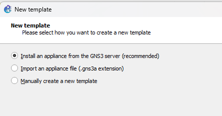{#fig-029 width=70%}  

В следующем окне выберем Routers и образ VyOS, нажмем Install. ([рис. @fig-030]).

{#fig-030 width=70%} 

Далее укажем, что устанавливать образ следует на виртуальную машину GNS3 VM. ([рис. @fig-031]).

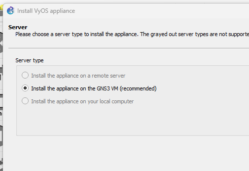{#fig-031 width=70%}

Далее предлагается выбор эмулятора, оставляем предложенное, нажимаем Next. ([рис. @fig-032]).

{#fig-032 width=70%} 

Далее идет в гитхаб и скачиваем оттуда образ и файл с расширением qcow2. ([рис. @fig-033]).

{#fig-033 width=70%} 

Далее нажимаю на кнопку create new version и вписываю туда новую версию образа VyOS. Далее туда же импортирую скаченные с гитхаба файлы.  ([рис. @fig-034]).

{#fig-034 width=70%} 

На заключительном окне указывается краткая информация об устройстве, просмотрим и нажмем Finish.([рис. @fig-035]).

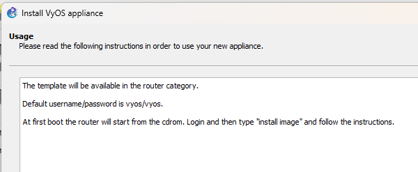{#fig-035 width=70%} 

Далее необходимо настроить образ маршрутизатора. Правой кнопкой мыши щёлкните на образе устройства, в меню выберем Configure template . В открывшемся окне во вкладке «General settings» в поле «On close» выбрем Send the shutdown signal (ACPI) . ([рис. @fig-036]).

{#fig-036 width=70%} 

Во вкладке «HDD» поставим галочку «Automatically create a config disk on HDD».  ([рис. @fig-037]).

{#fig-037 width=70%} 

Также можно изменить отображаемый в GNS3 символ этого устройства: вкладка «General settings», поле «Symbol» и кнопка Browse... , в открывшемся окне выбрем Classic и иконку Router.([рис. @fig-038]).

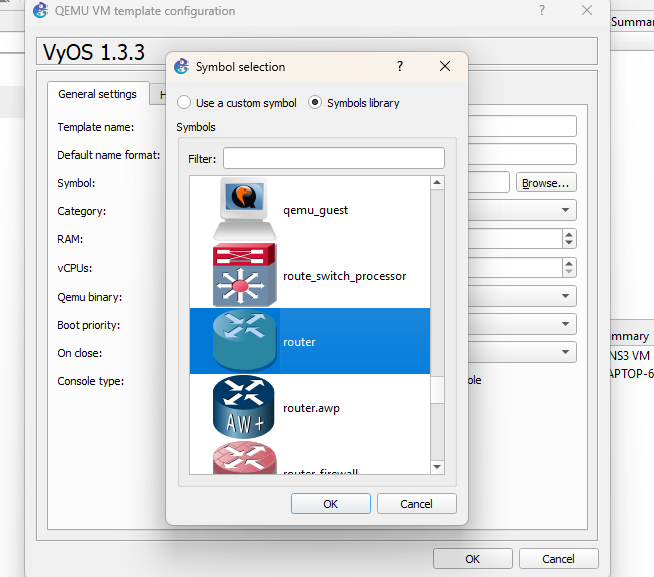{#fig-038 width=70%} 

И вот что у нас получается. ([рис. @fig-039]).

{#fig-039 width=70%} 

# Выводы

В ходе выполнения лабораторной работы №4 я установила и настроила GNS3 и сопутствующее программного обеспечения.

