---
## Author
author:
  name: Тойчубекова Асель Нурлановна
  degrees: DSc
  orcid: 0000-0002-0877-7063
  email: kulyabov-ds@rudn.ru
  affiliation:
    - name: Российский университет дружбы народов
      country: Российская Федерация
      postal-code: 117198
      city: Москва
      address: ул. Миклухо-Маклая, д. 6
## Title
title: Сетевые технологии
subtitle: Лабораторная работа №6
license: CC BY
date: today
date-format: "YYYY-MM-DD" # Example: 2025-09-06
---

# Информация

## Докладчик

:::::::::::::: {.columns align=center}
::: {.column width="70%"}

  * Тойчубекова Асель Нурлановна
  * Студент 3 курса
  * факультет физико-математических и естественных наук
  * Российский университет дружбы народов им. П. Лумумбы
  * [1032235033@rudn.ru](1032235033@rudn.ru)

:::
::: {.column width="30%"}

:::
::::::::::::::

# Цель работы

## Цель работы

Целью данной лабораторной работы является изучение принципов распределения и настройки адресного пространства на устройствах сети

# Задание

## Задание

1. Выполнить задание  на разбиение IPv4-сети на подсети
2. Выполнить задание  на разбиение IPv6-сети на подсети
3. Выполнить задание на настройку двойного стека адресации IPv4 и IPv6 в локальной сети
4. Выполнить задание для самостоятельного выполнения

# Теоретическое введение

## Теоретическое введение

Адресация в IP-сетях обеспечивает однозначную идентификацию сетевых интерфейсов и позволяет организовывать маршрутизацию данных. Каждое сетевое устройство может иметь один или несколько интерфейсов, и каждому из них назначаются IP-адреса. В современных сетях применяются два протокола — IPv4 и IPv6, отличающиеся длиной адреса и принципами структурирования адресного пространства.

## Теоретическое введение

IPv4-адреса имеют длину 32 бита и записываются в десятично-точечной нотации. Структурно адрес состоит из идентификатора сети, подсети и узла. Для выделения подсетей используется маска подсети и CIDR-нотация (адрес/префикс). Благодаря технологии VLSM сеть можно рекурсивно разбивать на подсети разного размера. Некоторые IPv4-адреса зарезервированы для специальных целей (broadcast, loopback, служебные сети).

## Теоретическое введение

IPv6-адреса имеют длину 128 бит и записываются в шестнадцатеричной форме. Для их сокращения допускается опускание ведущих нулей и единожды — длинной последовательности нулевых блоков. Адрес IPv6 идентифицирует интерфейс и может относиться к одному из типов: unicast, anycast или multicast. Существуют специальные префиксы для локальных адресов, адресов локальной связи, глобальной маршрутизации и адресов, совместимых с IPv4.

## Теоретическое введение

Разбиение IPv6-сетей на подсети применяется для логической иерархии сети, а не для экономии адресов. Подсети могут выделяться как на основе идентификатора подсети, так и за счет уменьшения области идентификатора интерфейса.

# Выполнение лабораторной работы

## Разбиение IPv4-сети на подсети

1. Задана IPv4-сеть 172.16.20.0/24. Для заданной сети определяю префикс, маску, broadcast-адрес, число возможных подсетей, диапазон адресов узлов. Далее разбиваю сеть на 3 подсети с максимально возможным числом адресов узлов 126, 62, 62 соответственно.

## Разбиение IPv4-сети на подсети

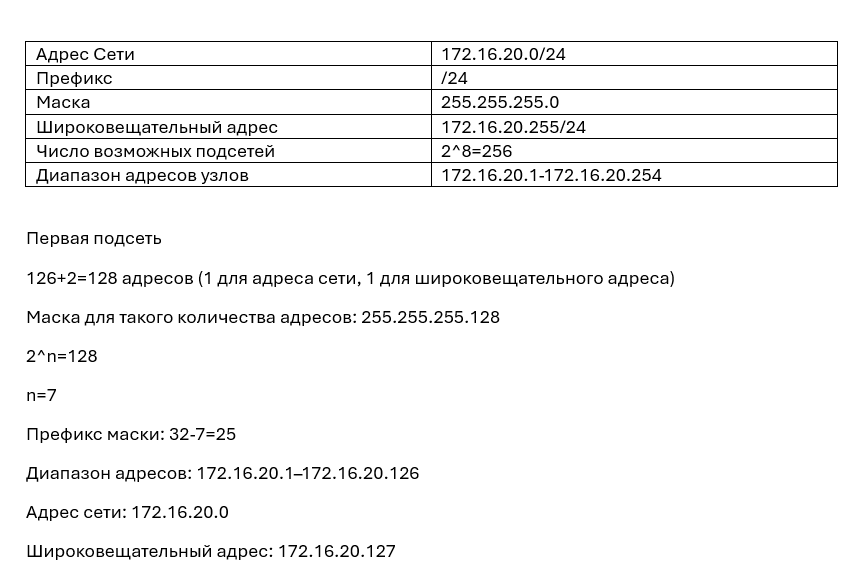{width=60%}

## Разбиение IPv4-сети на подсети

{width=50%}

## Разбиение IPv4-сети на подсети

2. Задана сеть 10.10.1.64/26. Для заданной сети определяю префикс, маску, broadcast-адрес, число возможных подсетей, диапазон адресов узлов. Выделяю в этой сети подсеть на 30 узлов.

## Разбиение IPv4-сети на подсети

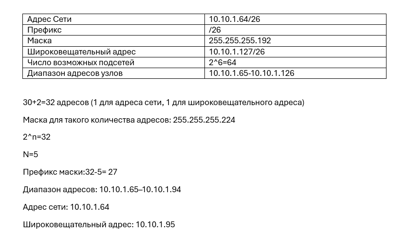{width=60%}

## Разбиение IPv4-сети на подсети

3. Задана сеть 10.10.1.0/26. Для этой сети определяю префикс, маску, broadcast-адрес, число возможных подсетей, диапазон адресов узлов. Выделяю в этой сети подсеть на 14 узлов.

## Разбиение IPv4-сети на подсети

{width=60%}

## Разбиение IPv6-сети на подсети

1. Задана сеть 2001:db8:c0de::/48. Описываю адрес, определите маску, префикс, диапазон адресов для узлов сети (краевые значения). Разбиваю сеть на 2 подсети двумя способами — с использованием идентификатора подсети и с использованием идентификатора интерфейса. 

## Разбиение IPv6-сети на подсети

{width=60%}

## Разбиение IPv6-сети на подсети

2. Задана сеть 2a02:6b8::/64. Описываю адрес, определите маску, префикс, диапазон адресов для узлов сети (краевые значения). Разбиваю сеть на 2 подсети двумя способами — с использованием идентификатора подсети и с использованием идентификатора интерфейса.

## Разбиение IPv6-сети на подсети

{width=60%}

## Настройка двойного стека адресации IPv4 и IPv6 в локальной сети

Запускаю GNS3 VM и GNS3. Создаю новый проект. 

В рабочем пространстве размещаю и соединяю устройства в соответствии с топологией в лабораторной работе. Для подсети IPv4 использую маршрутизатор FRR, а для подсети с IPv6 — маршрутизатор VyOS.

Изменяю отображаемые названия устройств. Коммутаторам присваиваю названия msk-antoychubekova-sw-0x, маршрутизаторам — msk-antoychubekova-gw-0x, VPCS — PCx-antoychubekova. 

## Настройка двойного стека адресации IPv4 и IPv6 в локальной сети

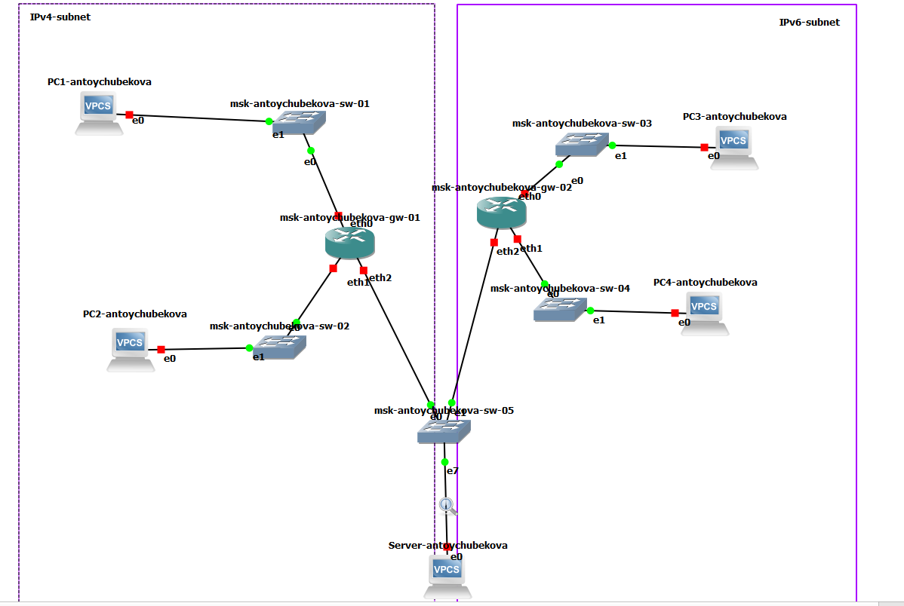{width=60%}

## Настройка двойного стека адресации IPv4 и IPv6 в локальной сети

Включаю захват трафика на соединении между сервером двойного стека адресации и ближайшим к нему коммутатором. 

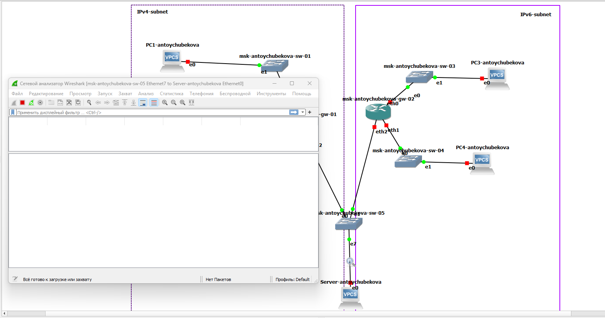{width=60%}

## Настройка двойного стека адресации IPv4 и IPv6 в локальной сети

Настроим IPv4-адресацию для интерфейсов узлов, присвоив каждой соответствующий ip и шлюз.  

{width=60%}

## Настройка двойного стека адресации IPv4 и IPv6 в локальной сети

Посмотрим на PC1 и PC2 конфигурацию IPv4 и IPv6. Мы видим, что все корректно обновилось. 

## Настройка двойного стека адресации IPv4 и IPv6 в локальной сети

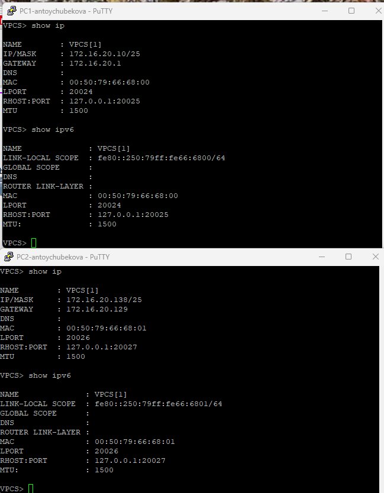{width=45%}

## Настройка двойного стека адресации IPv4 и IPv6 в локальной сети

Настроем IPv4-адресацию для интерфейсов локальной сети маршрутизатора FRR msk-antoychubrkova-gw-01. Укажем соответствующие адреса для интерфейсов eth0 eth1 eth2. 

## Настройка двойного стека адресации IPv4 и IPv6 в локальной сети

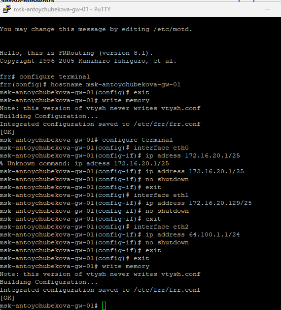{width=60%}

## Настройка двойного стека адресации IPv4 и IPv6 в локальной сети

Проверим конфигурацию маршрутизатора и настройки IPv4-адресации. Мы видим, что все корректно сохранилось.

## Настройка двойного стека адресации IPv4 и IPv6 в локальной сети

{width=60%}

## Настройка двойного стека адресации IPv4 и IPv6 в локальной сети

Проверим подключение с помощью команд ping и trace. Мы видим, что узлы PC1 и PC2 успешно отправляют эхо-запросы друг другу и на сервер с двойным стеком. 

{width=60%}

## Настройка двойного стека адресации IPv4 и IPv6 в локальной сети

Настроем IPv6-адресацию для интерфейсов узлов PC3, PC4, Serve, присвоив каждой соответствующий ipv6.

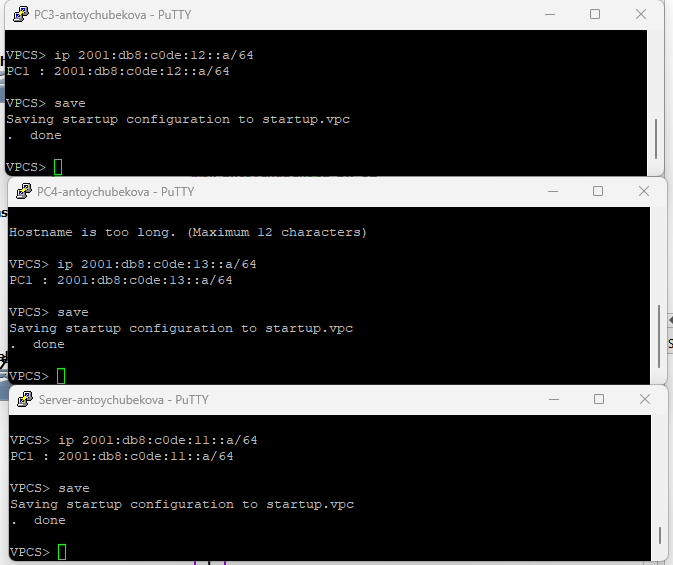{width=50%}

## Настройка двойного стека адресации IPv4 и IPv6 в локальной сети

Посмотрим на PC3 и PC4 конфигурацию IPv4 и IPv6. Мы видим, что все корректно сохранилось. 

## Настройка двойного стека адресации IPv4 и IPv6 в локальной сети

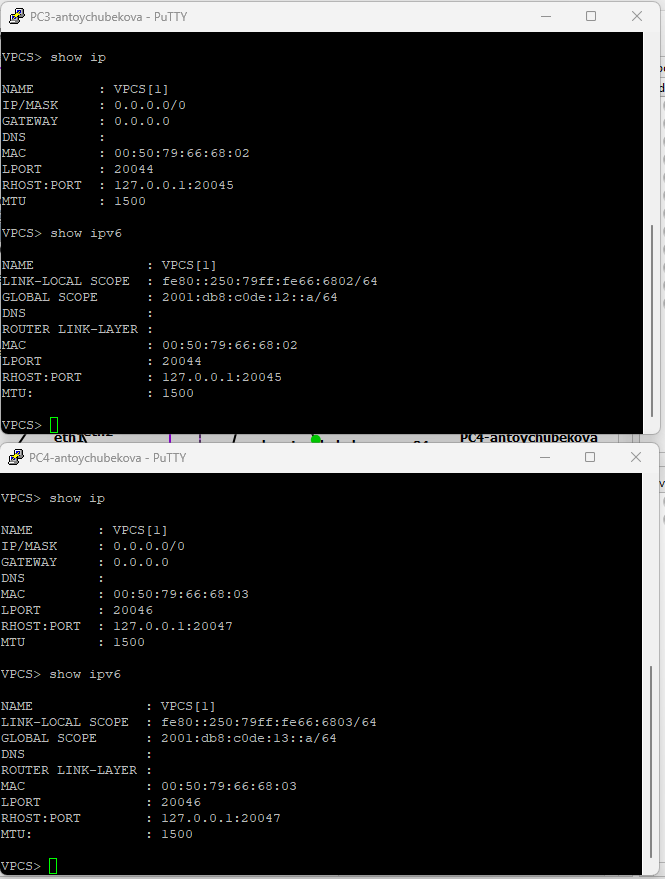{width=50%}

## Настройка двойного стека адресации IPv4 и IPv6 в локальной сети

Настроем IPv6-адресацию для интерфейсов локальной сети маршрутизатора VyOS msk-antoychubekova-gw-02. Установим систему на маршрутизатор VyOS. Перейдем в режим конфигурирования, изменим имя устройства. 

## Настройка двойного стека адресации IPv4 и IPv6 в локальной сети

{width=60%}

## Настройка двойного стека адресации IPv4 и IPv6 в локальной сети

Назначим IPv6-адреса маршрутизатору msk-antoychubekova-gw-02. 

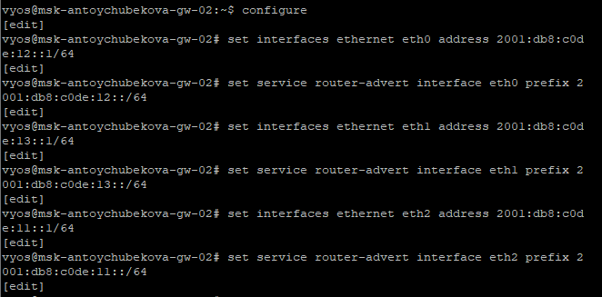{width=60%}

## Настройка двойного стека адресации IPv4 и IPv6 в локальной сети

{width=60%}

## Настройка двойного стека адресации IPv4 и IPv6 в локальной сети

{width=60%}

## Настройка двойного стека адресации IPv4 и IPv6 в локальной сети

Проверим подключение с помощью команд ping и trace. Мы видим, что узлы PC3 и PC4 успешно отправляют эхо-запросы друг другу и на сервер с двойным стеком. 

{width=60%}

## Настройка двойного стека адресации IPv4 и IPv6 в локальной сети

Убедимся, что устройства из подсети IPv4 не доступны для устройств из подсети IPv6 и наоборот. Только сервер двойного стека может обращаться к устройствам обеих подсетей. Мы видим, что все корректно обрабатывается и подсети IPv4 не доступны для устройств из подсети IPv6 и наоборот. 

## Настройка двойного стека адресации IPv4 и IPv6 в локальной сети

{width=60%}

## Настройка двойного стека адресации IPv4 и IPv6 в локальной сети

Посмотрим захваченный на соединении сервера двойного стека адресации с коммутатором трафик ARP, ICMP, ICMPv6. 

## Настройка двойного стека адресации IPv4 и IPv6 в локальной сети

Мы видим, что был перехвачен ARP-пакет типа Gratuitous ARP. 

{width=60%}

## Настройка двойного стека адресации IPv4 и IPv6 в локальной сети

Далее мы видим, что был перехвачен ICMP Echo Request (ping-запрос). 

{width=60%}

## Настройка двойного стека адресации IPv4 и IPv6 в локальной сети

Затем был перехвачен ICMP Echo Reply — ответ на ранее отправленный ping-запрос. 

{width=60%}

## Настройка двойного стека адресации IPv4 и IPv6 в локальной сети

Далее был перехвачен ICMPv6 Echo Reply — ответ на ping-запрос в сети IPv6. 

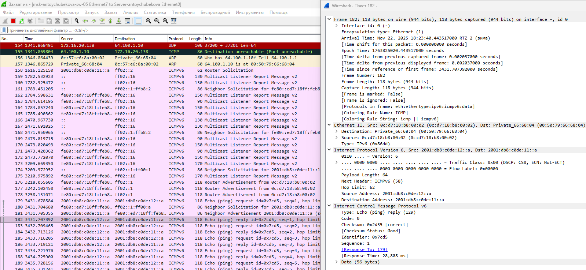{width=60%}

## Настройка двойного стека адресации IPv4 и IPv6 в локальной сети

Далее был перехвачен ICMPv6 Echo Request — запрос, отправленный узлом для проверки доступности другого IPv6-адреса. 

{width=60%}

## Задание для самостоятельного выполнения

У нас есть 2 подсети ipv4.

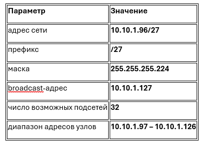{width=60%}

## Задание для самостоятельного выполнения

{width=60%}

## Задание для самостоятельного выполнения

Также у нас есть 2 подсети ipv6.

{width=60%}

## Задание для самостоятельного выполнения

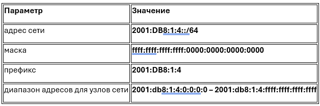{width=60%}

## Задание для самостоятельного выполнения

Ниже представлена таблица адресации для заданной топологии и адресного пространства, причём для интерфейсов маршрутизатора выбрать наименьший адрес в подсети. 

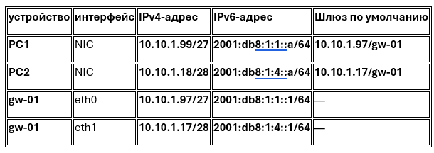{width=60%}

## Задание для самостоятельного выполнения

Построим топологии сети с двумя локальными подсетями, указав соответствующие название устройств. 

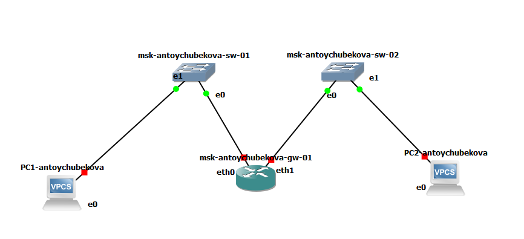{width=60%}

## Задание для самостоятельного выполнения

Настроем ipv4 ipv6 адресацию для pc1-antoychubekova. С помощью команд show ip и show ipv6 мы видим, что изменения были корректно внесены. 

{width=50%}

## Задание для самостоятельного выполнения

Настроем ipv4 ipv6 адресацию для pc2-antoychubekova. С помощью команд show ip и show ipv6 мы видим, что изменения были корректно внесены. 

## Задание для самостоятельного выполнения

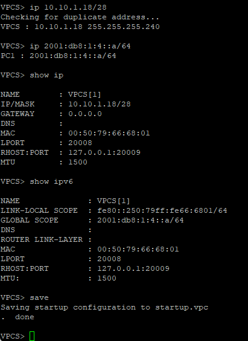{width=60%}

## Задание для самостоятельного выполнения

Настроим IP-адресацию на маршрутизаторе VyOS и оконечных устройствах,причём на интерфейсах маршрутизатора установить наименьший адрес в подсети.

## Задание для самостоятельного выполнения

{width=60%}

## Задание для самостоятельного выполнения

{width=50%}

## Задание для самостоятельного выполнения

Проверим подключение между устройствами подсети с помощью команд ping и trace. Мы видим, что все корректно обрабатывается.

{width=60%}

# Вывод

## Вывод

В ходе выполнения лабораторной №6 я изучила принципы распределения и настройки адресного пространства на устройствах сети. 

