---
## Author
author:
  name: Тойчубекова Асель Нурлановна
  degrees: DSc
  orcid: 0000-0002-0877-7063
  email: kulyabov-ds@rudn.ru
  affiliation:
    - name: Российский университет дружбы народов
      country: Российская Федерация
      postal-code: 117198
      city: Москва
      address: ул. Миклухо-Маклая, д. 6

## Title
title: "Сетевые техноогии"
subtitle: "Лабораторная работа №6"
license: "CC BY"
---

# Цель работы

Целью данной лабораторной работы является изучение принципов распределения и настройки адресного пространства на устройствах сети

# Задание

1. Выполнить задание  на разбиение IPv4-сети на подсети
2. Выполнить задание  на разбиение IPv6-сети на подсети
3. Выполнить задание на настройку двойного стека адресации IPv4 и IPv6 в локальной сети
4. Выполнить задание для самостоятельного выполнения

# Теоретическое введение

Адресация в IP-сетях обеспечивает однозначную идентификацию сетевых интерфейсов и позволяет организовывать маршрутизацию данных. Каждое сетевое устройство может иметь один или несколько интерфейсов, и каждому из них назначаются IP-адреса. В современных сетях применяются два протокола — IPv4 и IPv6, отличающиеся длиной адреса и принципами структурирования адресного пространства.

IPv4-адреса имеют длину 32 бита и записываются в десятично-точечной нотации. Структурно адрес состоит из идентификатора сети, подсети и узла. Для выделения подсетей используется маска подсети и CIDR-нотация (адрес/префикс). Благодаря технологии VLSM сеть можно рекурсивно разбивать на подсети разного размера. Некоторые IPv4-адреса зарезервированы для специальных целей (broadcast, loopback, служебные сети).

IPv6-адреса имеют длину 128 бит и записываются в шестнадцатеричной форме. Для их сокращения допускается опускание ведущих нулей и единожды — длинной последовательности нулевых блоков. Адрес IPv6 идентифицирует интерфейс и может относиться к одному из типов: unicast, anycast или multicast. Существуют специальные префиксы для локальных адресов, адресов локальной связи, глобальной маршрутизации и адресов, совместимых с IPv4.

Разбиение IPv6-сетей на подсети применяется для логической иерархии сети, а не для экономии адресов. Подсети могут выделяться как на основе идентификатора подсети, так и за счет уменьшения области идентификатора интерфейса.

# Выполнение лабораторной работы

## Разбиение IPv4-сети на подсети

1. Задана IPv4-сеть 172.16.20.0/24. Для заданной сети определяю префикс, маску, broadcast-адрес, число возможных подсетей, диапазон адресов узлов. Далее разбиваю сеть на 3 подсети с максимально возможным числом адресов узлов 126, 62, 62 соответственно. ([рис. @fig-001]и [рис. @fig-002] и [рис. @fig-003]).

{#fig-001 width=70%}

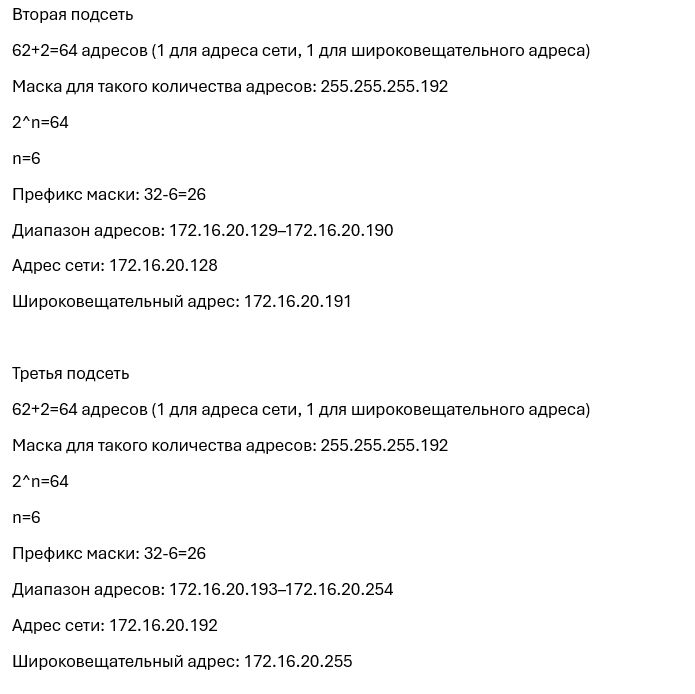{#fig-002 width=70%}

2. Задана сеть 10.10.1.64/26. Для заданной сети определяю префикс, маску, broadcast-адрес, число возможных подсетей, диапазон адресов узлов. Выделяю в этой сети подсеть на 30 узлов.([рис. @fig-003]).

{#fig-003 width=70%}

3. Задана сеть 10.10.1.0/26. Для этой сети определяю префикс, маску, broadcast-адрес, число возможных подсетей, диапазон адресов узлов. Выделяю в этой сети подсеть на 14 узлов. ([рис. @fig-004]).

{#fig-004 width=70%}

## Разбиение IPv6-сети на подсети

1. Задана сеть 2001:db8:c0de::/48. Описываю адрес, определите маску, префикс, диапазон адресов для узлов сети (краевые значения). Разбиваю сеть на 2 подсети двумя способами — с использованием идентификатора подсети и с использованием идентификатора интерфейса. ([рис. @fig-005]).

{#fig-005 width=70%}

В первом случае для определения доступных подсетей достаточно рассчитать шестнадцатеричное число (идентификатор подсети), следующее за префиксом глобальной маршрутизации (48 бит). Последние 64 бита идентифицируют конкретный узел сети.

Во втором случае разбиение адресного пространства на подсети делается за счёт бит идентификатора интерфейса. При этом рекомендуется создавать подсеть на границе полубайта (4 бита или одна шестнадцатеричная цифра).

2. Задана сеть 2a02:6b8::/64. Описываю адрес, определите маску, префикс, диапазон адресов для узлов сети (краевые значения). Разбиваю сеть на 2 подсети двумя способами — с использованием идентификатора подсети и с использованием идентификатора интерфейса. ([рис. @fig-006]).

{#fig-006 width=70%}

## Настройка двойного стека адресации IPv4 и IPv6 в локальной сети

Запускаю GNS3 VM и GNS3. Создаю новый проект. 

В рабочем пространстве размещаю и соединяю устройства в соответствии с топологией в лабораторной работе. Для подсети IPv4 использую маршрутизатор FRR, а для подсети с IPv6 — маршрутизатор VyOS.

Изменяю отображаемые названия устройств. Коммутаторам присваиваю названия msk-antoychubekova-sw-0x, маршрутизаторам — msk-antoychubekova-gw-0x, VPCS — PCx-antoychubekova. ([рис. @fig-007]).

{#fig-007 width=70%}

Включаю захват трафика на соединении между сервером двойного стека адресации и ближайшим к нему коммутатором. ([рис. @fig-008]).

{#fig-008 width=70%}

Настроим IPv4-адресацию для интерфейсов узлов, присвоив каждой соответствующий ip и шлюз.  ([рис. @fig-009]).

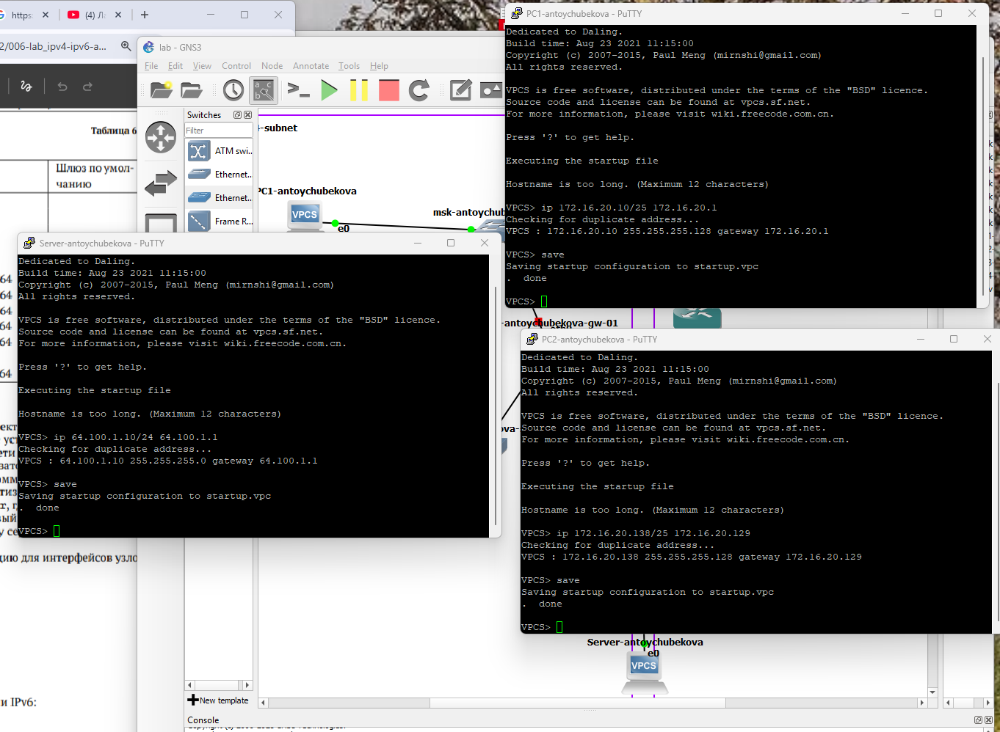{#fig-009 width=70%}

Посмотрим на PC1 и PC2 конфигурацию IPv4 и IPv6. Мы видим, что все корректно обновилось.  ([рис. @fig-010]).

{#fig-010 width=70%}

Настроем IPv4-адресацию для интерфейсов локальной сети маршрутизатора FRR msk-antoychubrkova-gw-01. Укажем соответствующие адреса для интерфейсов eth0 eth1 eth2. ([рис. @fig-011]).

{#fig-011 width=70%}

Проверим конфигурацию маршрутизатора и настройки IPv4-адресации. Мы видим, что все корректно сохранилось. ([рис. @fig-012]).

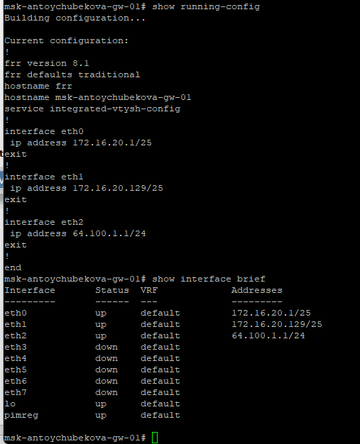{#fig-012 width=70%}

Проверим подключение с помощью команд ping и trace. Мы видим, что узлы PC1 и PC2 успешно отправляют эхо-запросы друг другу и на сервер с двойным стеком. ([рис. @fig-013]).

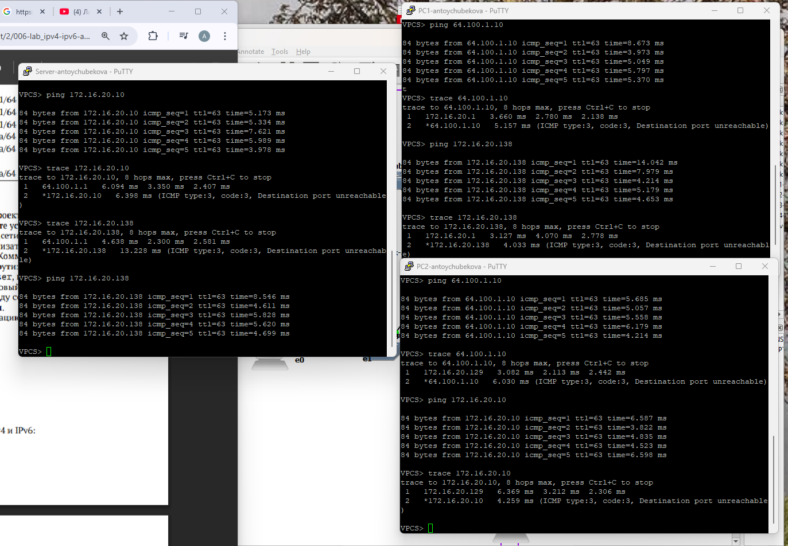{#fig-013 width=70%}

Настроем IPv6-адресацию для интерфейсов узлов PC3, PC4, Serve, присвоив каждой соответствующий ipv6.([рис. @fig-014]).

{#fig-014 width=70%}

Посмотрим на PC3 и PC4 конфигурацию IPv4 и IPv6. Мы видим, что все корректно сохранилось. ([рис. @fig-015]).

{#fig-015 width=70%}

Настроем IPv6-адресацию для интерфейсов локальной сети маршрутизатора VyOS msk-antoychubekova-gw-02. Установим систему на маршрутизатор VyOS. Перейдем в режим конфигурирования, изменим имя устройства. ([рис. @fig-016]).

{#fig-016 width=70%}

Назначим IPv6-адреса маршрутизатору msk-antoychubekova-gw-02. ([рис. @fig-017] [рис. @fig-018] [рис. @fig-019]).

{#fig-017 width=70%}

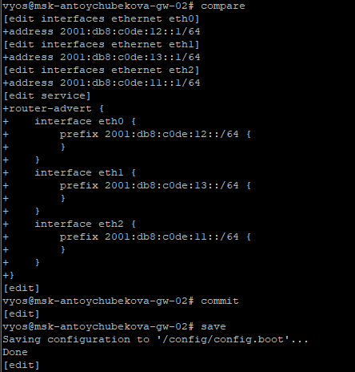{#fig-018 width=70%}

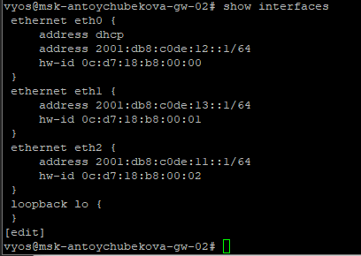{#fig-019 width=70%}

Проверим подключение с помощью команд ping и trace. Мы видим, что узлы PC3 и PC4 успешно отправляют эхо-запросы друг другу и на сервер с двойным стеком. ([рис. @fig-020]).

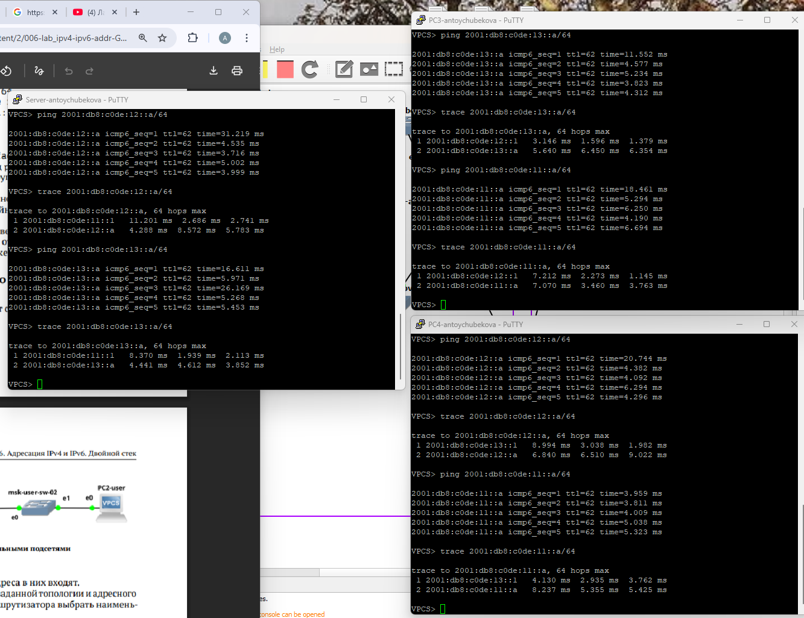{#fig-020 width=70%}

Убедимся, что устройства из подсети IPv4 не доступны для устройств из подсети IPv6 и наоборот. Только сервер двойного стека может обращаться к устройствам обеих подсетей. Мы видим, что все корректно обрабатывается и подсети IPv4 не доступны для устройств из подсети IPv6 и наоборот. ([рис. @fig-021]).

{#fig-021 width=70%}

Посмотрим захваченный на соединении сервера двойного стека адресации с коммутатором трафик ARP, ICMP, ICMPv6. 

Мы видим, что был перехвачен ARP-пакет типа Gratuitous ARP. По его содержимому можно определить следующее:

Тип кадра и протокола

Кадр Ethernet содержит ARP-сообщение (ethertype 0x0806).

Источник и назначение

MAC-адрес источника: 00:50:79:66:68:04

MAC-адрес назначения: ff:ff:ff:ff:ff:ff (широковещательно)

Назначение сообщения

Gratuitous ARP — узел объявляет свой IP-адрес (64.100.1.10), чтобы проверить отсутствие конфликта IP и сообщить о себе другим устройствам в сети.

Параметры ARP

Hardware type: Ethernet

Protocol type: IPv4

Opcode: request

Sender IP: 64.100.1.10

Target IP: 64.100.1.10

Пакет показывает, какой хост активен в сети, какой MAC привязан к IP-адресу, а также подтверждает, что в данный момент выполняется проверка/объявление адреса. ([рис. @fig-022]).

{#fig-022 width=70%}

Далее мы видим, что был перехвачен ICMP Echo Request (ping-запрос). По его структуре можно определить:

Информация уровня Ethernet

MAC источника: 00:50:79:66:68:04

MAC назначения: 0c:57:e6:8a:00:02

Кадр направлен конкретному узлу, а не в широковещание.

Параметры IPv4

IP-адрес источника: 64.100.1.10

IP-адрес назначения: 172.16.20.10

Протокол: ICMP

TTL: 64

Общая длина пакета: 84 байта

Это говорит о том, что узел 64.100.1.10 выполняет проверку доступности узла 172.16.20.10.

Параметры ICMP

Тип: 8 (Echo Request)

Код: 0

Идентификатор и номер последовательности используются для сопоставления ответа и запроса.

Отметка “Response frame: 15” указывает, что в кадре №15 находится соответствующий Echo Reply.

Полезная нагрузка

56 байт данных — стандартный размер для ping.  ([рис. @fig-023]).

{#fig-023 width=70%}

Затем был перехвачен ICMP Echo Reply — ответ на ранее отправленный ping-запрос. По его структуре можно определить:

Информация уровня Ethernet

MAC источника: 0c:57:e6:8a:00:02

MAC назначения: 00:50:79:66:68:04

Кадр направлен обратно инициатору ping-запроса.

Параметры IPv4

IP-адрес источника: 172.16.20.10

IP-адрес назначения: 64.100.1.10

Протокол: ICMP

TTL: 63

Общая длина пакета: 84 байта

Это говорит о том, что узел 172.16.20.10 успешно отвечает на запрос узла 64.100.1.10, подтверждая доступность.

Параметры ICMP

Тип: 0 (Echo Reply)

Код: 0

Идентификатор и номер последовательности совпадают с исходным запросом, что позволяет привязать ответ к конкретному ping.

Отметка “Response frame: 14” показывает, что предыдущий кадр №14 — это соответствующий Echo Request.

Полезная нагрузка

56 байт данных — стандартная нагрузка ICMP. ([рис. @fig-024]).

{#fig-024 width=70%}

Далее был перехвачен ICMPv6 Echo Reply — ответ на ping-запрос в сети IPv6. По его структуре можно определить:

Информация уровня Ethernet

MAC источника: 0c:d7:18:b8:00:02

MAC назначения: 00:50:79:66:68:04

Кадр направляется узлу, который ранее отправил ICMPv6 запрос.

Параметры IPv6

IPv6-адрес источника: 2001:db8:c0de:12::a

IPv6-адрес назначения: 2001:db8:c0de:111::a

Next Header: ICMPv6 (58)

Hop Limit: 64

Payload Length: 64 байта

Это означает, что узел 2001:db8:c0de:12::a отвечает на ICMPv6 Echo Request, отправленный узлом 2001:db8:c0de:111::a.

Параметры ICMPv6

Тип: 129 (Echo Reply)

Код: 0

Идентификатор: 0x7cd5

Sequence Number: 1

Метка “Response To: 179” указывает, что пакет является ответом на кадр №179 (Echo Request).

Response Time: ~28,8 ms — время между запросом и ответом.

Полезная нагрузка

56 байт данных, что соответствует стандартному наполнению ICMPv6 ping. ([рис. @fig-025]).

{#fig-025 width=70%}

Далее был перехвачен ICMPv6 Echo Request — запрос, отправленный узлом для проверки доступности другого IPv6-адреса. По структуре кадра можно определить:

Информация уровня Ethernet

MAC источника: 00:50:79:66:68:04

MAC назначения: 0c:d7:18:b8:00:02

Кадр направлен конкретному соседнему узлу на канальном уровне.

Параметры IPv6

IPv6-адрес источника: 2001:db8:c0de:111::a

IPv6-адрес назначения: 2001:db8:c0de:12::a

Next Header: ICMPv6 (58)

Hop Limit: 64

Payload Length: 64

Это указывает, что хост 2001:db8:c0de:111::a инициирует проверку связи с узлом 2001:db8:c0de:12::a.

Параметры ICMPv6

Тип: 128 (Echo Request — ping-запрос)

Код: 0

Идентификатор: 0x7cd5

Sequence Number: 2

Поле “Response In: 184” показывает, что ответ на этот пакет находится в кадре №184.

Полезная нагрузка

56 байт данных, что является стандартным размером ICMPv6-ping. ([рис. @fig-026]).

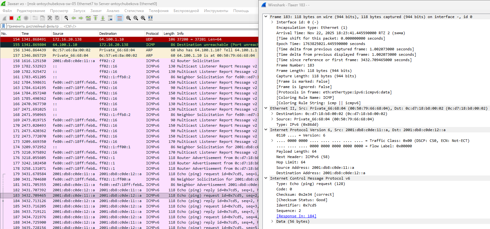{#fig-026 width=70%}

## Задание для самостоятельного выполнения

У нас есть 2 подсети ipv4. ([рис. @fig-027] и [рис. @fig-028]).

{#fig-027 width=70%}

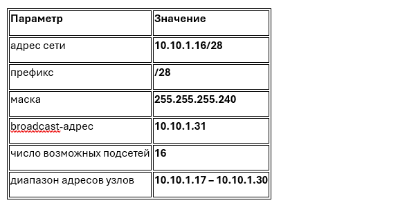{#fig-028 width=70%}

Также у нас есть 2 подсети ipv6. ([рис. @fig-029] и [рис. @fig-030]).

{#fig-029 width=70%}

{#fig-030 width=70%}

Ниже представлена таблица адресации для заданной топологии и адресного пространства, причём для интерфейсов маршрутизатора выбрать наименьший адрес в подсети. ([рис. @fig-031]).

{#fig-031 width=70%}

Построим топологии сети с двумя локальными подсетями, указав соответствующие название устройств. ([рис. @fig-032]).

{#fig-032 width=70%}

Настроем ipv4 ipv6 адресацию для pc1-antoychubekova. С помощью команд show ip и show ipv6 мы видим, что изменения были корректно внесены. ([рис. @fig-033]).

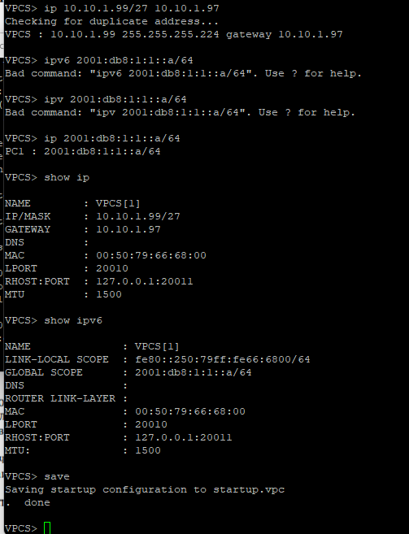{#fig-033 width=70%}

Настроем ipv4 ipv6 адресацию для pc2-antoychubekova. С помощью команд show ip и show ipv6 мы видим, что изменения были корректно внесены. ([рис. @fig-034]).

{#fig-034 width=70%}

Настроим IP-адресацию на маршрутизаторе VyOS и оконечных устройствах,причём на интерфейсах маршрутизатора установить наименьший адрес в подсети. ([рис. @fig-035] и [рис. @fig-036]).

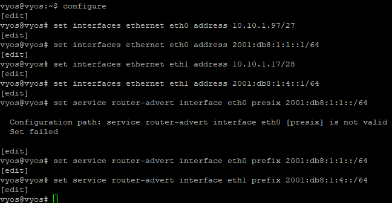{#fig-035 width=70%}

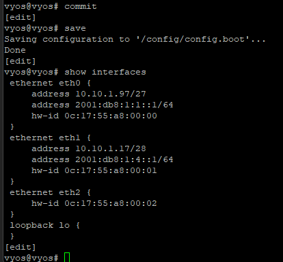{#fig-036 width=70%}

Проверим подключение между устройствами подсети с помощью команд ping и trace. Мы видим, что все корректно обрабатывается. ([рис. @fig-032]).

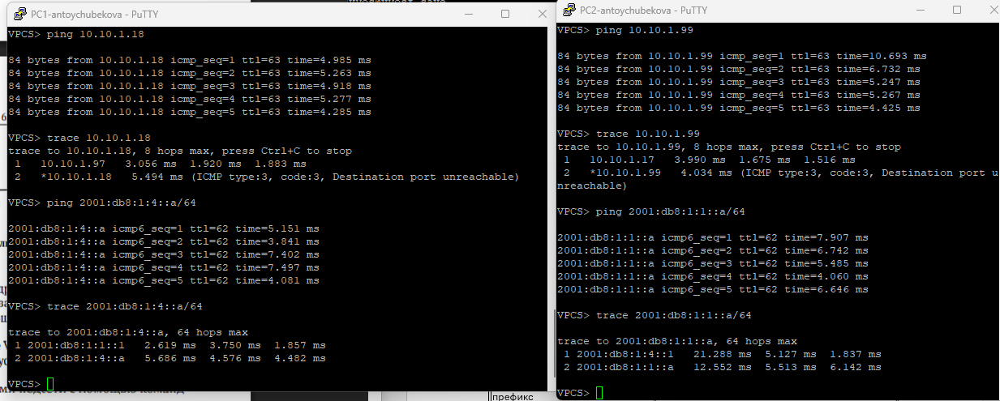{#fig-037 width=70%}

# Вывод

В ходе выполнения лабораторной №6 я изучила принципы распределения и настройки адресного пространства на устройствах сети. 

