---
## Author
author:
  name: Тойчубекова Асель Нурлановна
  degrees: DSc
  orcid: 0000-0002-0877-7063
  email: kulyabov-ds@rudn.ru
  affiliation:
    - name: Российский университет дружбы народов
      country: Российская Федерация
      postal-code: 117198
      city: Москва
      address: ул. Миклухо-Маклая, д. 6
## Title
title: Сеетевые технологии
subtitle: Лабораторная работа №7
license: CC BY
date: today
date-format: "YYYY-MM-DD" # Example: 2025-09-06
---

# Информация

## Докладчик

:::::::::::::: {.columns align=center}
::: {.column width="70%"}

  * Тойчубекова Асель Нурлановна
  * Студент 3 курса
  * факультет физико-математических и естественных наук
  * Российский университет дружбы народов им. П. Лумумбы
  * [1032235033@rudn.ru](1032235033@rudn.ru)

:::
::: {.column width="30%"}

:::
::::::::::::::

# Цель работы

## Цель работы

Целью данной лабораторной работы является получение навыков настройки службы DHCP на сетевом оборудовании для распределения адресов IPv4 и IPv6. 

# Задание

## Задание

1. Настроить DHCP в случае IPv4
2. Настроить DHCP в случае IPv6

# Теоретическое введение

## Теоретическое введение

В современных компьютерных сетях для обеспечения корректной работы устройств необходима настройка сетевых параметров, таких как IP-адрес, маска подсети, шлюз по умолчанию и адреса DNS-серверов. Ручная конфигурация этих параметров на каждом узле является трудоёмкой и подверженной ошибкам, поэтому в сетях IPv4 и IPv6 широко применяется автоматическая настройка с использованием протоколов динамической конфигурации.

## Теоретическое введение

Для сетей IPv4 таким механизмом является DHCP (Dynamic Host Configuration Protocol). Он реализует модель клиент–сервер и обеспечивает автоматическое распределение IP-адресов из заранее определённого пула. Передача DHCP-сообщений осуществляется через протокол UDP: сервер принимает запросы клиентов на порту 67 и отправляет ответы на порт 68. Процесс аренды адреса включает обмен сообщениями DHCPDISCOVER, DHCPOFFER, DHCPREQUEST и DHCPACK. 

## Теоретическое введение

В сетях IPv6 применяются два механизма автоматической настройки: SLAAC (Stateless Address Autoconfiguration) и DHCPv6. SLAAC позволяет узлу самостоятельно сформировать IPv6-адрес на основе информации, поступающей от маршрутизатора в виде ICMPv6-сообщений Router Advertisement. Проверка уникальности созданного адреса выполняется с помощью процедуры обнаружения дубликатов (DAD). Однако SLAAC предоставляет только базовые параметры, поэтому для получения дополнительной информации может использоваться DHCPv6.

# Выполнение лабораторной работы

## Настройка DHCP в случае IPv4

Запустим GNS3 VM и GNS3. Создадим новый проект. В рабочем пространстве разместим и соединим устройства в соответствии с топологией данной в лабораторной работе. Изменим название устройств, указав наш логин и счетный номер.

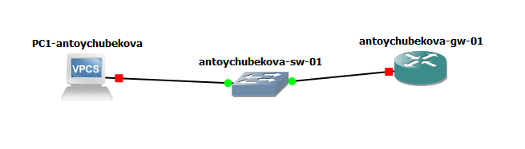{width=50%}

## Настройка DHCP в случае IPv4

Включим захват трафика на соединении между коммутатором sw-01 и маршрутизатором gw-01. 

{width=50%}

## Настройка DHCP в случае IPv4

На маршрутизаторе перейдем в режим конфигурирования, изменим имя устройства и доменное имя, заменим системного пользователя, заданного по умолчанию, на нашего пользователя. 

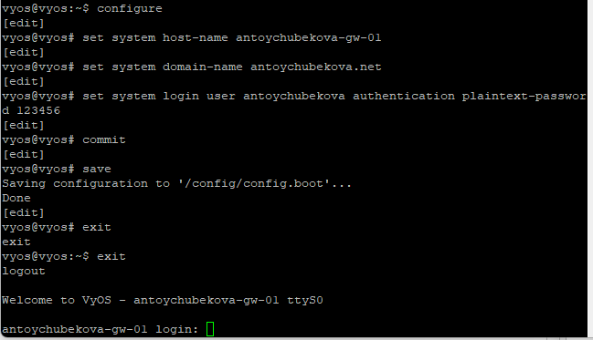{width=50%}

## Настройка DHCP в случае IPv4

Зайдем под нашим пользователем и удалим пользователя vyos. 

{width=50%}

## Настройка DHCP в случае IPv4

На маршрутизаторе под созданным пользователем перейдем в режим конфигурирования и настроим адресацию IPv4.

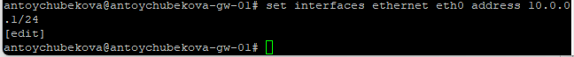{width=50%}

## Настройка DHCP в случае IPv4

Добавим конфигурацию DHCP-сервера на маршрутизаторе.Создадим разделяемую сеть
(shared-network-name) с названием antoychubekova.

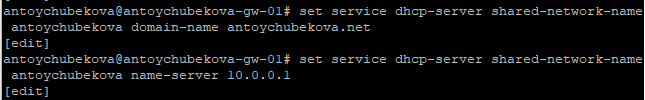{width=50%}

## Настройка DHCP в случае IPv4

Далее создадим подсеть (subnet) с адресом 10.0.0.0/24, задан диапазон адресов (range) с именем hosts, содержащий адреса 10.0.0.2–10.0.0.253. 

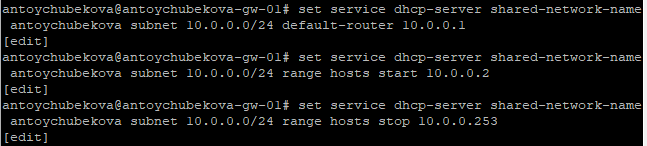{width=50%}

## Настройка DHCP в случае IPv4

Сохраним наши изменения. 

{width=50%}

## Настройка DHCP в случае IPv4

Просмотрим статистики DHCP-сервера и выданных адресов. Мы видим, что сводную статистику DHCP-сервера: размер пула адресов, количество выданных аренд (leases), доступные адреса и процент использования пула. В представленном выводе пул содержит 252 адреса, все они доступны, аренды отсутствуют (0% использования).

Также видим выданные IP-адреса, MAC-адреса клиентов, состояние аренды, время начала и окончания, оставшееся время, пул и имя хоста. В данном выводе аренды отсутствуют, поэтому таблица пуста.

## Настройка DHCP в случае IPv4

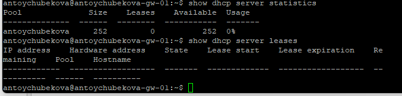{width=50%}

## Настройка DHCP в случае IPv4

Настроим оконечное устройство PC1. 

{width=50%}

## Настройка DHCP в случае IPv4

{width=50%}

## Настройка DHCP в случае IPv4

Проверим конфигурацию IPv4 на узле, пропингуем маршрутизатор. Мы видим, что все корректно работает. 

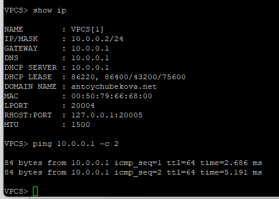{width=50%}

## Настройка DHCP в случае IPv4

На маршрутизаторе вновь посмотрим статистику DHCP-сервера и выданные адреса. 

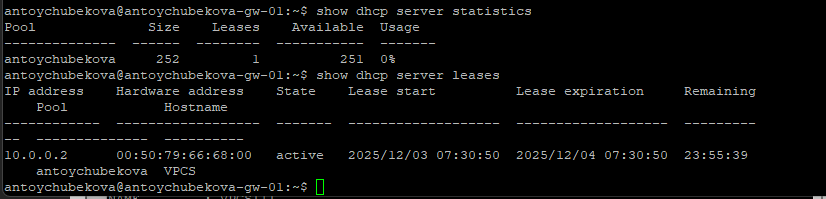{width=50%}

## Настройка DHCP в случае IPv4

На маршрутизаторе посмотрим журнал работы DHCP-сервера. 

{width=50%}

## Настройка DHCP в случае IPv4

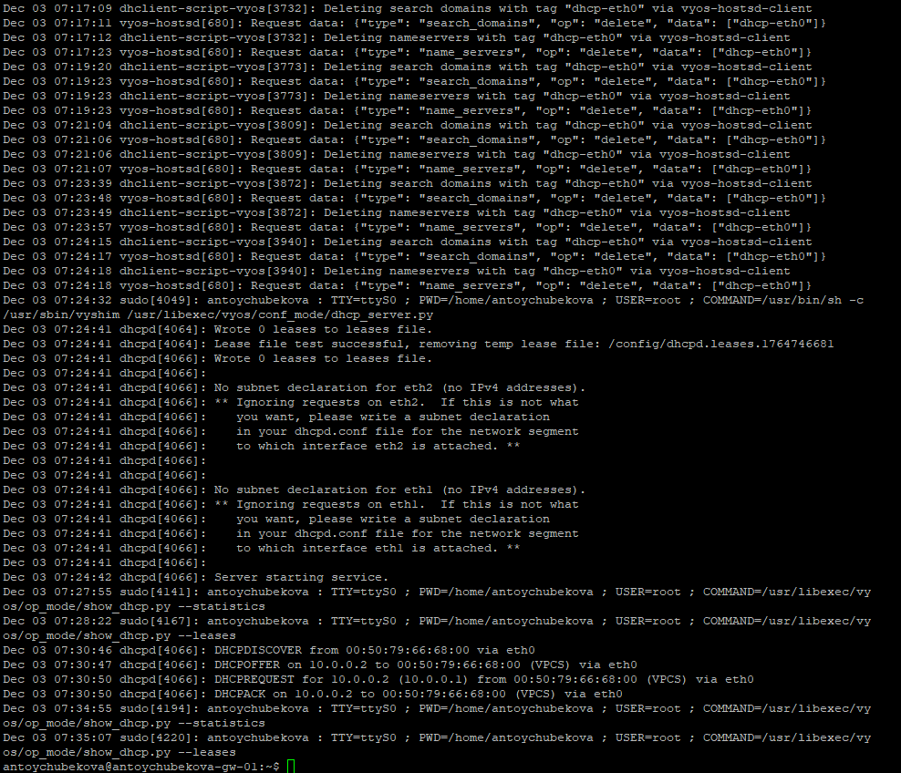{width=50%}

## Настройка DHCP в случае IPv4

Логи показывают работу DHCP-сервера и связанные с ним процессы в системе VyOS. Видно удаление старых DNS-настроек интерфейса eth0, запуск DHCP-демона, проверку конфигурации, а также ключевые события аренды: получение клиентом DHCPDISCOVER, отправку DHCPOFFER, DHCPREQUEST и подтверждение DHCPACK.

## Настройка DHCP в случае IPv4

{width=50%}

## Настройка DHCP в случае IPv4

{width=50%}

## Настройка DHCP в случае IPv4

{width=50%}

## Настройка DHCP в случае IPv4

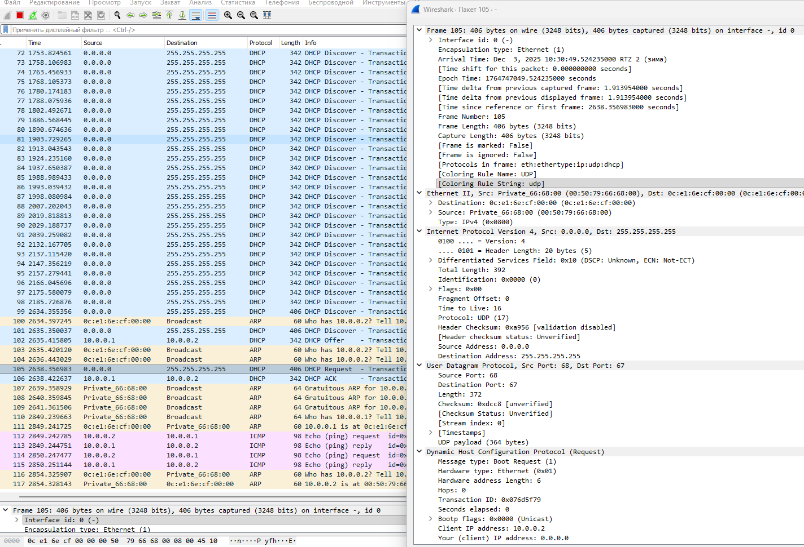{width=50%}

## Настройка DHCP в случае IPv4

{width=50%}

## Настройка DHCP в случае IPv4

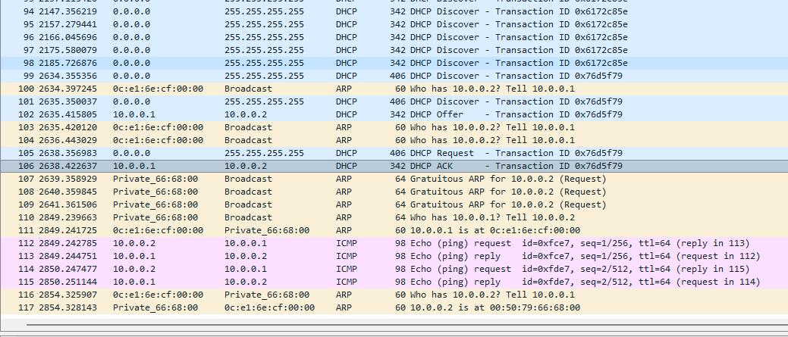{width=50%}

## Настройка DHCP в случае IPv6

В предыдущем проекте в рабочем пространстве дополним сеть, разместив и соединив устройства в соответствии с топологией, приведённой в лабораторной работе. Используем хост (клиент) Kali Linux CLI, поскольку клиент VPCS не поддерживает DHCPv6. Измените отображаемые названия устройств. 

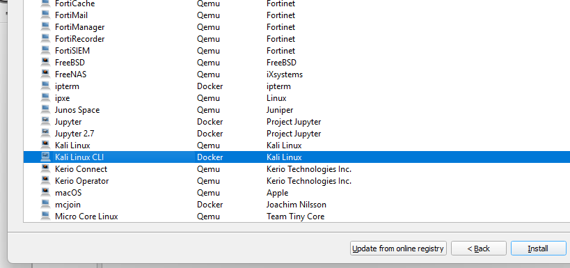{width=50%}

## Настройка DHCP в случае IPv6

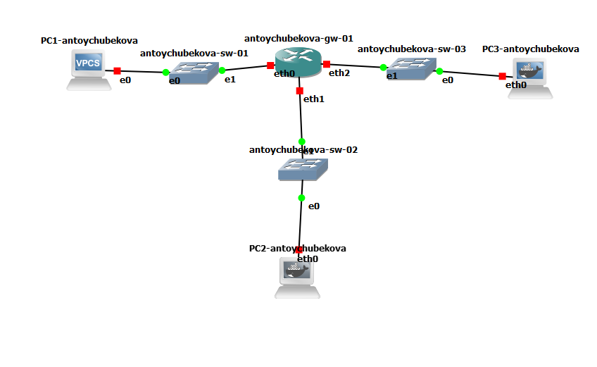{width=50%}

## Настройка DHCP в случае IPv6

Включим захват трафика на соединениях между маршрутизатором gw-01 и коммутаторами sw-02 и sw-03. 

{width=50%}

## Настройка DHCP в случае IPv6

Настроим адресацию IPv6 на маршрутизаторе. 

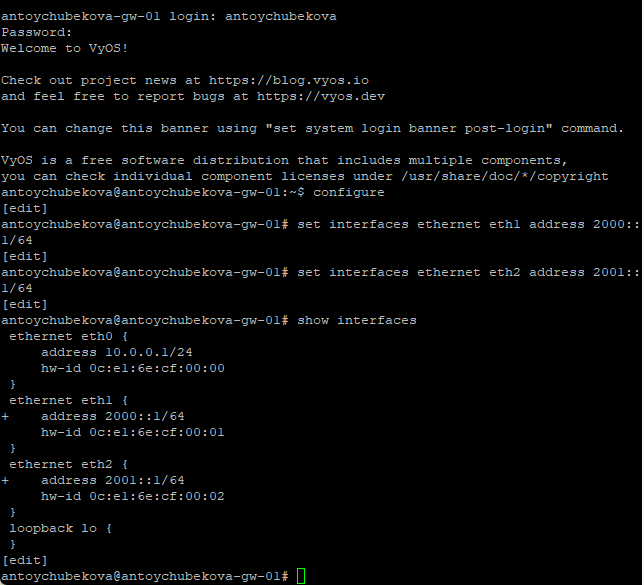{width=50%}

## Настройка DHCP в случае IPv6

Сохраним наши изменения. 

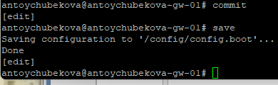{width=50%}

## Настройка DHCP в случае IPv6

На маршрутизаторе настроим DHCPv6 без отслеживания состояния. Настроим объявления о маршрутизаторах (Router Advertisements, RA) на интерфейсе eth1. 

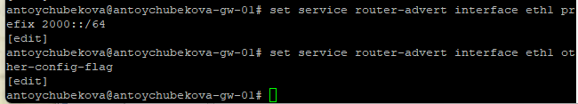{width=50%}

## Настройка DHCP в случае IPv6

Добавим конфигурации DHCP-сервера. Создаем разделяемую сеть (shared-network-name) с названием antoychubekova, задаем информацию общих опций (common-options) для разделяемой сети. При этом подсеть (subnet) 2000::/64 не требуется настраивать, поскольку она не будет содержать полезной информации.

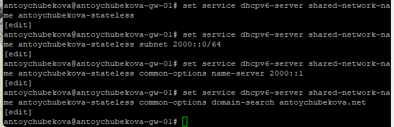{width=50%}

## Настройка DHCP в случае IPv6

Далее сохраняем наши изменения и посмотрим корректность отработки выше команд. 

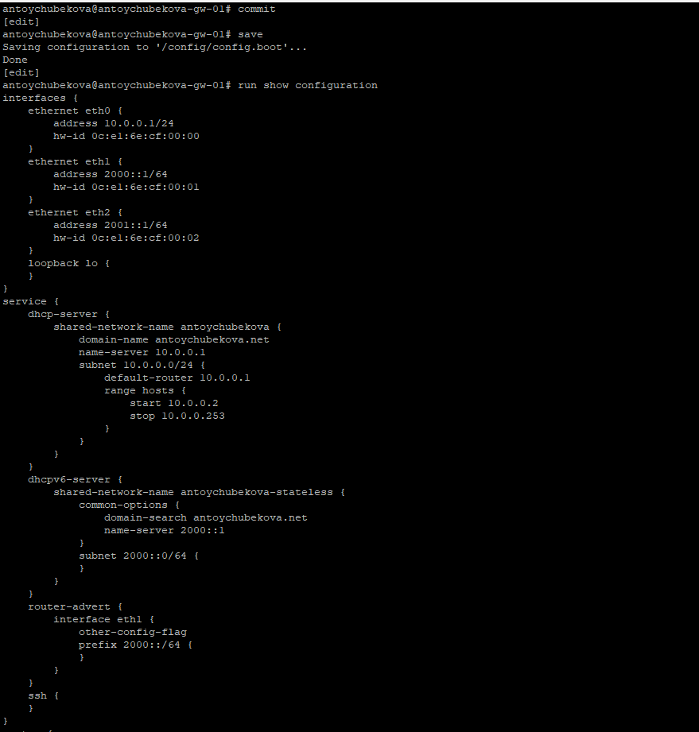{width=50%}

## Настройка DHCP в случае IPv6

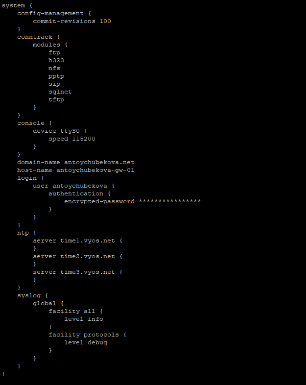{width=50%} 

## Настройка DHCP в случае IPv6

На узле PC2 проверим настройки сети. На ПК2 настроены два сетевых интерфейса: eth0 с глобальным IPv6-адресом 2000::3c40:8bff:fece:ad0a и локальным fe80::3c40:8bff:fece:ad0a, а также eth1 с локальным IPv6-адресом fe80::b0ee:9cff:fea5:a8. Интерфейс lo настроен для loopback (127.0.0.1 и ::1).

Маршрутизация IPv6 реализована через eth0 для глобальной сети 2000::/64 и через локальные адреса для link-local сети fe80::/64. Шлюз по умолчанию (::/0) настроен через адрес fe80::0c:e1:6e:ff:fe:cf:01 на eth0.

## Настройка DHCP в случае IPv6

{width=50%}

## Настройка DHCP в случае IPv6

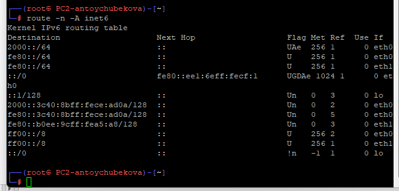{width=50%}

## Настройка DHCP в случае IPv6

На узле PC2 пропингуем маршрутизатор. Мы видим, что все правильно обрабатывается. 

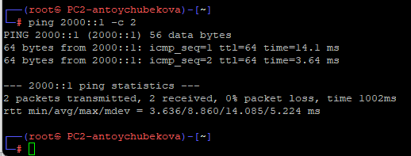{{width=50%}

## Настройка DHCP в случае IPv6

На узле PC2 проверим настройки DNS. 

{width=50%} 

## Настройка DHCP в случае IPv6

На узле PC2 получим адрес по DHCPv6. Здесь опция -6 указывает на использование протокола DHCPv6, опция -S — на запрос только информации DHCPv6, но не адреса, опция -v — на вывод на экран подробной информации. 

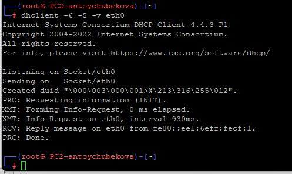{width=50%} 

## Настройка DHCP в случае IPv6

Вновь пропингуем от узла PC2 маршрутизатор, проверим настройки DNS. Мы видим имя домена и его IPv6.

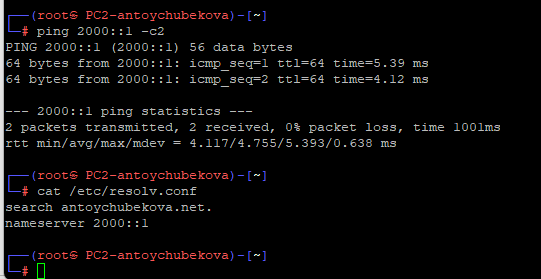{width=50%} 

## Настройка DHCP в случае IPv6

На маршрутизаторе посмотрим статистику DHCP-сервера и выданные адреса. 

{width=50%}

## Настройка DHCP в случае IPv6

Далее просмотрим захваченный трафик. 

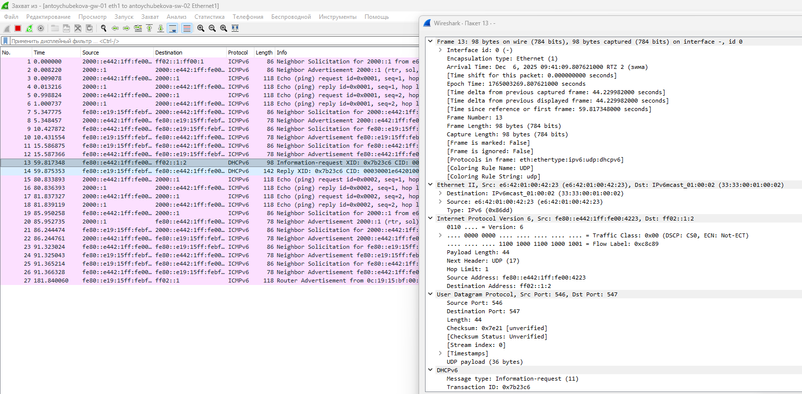{width=50%}

## Настройка DHCP в случае IPv6

{width=50%}

## Настройка DHCP в случае IPv6

{width=50%}

## Настройка DHCP в случае IPv6

На маршрутизаторе настроим DHCPv6 с отслеживанием состояния. На интерфейсе eth2  маршрутизатора настроим объявления о маршрутизаторах. Опция managed-flag означает, что хосты использует администрируемый (отслеживающий состояние) протокол для автоматической настройки адресов в дополнение к любым адресам, автоматически настраиваемым
с помощью SLAAC. 

## Настройка DHCP в случае IPv6

{width=50%}

## Настройка DHCP в случае IPv6

Добавим конфигурацию DHCP-сервера на маршрутизаторе. Создаем разделяемая сеть
(shared-network-name) с названием username, подсеть (subnet) с адресом 2001::/64, задаем диапазон адресов (range) с именем hosts, содержащий адреса 2001::100 – 2001::199. 

На маршрутизаторе посмотрим статистику DHCP-сервера и выданные адреса. 

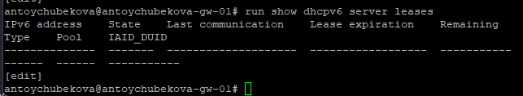{width=50%}

## Настройка DHCP в случае IPv6

Подключимся к узлу PC3 и проверим настройки сети. 

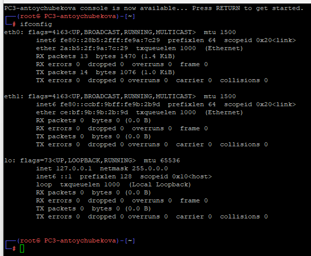{width=50%}

## Настройка DHCP в случае IPv6

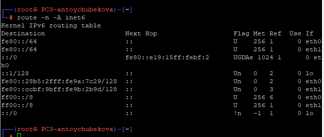{width=50%}

## Настройка DHCP в случае IPv6

На узле PC3 проверим настройки DNS. 

{width=50%}

## Настройка DHCP в случае IPv6

На узле PC3 получите адрес по DHCPv.

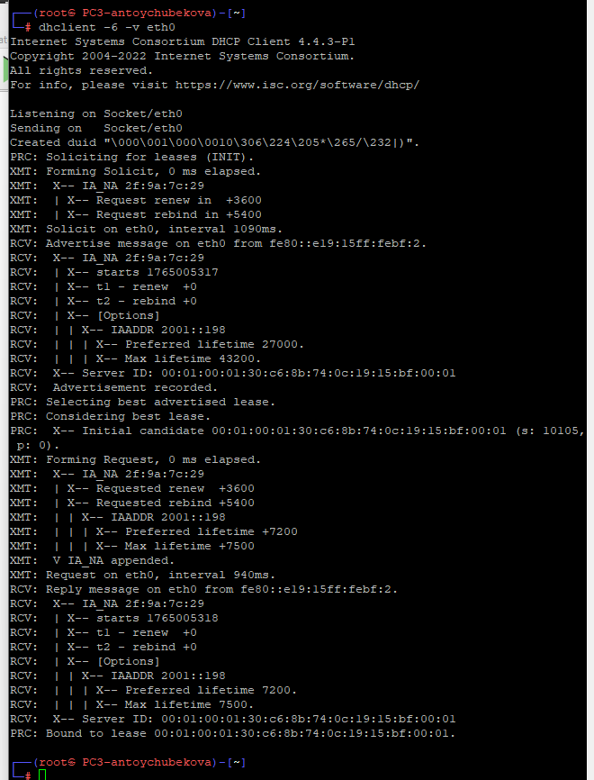{width=50%}

## Настройка DHCP в случае IPv6

Вновь на узле PC3 проверим настройки сети, пропингуем маршрутизатор, проверьте настройки DNS.

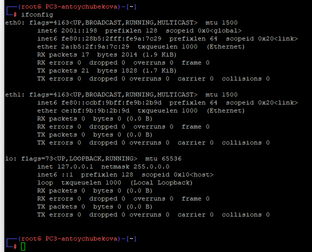{width=50%}

## Настройка DHCP в случае IPv6

{width=50%}

## Настройка DHCP в случае IPv6

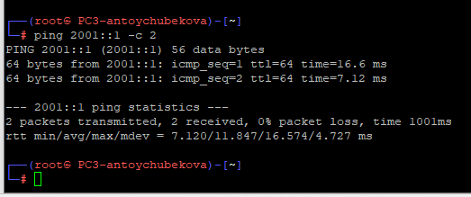{width=50%}

## Настройка DHCP в случае IPv6

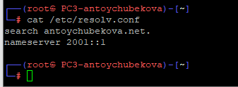{width=50%}

## Настройка DHCP в случае IPv6

На маршрутизаторе посмотриv статистику DHCP-сервера и выданные адреса. 

{width=50%}

## Настройка DHCP в случае IPv6

Далее посмотри захваченный трафик по DHCPv6. 

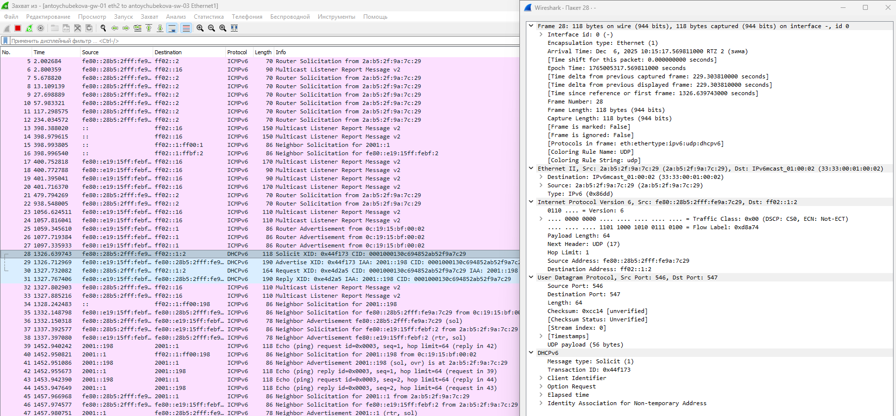{width=50%}

# Выводы

## Выводы

В ходе выполнения лабораторной работы №7 я получила навыки настройки службы DHCP на сетевом оборудовании для распределения адресов IPv4 и IPv6.
