---
## Author
author:
  name: Тойчубекова Асель Нурлановна
  degrees: DSc
  orcid: 0000-0002-0877-7063
  email: kulyabov-ds@rudn.ru
  affiliation:
    - name: Российский университет дружбы народов
      country: Российская Федерация
      postal-code: 117198
      city: Москва
      address: ул. Миклухо-Маклая, д. 6

## Title
title: "Сетевые технологии"
subtitle: "Лабораторная работа №7"
license: "CC BY"
---

# Цель работы

Целью данной лабораторной работы является получение навыков настройки службы DHCP на сетевом оборудовании для распределения адресов IPv4 и IPv6. 

# Задание

1. Настроить DHCP в случае IPv4
2. Настроить DHCP в случае IPv6

# Теоретическое введение

В современных компьютерных сетях для обеспечения корректной работы устройств необходима настройка сетевых параметров, таких как IP-адрес, маска подсети, шлюз по умолчанию и адреса DNS-серверов. Ручная конфигурация этих параметров на каждом узле является трудоёмкой и подверженной ошибкам, поэтому в сетях IPv4 и IPv6 широко применяется автоматическая настройка с использованием протоколов динамической конфигурации.

Для сетей IPv4 таким механизмом является DHCP (Dynamic Host Configuration Protocol). Он реализует модель клиент–сервер и обеспечивает автоматическое распределение IP-адресов из заранее определённого пула. Передача DHCP-сообщений осуществляется через протокол UDP: сервер принимает запросы клиентов на порту 67 и отправляет ответы на порт 68. Процесс аренды адреса включает обмен сообщениями DHCPDISCOVER, DHCPOFFER, DHCPREQUEST и DHCPACK. Помимо адреса, DHCP может передавать дополнительные параметры: маску подсети, адрес шлюза, DNS-серверов и домена. Каждый IP-адрес выдаётся клиенту на ограниченный срок (lease time), после истечения которого процедура конфигурации повторяется.

В сетях IPv6 применяются два механизма автоматической настройки: SLAAC (Stateless Address Autoconfiguration) и DHCPv6. SLAAC позволяет узлу самостоятельно сформировать IPv6-адрес на основе информации, поступающей от маршрутизатора в виде ICMPv6-сообщений Router Advertisement. Проверка уникальности созданного адреса выполняется с помощью процедуры обнаружения дубликатов (DAD). Однако SLAAC предоставляет только базовые параметры, поэтому для получения дополнительной информации может использоваться DHCPv6.

Протокол DHCPv6 обеспечивает как статeless-, так и stateful-конфигурацию. Режим работы определяется флагами M и O, передаваемыми в сообщениях Router Advertisement. В статeless-режиме устройство самостоятельно формирует адрес с использованием SLAAC, но получает дополнительные параметры от DHCPv6-сервера. В stateful-режиме сервер полностью управляет распределением IPv6-адресов и других настроек. Передача данных осуществляется через UDP: сервер прослушивает порт 547 и отправляет ответы клиентам на порт 546. Процесс настройки включает сообщения SOLICIT, ADVERTISE, INFORMATION-REQUEST, REQUEST и REPLY.

# Выполнение лабораторной работы

## Настройка DHCP в случае IPv4

Запустим GNS3 VM и GNS3. Создадим новый проект. В рабочем пространстве разместим и соединим устройства в соответствии с топологией данной в лабораторной работе. Изменим название устройств, указав наш логин и счетный номер. ([рис. @fig-001]).

{#fig-001 width=70%}

Включим захват трафика на соединении между коммутатором sw-01 и маршрутизатором gw-01. ([рис. @fig-002]).

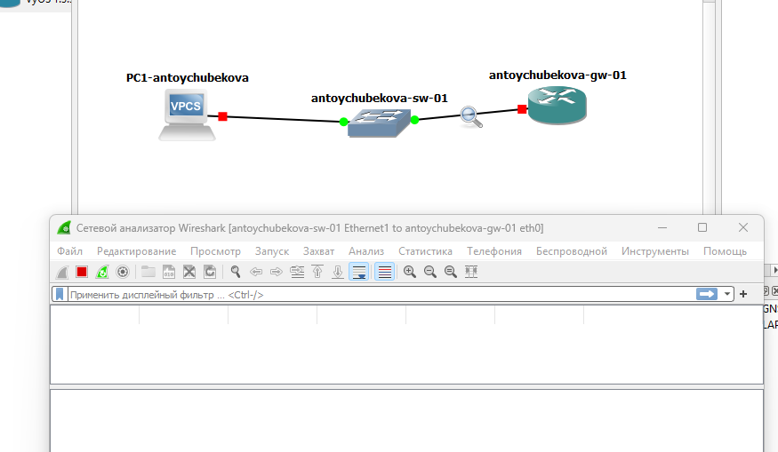{#fig-002 width=70%}

Настроим образ VyOS. Установим систему на маршрутизаторы VyOS. Мы видим, что она уже установлена. ([рис. @fig-003]).

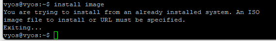{#fig-003 width=70%}

На маршрутизаторах перейдем в режим конфигурирования, изменим имя устройства и доменное имя, заменим системного пользователя, заданного по умолчанию, на нашего пользователя.  ([рис. @fig-004]).

{#fig-004 width=70%}

Зайдем под нашим пользователем и удалим пользователя vyos. ([рис. @fig-005]).

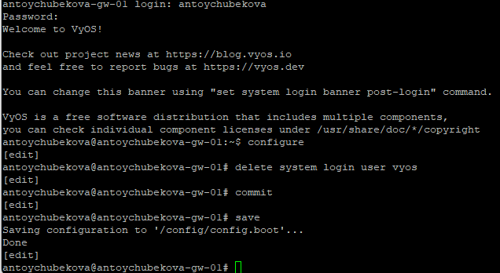{#fig-005 width=70%}

На маршрутизаторе под созданным пользователем перейдем в режим конфигурирования и настроим адресацию IPv4. ([рис. @fig-006]).

{#fig-006 width=70%}

Добавим конфигурацию DHCP-сервера на маршрутизаторе.Создадим разделяемую сеть
(shared-network-name) с названием antoychubekova ([рис. @fig-007]). 

{#fig-007 width=70%}

Далее создадим подсеть (subnet) с адресом 10.0.0.0/24, задан диапазон адресов (range) с именем hosts, содержащий адреса 10.0.0.2–10.0.0.253.([рис. @fig-008]). 

{#fig-008 width=70%}

Сохраним наши изменения. ([рис. @fig-009]).

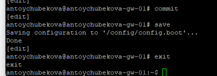{#fig-009 width=70%}

Просмотрим статистики DHCP-сервера и выданных адресов. Мы видим, что сводную статистику DHCP-сервера: размер пула адресов, количество выданных аренд (leases), доступные адреса и процент использования пула. В представленном выводе пул содержит 252 адреса, все они доступны, аренды отсутствуют (0% использования).

Также видим выданные IP-адреса, MAC-адреса клиентов, состояние аренды, время начала и окончания, оставшееся время, пул и имя хоста. В данном выводе аренды отсутствуют, поэтому таблица пуста. ([рис. @fig-010]).

{#fig-010 width=70%}

Настроим оконечное устройство PC1. ([рис. @fig-011] и [рис. @fig-012]).

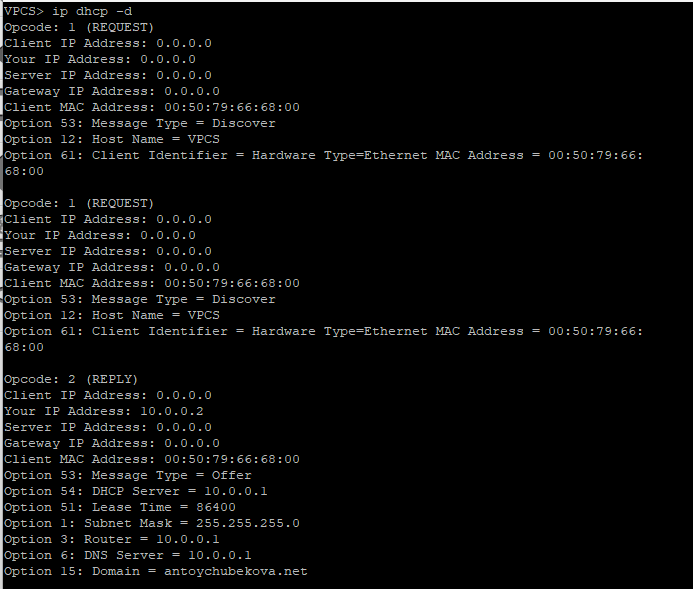{#fig-011 width=70%}

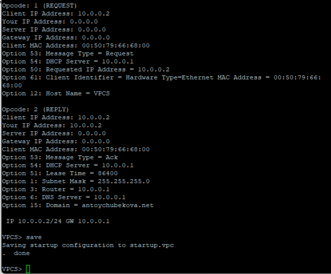{#fig-012 width=70%}

Мы видим подробную информацию по декодированиб запросов DHCP. 

1. DHCP DISCOVER

Клиент с MAC-адресом 00:50:79:66:68:00 отправляет широковещательный запрос (Opcode 1 — REQUEST), в котором ищет доступный DHCP-сервер. В сообщении указано имя хоста (VPCS) и идентификатор клиента.

2. DHCP OFFER

DHCP-сервер отвечает предложением (Opcode 2 — REPLY), предлагая клиенту IP-адрес 10.0.0.2.
Вместе с адресом сервер отправляет параметры сети:
– маска: 255.255.255.0
– шлюз по умолчанию: 10.0.0.1
– DNS-сервер: 10.0.0.1
– домен: antoychubekova.net
– время аренды: 86400 секунд (1 сутки)

3. DHCP REQUEST

Клиент подтверждает, что принимает предложенный сервером IP-адрес 10.0.0.2, и отправляет запрос на его резервирование.

4. DHCP ACK

Сервер подтверждает назначение адреса (Opcode 2 — Ack) и закрепляет за клиентом параметры конфигурации. Теперь адрес 10.0.0.2/24 официально выдан клиенту.

5. Итоговая настройка

Клиент сообщает, что его параметры сети установлены:
IP-адрес 10.0.0.2/24, шлюз 10.0.0.1.

Проверим конфигурацию IPv4 на узле, пропингуем маршрутизатор. Мы видим, что все корректно работает. ([рис. @fig-013]).

{#fig-013 width=70%}

На маршрутизаторе вновь посмотрим статистику DHCP-сервера и выданные адреса. ([рис. @fig-014]).

{#fig-014 width=70%}

DHCP-сервер корректно функционирует и предоставляет адреса из пула antoychubekova. Согласно выводу команды show dhcp server statistics, пул содержит 252 возможных IP-адреса, из которых один адрес уже выдан клиенту, а 251 остаётся доступным. Таким образом, использование пула минимально и составляет практически 0 %, что подтверждает успешную работу сервиса и наличие большого запаса свободных адресов для назначения новым устройствам.

Вывод команды show dhcp server leases показывает подробную информацию об активно выданной аренде. Клиент с MAC-адресом 00:50:79:66:68:00 получил IP-адрес 10.0.0.2, и его аренда находится в состоянии active. Адрес был назначен 03.12.2025 в 07:30:50 и будет действителен до 04.12.2025 в 07:30:50, что соответствует сроку аренды 24 часа. В поле Remaining отображается оставшееся время действия аренды — почти полные сутки. Адрес был выдан из пула antoychubekova, а имя хоста клиента определено как VPCS, что соответствует виртуальной машине PC1.

На маршрутизаторе посмотрим журнал работы DHCP-сервера. ([рис. @fig-015] и [рис. @fig-016]).

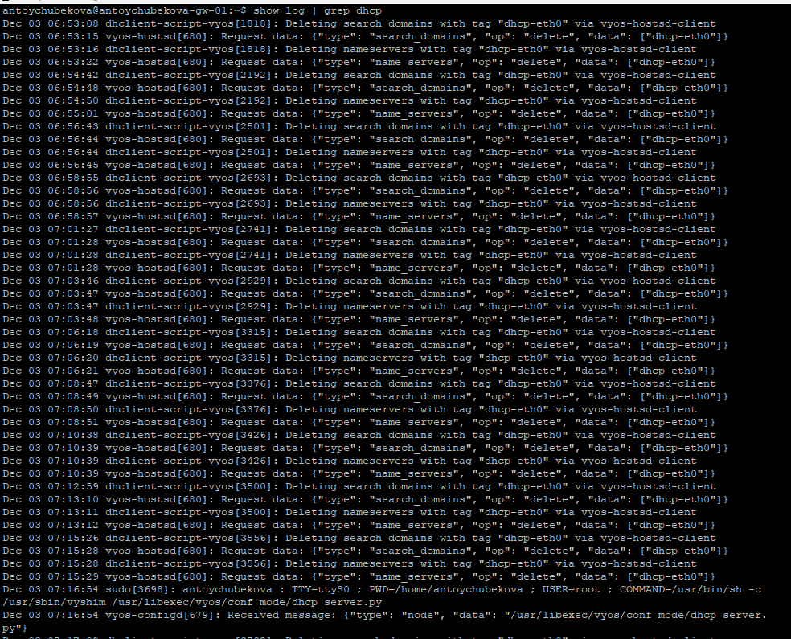{#fig-015 width=70%}

{#fig-016 width=70%}

Логи показывают работу DHCP-сервера и связанные с ним процессы в системе VyOS. Видно удаление старых DNS-настроек интерфейса eth0, запуск DHCP-демона, проверку конфигурации, а также ключевые события аренды: получение клиентом DHCPDISCOVER, отправку DHCPOFFER, DHCPREQUEST и подтверждение DHCPACK.

Далее просмотрим захваченный трафик, относящиеся к работе DHCP и назначению адреса устройства. 

Захваченный пакет представляет собой DHCP Discover, отправленный клиентом для запроса IP-адреса. Фрейм передаётся по Ethernet с источником MAC 00:50:79:66:68:00 и направлен на broadcast-адрес ff:ff:ff:ff:ff:ff, что типично для первичного DHCP-запроса, когда клиент ещё не имеет IP.

Внутри пакета используется IPv4 с адресами 0.0.0.0 → 255.255.255.255, а транспортный уровень — UDP, порты 68 → 67 (клиент → сервер). Payload содержит DHCP-сообщение типа Discover, в котором клиент объявляет себя в сети и запрашивает параметры конфигурации. Размер пакета 406 байт соответствует стандартному формату DHCP c набором опций (hostname, client identifier и др.).

Пакет является первым шагом DHCP-процесса и свидетельствует о том, что клиент начал процедуру получения IP-адреса. ([рис. @fig-017]).

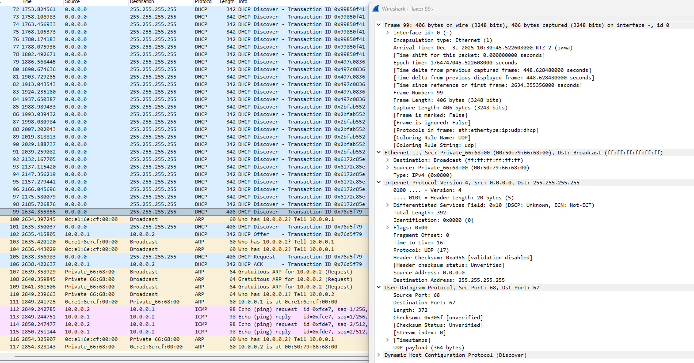{#fig-017 width=70%}

Этот фрейм также представляет собой DHCP Discover, отправленный клиентом с MAC-адресом 00:50:79:66:68:00. Как и положено для начальной стадии DHCP, пакет рассылается на широковещательный Ethernet-адрес ff:ff:ff:ff:ff:ff и в IP-заголовке использует адреса 0.0.0.0 → 255.255.255.255, так как у клиента ещё нет назначенного IP.

Пакет передаётся по UDP с портов 68 (клиент) → 67 (сервер). Внутри UDP содержится DHCP-сообщение с типом Discover — это первый шаг в процессе получения IP-адреса. Указаны стандартные параметры BOOTP/DHCP: аппаратный тип Ethernet, длина MAC-адреса, нулевая задержка, флаги для unicast-ответа и уникальный Transaction ID, который используется для связывания последующих DHCP-сообщений между клиентом и сервером.

Захваченный фрейм фиксирует повторное широковещательное сообщение DHCP Discover, что является нормальным поведением клиента до получения ответа (Offer) от DHCP-сервера. ([рис. @fig-018]).

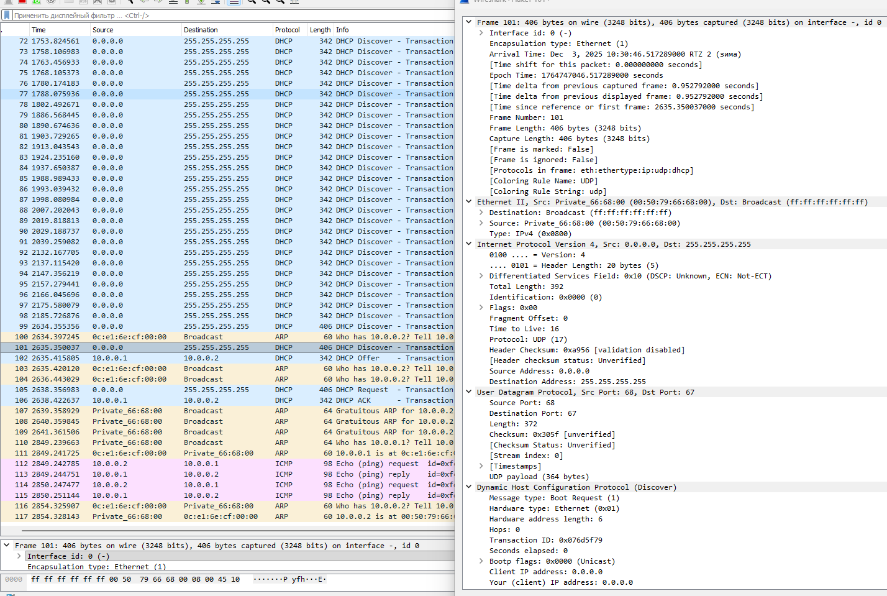{#fig-018 width=70%}

Захваченный пакет представляет собой DHCP Offer, то есть ответ DHCP-сервера на ранее полученное сообщение Discover от клиента. Фрейм передаётся по Ethernet от сервера с MAC-адресом 0c:…:cf:00:00 к клиенту 00:50:79:66:68:00, уже в одноадресном (unicast) режиме, что характерно после того, как сервер определил MAC клиента.

На сетевом уровне используется IPv4 с адресами 10.0.0.1 → 10.0.0.2. Это означает, что сервер сообщает клиенту, какой IP ему предлагается получить. Транспортный уровень — UDP, порты 67 (сервер) → 68 (клиент).

Внутри UDP находится DHCP-сообщение типа Offer. Оно содержит параметры, предлагаемые клиенту: тип сообщения — Boot Reply, тот же Transaction ID, что и в Discover (0x076d5f79), чтобы клиент мог сопоставить ответ с запросом. В поле Your (client) IP address указан 10.0.0.2, то есть сервер предлагает этот IP-адрес клиенту. Указанные нулевые флаги BOOTP означают одноадресный ответ.

Таким образом, фрейм фиксирует момент, когда DHCP-сервер предоставляет клиенту IP-адрес и параметры сети, переходя к следующему шагу DHCP-процедуры. ([рис. @fig-019]).

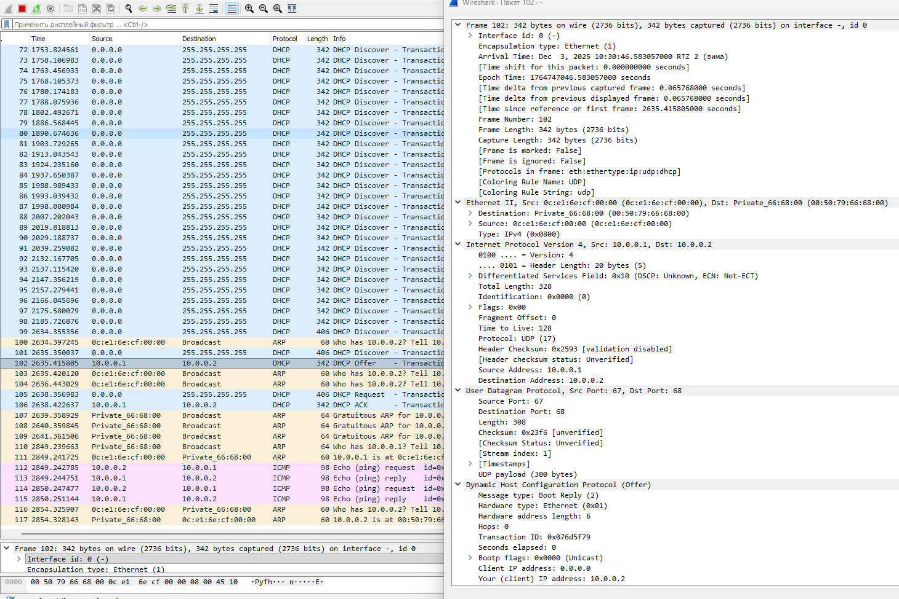{#fig-019 width=70%}

Этот фрейм представляет собой DHCP Request, отправленный клиентом после получения предложения IP-адреса (Offer). Клиент с MAC-адресом 00:50:79:66:68:00 обращается к DHCP-серверу, подтверждая, что он хочет получить предложенный IP-адрес. Пакет снова отправляется на широковещательный адрес 255.255.255.255, что является нормальным поведением на этой стадии, поскольку у клиента ещё нет окончательно подтверждённого IP.

На уровне IP используется источник 0.0.0.0 и широковещательный адрес назначения. UDP-порты те же: 68 (клиент) → 67 (сервер). Внутри UDP содержится сообщение DHCP типа Request, которое включает тот же Transaction ID (0x076d5f79), что и в предыдущих Discover и Offer, что подтверждает принадлежность к одной сессии.

В поле Client IP address клиент уже указывает 10.0.0.2, который ему был предложен сервером. Это означает, что клиент принимает предложенный адрес и запрашивает его окончательное закрепление. Параметр Bootp flags равен 0, что соответствует одноадресному ответу.

Таким образом, фрейм фиксирует шаг DHCP Request — подтверждение клиентом выбора IP-адреса 10.0.0.2 перед получением финального ACK от сервера. ([рис. @fig-020]).

{#fig-020 width=70%}

Данный фрейм представляет собой сообщение DHCP ACK, отправленное сервером DHCP клиенту. Это финальный этап процесса выдачи IP-адреса. DHCP-сервер с адресом 10.0.0.1 и MAC-адресом 0c:e1:6e:cf:00:00 подтверждает клиенту назначение IP-адреса 10.0.0.2, который был ранее запрошен клиентом в сообщении DHCP Request.

На канальном уровне фрейм направлен напрямую клиенту (MAC: 00:50:79:66:68:00), уже без использования широковещательной рассылки. На сетевом уровне IP-пакет передаётся от 10.0.0.1 к 10.0.0.2. В транспортном слое используется стандартная пара портов UDP 67 → 68.

Сообщение DHCP имеет тип ACK (Boot Reply), что означает успешное завершение процесса конфигурации. Оно содержит тот же Transaction ID (0x076d5f79), что и предыдущие DHCP-пакеты, что подтверждает принадлежность к одной сессии. В полях DHCP указаны подтверждённый IP-адрес клиента, а также дополнительные сетевые параметры (маска подсети, шлюз, DNS — они присутствуют в полном содержимом, хотя не все отображены в данном фрагменте).

Таким образом, этот фрейм завершает процесс получения сетевых настроек клиентом и подтверждает успешную выдачу адреса 10.0.0.2. ([рис. @fig-021]).

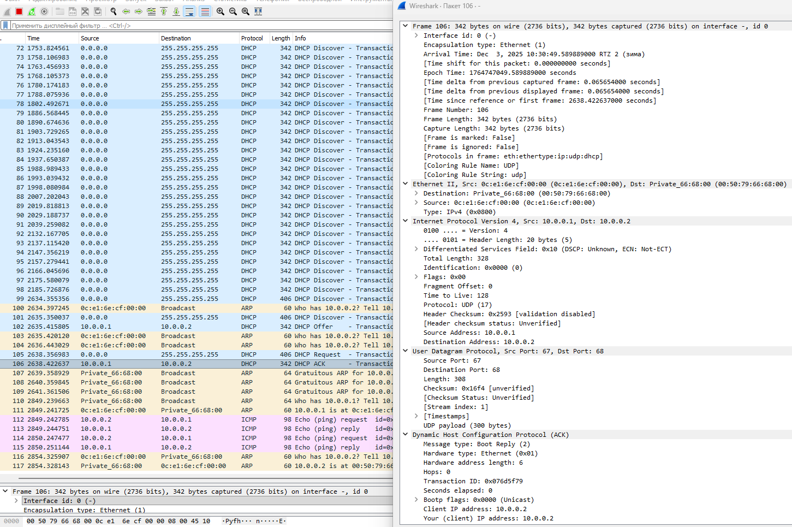{#fig-021 width=70%}

Далее представлен фрагмент трафика, который отражает полный процесс динамического получения IP-адреса клиентом через DHCP, а также последующую проверку доступности сети с помощью ARP и ICMP.

Сначала клиент (0.0.0.0, MAC: 00:50:79:66:68:00) несколько раз отправляет DHCP Discover (фреймы 94–101, 99–101) для поиска DHCP-сервера. Сервер отвечает DHCP Offer (фрейм 102), предлагая IP-адрес 10.0.0.2. Клиент подтверждает выбор через DHCP Request (фрейм 105), после чего сервер окончательно назначает адрес в DHCP ACK (фрейм 106).

Далее клиент выполняет серию Gratuitous ARP (фреймы 107–110) для проверки уникальности назначенного IP в сети и обновления ARP-кэшей у соседних устройств. После этого происходят ICMP Echo (ping) запросы и ответы между клиентом 10.0.0.2 и сервером 10.0.0.1 (фреймы 112–115), что подтверждает успешную сетевую коммуникацию. Завершают процесс стандартные ARP-запросы и ответы для поддержки актуального сопоставления IP и MAC-адресов (фреймы 116–117).

В целом, трафик демонстрирует стандартный DHCP-процесс с последующей проверкой работоспособности сети через ARP и ICMP. ([рис. @fig-022]).

{#fig-022 width=70%}

## Настройка DHCP в случае IPv6

В предыдущем проекте в рабочем пространстве дополним сеть, разместив и соединив устройства в соответствии с топологией, приведённой в лабораторной работе. Используем хост (клиент) Kali Linux CLI, поскольку клиент VPCS не поддерживает DHCPv6. Измените отображаемые названия устройств.  ([рис. @fig-023] и [рис. @fig-024]).

{#fig-023 width=70%}

{#fig-024 width=70%}

Включим захват трафика на соединениях между маршрутизатором gw-01 и коммутаторами sw-02 и sw-03. ([рис. @fig-025]).

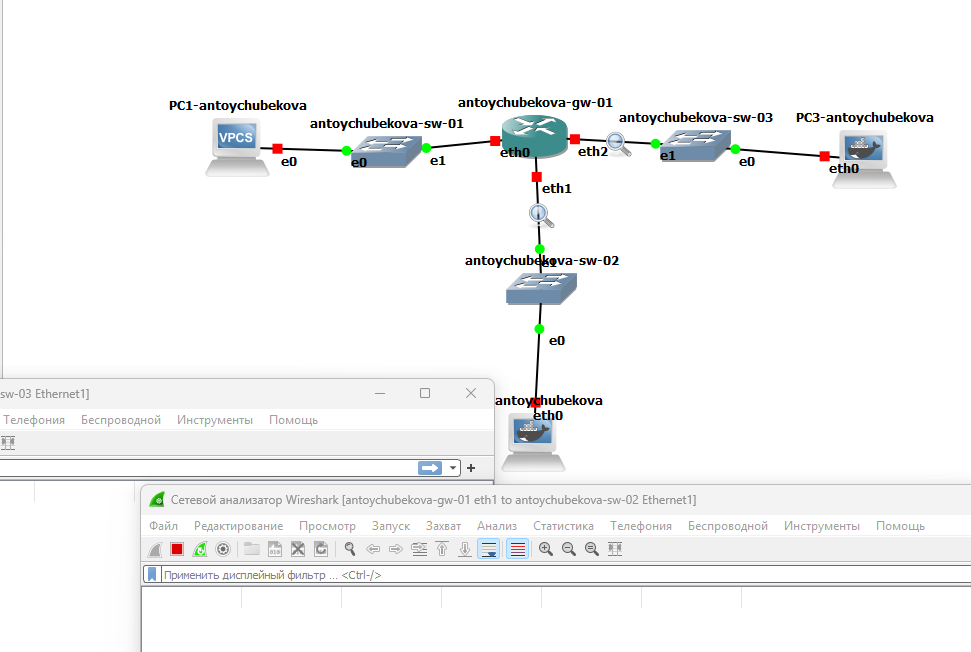{#fig-025 width=70%}

Настроим адресацию IPv6 на маршрутизаторе. ([рис. @fig-026]).

{#fig-026 width=70%}

Сохраним наши изменения. ([рис. @fig-027]).

{#fig-027 width=70%}

На маршрутизаторе настроим DHCPv6 без отслеживания состояния. Настроим объявления о маршрутизаторах (Router Advertisements, RA) на интерфейсе eth1. Опция other-config-flag означает, что для конфигурации не адресных параметров использует протокол с сохранением состояния.([рис. @fig-028]).

{#fig-028 width=70%}

Добавим конфигурации DHCP-сервера. Создаем разделяемую сеть (shared-network-name) с названием antoychubekova, задаем информацию общих опций (common-options) для разделяемой сети. При этом подсеть (subnet) 2000::/64 не требуется настраивать, поскольку она не будет содержать полезной информации.([рис. @fig-029]).

{#fig-029 width=70%}

Далее сохраняем наши изменения и посмотрим корректность отработки выше команд. ([рис. @fig-030] и [рис. @fig-031]).

{#fig-030 width=70%} 

{#fig-031 width=70%} 

На узле PC2 проверим настройки сети. На ПК2 настроены два сетевых интерфейса: eth0 с глобальным IPv6-адресом 2000::3c40:8bff:fece:ad0a и локальным fe80::3c40:8bff:fece:ad0a, а также eth1 с локальным IPv6-адресом fe80::b0ee:9cff:fea5:a8. Интерфейс lo настроен для loopback (127.0.0.1 и ::1).

Маршрутизация IPv6 реализована через eth0 для глобальной сети 2000::/64 и через локальные адреса для link-local сети fe80::/64. Шлюз по умолчанию (::/0) настроен через адрес fe80::0c:e1:6e:ff:fe:cf:01 на eth0. ([рис. @fig-032] и [рис. @fig-033]).

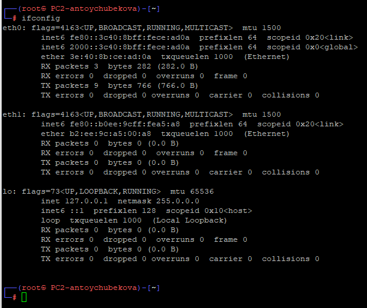{#fig-032 width=70%} 

{#fig-033 width=70%} 

На узле PC2 пропингуем маршрутизатор. Мы видим, что все правильно обрабатывается. ([рис. @fig-034].

{#fig-034 width=70%} 

На узле PC2 проверим настройки DNS. ([рис. @fig-035].

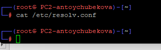{#fig-035 width=70%} 

На узле PC2 получим адрес по DHCPv6. Здесь опция -6 указывает на использование протокола DHCPv6, опция -S — на запрос только информации DHCPv6, но не адреса, опция -v — на вывод на экран подробной информации. ([рис. @fig-036]).

{#fig-036 width=70%} 

Вновь пропингуем от узла PC2 маршрутизатор, проверим настройки DNS. Мы видим имя домена и его IPv6 ([рис. @fig-037]).

{#fig-037 width=70%} 

На маршрутизаторе посмотрим статистику DHCP-сервера и выданные адреса.  ([рис. @fig-038]).

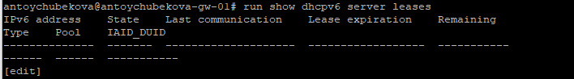{#fig-038 width=70%}

Далее просмотрим захваченный трафик. 

Пакет №14 представляет собой сетевой трафик протоколов Ethernet, IPv6, UDP и DHCPv6. Источником является устройство с MAC-адресом 00:19:15:bf:00:01 и IPv6-адресом fe80::e19:15ff:febf:1, а получателем — устройство с MAC-адресом 26:42:01:00:42:23 и IPv6-адресом fe80::e442:1ff:fe00:4223. Передача осуществляется по UDP-портам 547 (сервер) и 546 (клиент), пакет имеет длину 142 байта.

Сетевой трафик является DHCPv6-ответом (Message type: Reply), что указывает на предоставление клиенту сетевых параметров. В составе сообщения содержатся идентификаторы клиента и сервера, а также информация о DNS-серверах и доменных поисковых списках. Адресация использует локальные IPv6-адреса (link-local), что типично для обмена конфигурационными данными в пределах одной подсети.

В целом данный пакет демонстрирует стандартный процесс DHCPv6, когда сервер предоставляет клиенту необходимые сетевые настройки, включая информацию для разрешения DNS и параметры поиска доменов. ([рис. @fig-039]).

{#fig-039 width=70%}

Сетевой трафик IPv6 с использованием протокола DHCPv6. Пакет проанализирован на трёх уровнях сетевой модели.

На канальном уровне (Ethernet II) исходный MAC-адрес пакета — e6:42:01:00:42:23, а адрес назначения — IPv6 multicast (33:33:00:01:00:02). Это указывает на то, что пакет адресован всем DHCPv6-серверам в локальной сети.

На сетевом уровне (IPv6) исходный адрес пакета — fe80::e442:1ff:fe00:4223, что является link-local адресом, а адрес назначения — ff02::1:2, multicast-адрес всех DHCPv6-серверов в пределах локальной сети. Параметр Hop Limit установлен в 1, что означает, что пакет не выходит за локальный сегмент сети.

На транспортном уровне (UDP) исходный порт равен 546, что соответствует DHCPv6-клиенту, а порт назначения — 547, стандартный порт DHCPv6-сервера.

В протоколе DHCPv6 данный пакет имеет тип сообщения Information-request (11), что указывает на запрос клиентом конфигурационной информации у DHCPv6-сервера. Transaction ID равен 0x7b23c6 и служит уникальным идентификатором сессии запроса/ответа.

В целом, этот пакет представляет собой DHCPv6-запрос клиента, предназначенный для поиска доступных DHCPv6-серверов и получения параметров сетевой конфигурации IPv6. Ограничение пакета локальной сетью подтверждается как hop limit = 1, так и использованием multicast-адреса назначения.([рис. @fig-040]).

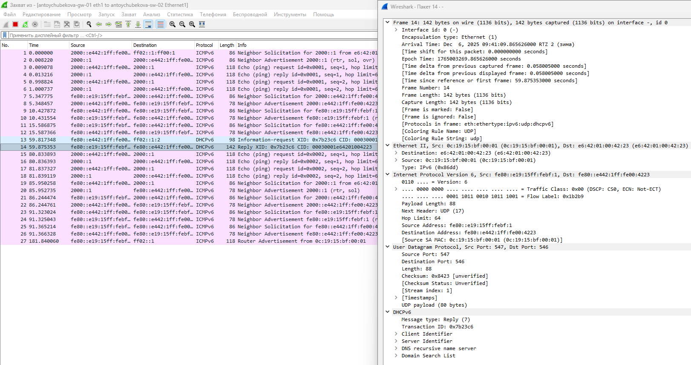{#fig-040 width=70%}

Основная часть трафика — это ICMPv6, включающая как Echo-запросы и Echo-ответы (ping), так и сообщения Neighbor Solicitation/Advertisement. Пакеты Echo используются для проверки доступности узлов в сети: узел 2000::e442:1ff:fe00… посылает запросы на адрес 2000::1, получая ответы с подтверждением активности. Параллельно несколько обменов Neighbor Solicitation/Advertisement выполняют обнаружение MAC-адресов соседних IPv6-адресов, что позволяет узлам корректно формировать таблицу соседей для локальной передачи пакетов. Присутствуют как link-local адреса (fe80::…), так и глобальные адреса (2000::…), что указывает на работу как в пределах локальной сети, так и с глобальной IPv6-подсетью.

В трафике также присутствует DHCPv6. Узел с адресом fe80::e19:15ff:febf:1 выполняет запрос типа Information-request (XID 0x7b23c6) к DHCPv6-серверу fe80::e442:1ff:fe00:4223. Сервер отвечает сообщением Reply, предоставляя клиенту параметры сетевой конфигурации, включая идентификаторы и, вероятно, информацию о DNS и доменных списках. Этот обмен происходит только в локальной сети (link-local).

Кроме того, зафиксирован Router Advertisement от узла с MAC 0c:19:15:bf:00:01, который информирует сеть о наличии маршрутизатора и предоставляет информацию для настройки IPv6-адресов у клиентов.

В целом, трафик демонстрирует стандартную работу сети IPv6 с локальной настройкой адресов, обменом конфигурационными параметрами через DHCPv6, обнаружением соседей и проверкой доступности узлов через ICMPv6. Это типичная последовательность сетевых событий при инициализации и поддержании корректной работы IPv6-сети. ([рис. @fig-041]).

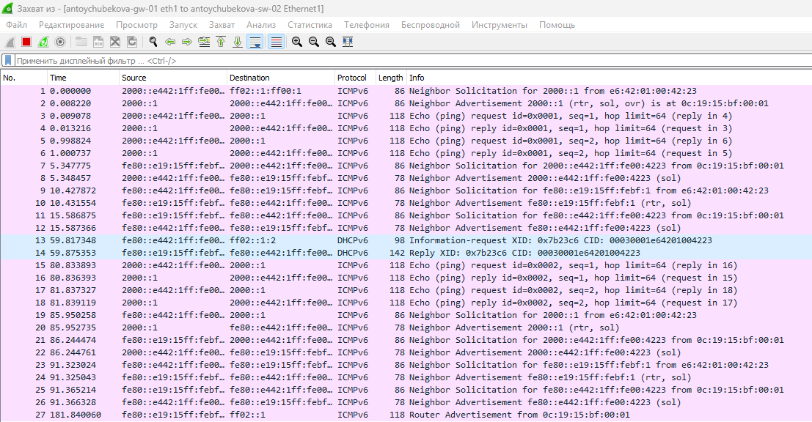{#fig-041 width=70%}

На маршрутизаторе настроим DHCPv6 с отслеживанием состояния. На интерфейсе eth2  маршрутизатора настроим объявления о маршрутизаторах. Опция managed-flag означает, что хосты использует администрируемый (отслеживающий состояние) протокол для автоматической настройки адресов в дополнение к любым адресам, автоматически настраиваемым
с помощью SLAAC. ([рис. @fig-042]).

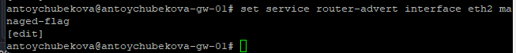{#fig-042 width=70%}

Добавим конфигурацию DHCP-сервера на маршрутизаторе. Создаем разделяемая сеть
(shared-network-name) с названием username, подсеть (subnet) с адресом 2001::/64, задаем диапазон адресов (range) с именем hosts, содержащий адреса 2001::100 – 2001::199. 

На маршрутизаторе посмотрим статистику DHCP-сервера и выданные адреса. ([рис. @fig-044]).

{#fig-044 width=70%}

Подключимся к узлу PC3 и проверим настройки сети. На PC3-antoychubekova настроены следующие сетевые параметры:

Система имеет два активных сетевых интерфейса eth0 и ethl, оба с включенной поддержкой IPv6 и link-local адресами:

eth0: fe80::28b5:2fff:fe9a:7c29, MAC 2a:b5:2f:9a:7c:29, передано 14 пакетов, получено 13 пакетов.

ethl: fe80::ccbf:9bff:fe9b:2b9d, MAC ce:bf:9b:9b:2b:9d, трафика пока нет.

Локальный интерфейс lo настроен с IPv4 127.0.0.1 и IPv6 ::1 для loopback-трафика.

Таблица маршрутизации IPv6 показывает:

Link-local подсети fe80::/64 доступны напрямую через соответствующие интерфейсы.

Шлюз по умолчанию (::/0) установлен через адрес fe80::e19:15ff:febf:2.

Мультикаст-сети ff00::/8 маршрутизируются через все интерфейсы.  ([рис. @fig-045] и [рис. @fig-046]).

{#fig-045 width=70%}

{#fig-046 width=70%}

На узле PC3 проверим настройки DNS. ([рис. @fig-047]).

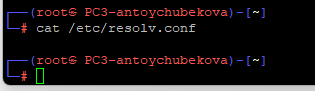{#fig-047 width=70%}

На узле PC3 получите адрес по DHCPv. ([рис. @fig-048]).

{#fig-048 width=70%}

Вновь на узле PC3 проверим настройки сети ([рис. @fig-049] и [рис. @fig-050]), пропингуем маршрутизатор, проверьте настройки DNS. ([рис. @fig-052] и [рис. @fig-052]).

{#fig-049 width=70%}

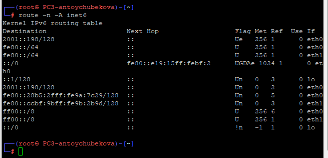{#fig-050 width=70%}

{#fig-051 width=70%}

{#fig-052 width=70%}

На маршрутизаторе посмотриv статистику DHCP-сервера и выданные адреса. ([рис. @fig-053]).

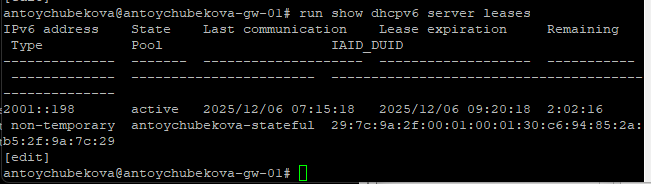{#fig-053 width=70%}

Мы видим, что показаны текущие аренды IPv6-адресов, выданные DHCPv6-сервером на устройстве antoychubekova-gw-01.

Сервер выдал адрес 2001::198 с типом аренды non-temporary, что соответствует постоянной (stateful) конфигурации, при которой клиент получает конкретный IPv6-адрес на ограниченный срок. Последняя связь с клиентом была 06 декабря 2025 года в 07:15:18, срок действия аренды истекает 06 декабря 2025 года в 09:20:18, оставшееся время аренды — 2 часа 2 минуты 16 секунд.

Аренда относится к пулу antoychubekova-stateful, идентификатор интерфейса клиента (IAID) — 29:7c:9a:2f:00:01:00:01:30:c6:94:85:2a:b5:2f:9a:7c:29, а DUID клиента полностью указан. Это показывает, что DHCPv6 настроен для выдачи статических IPv6-адресов в рамках заданного пула и поддерживает отслеживание состояния аренды для каждого клиента.

Далее посмотри захваченный трафик по DHCPv6.  ([рис. @fig-054]).

{#fig-054 width=70%}

Тут показан процесс DHCPv6 конфигурации IPv6-адреса и сопутствующие сетевые сообщения.

Узел с адресом fe80::28b5:2fff:fe9a:7c29 посылает DHCPv6 Solicit (XID: 0x44f173) на multicast-адрес всех DHCPv6-серверов ff02::1:2, запрашивая сетевую конфигурацию. Сервер с адресом fe80::e19:15ff:febf… отвечает сообщением Advertise, предлагая клиенту аренду IPv6-адреса 2001::198. Клиент подтверждает получение адреса через Request, на что сервер отвечает Reply, окончательно назначая адрес.

Дополнительно видны ICMPv6 Router Advertisement и Multicast Listener Report v2, которые обеспечивают оповещение о наличии маршрутизатора и участие клиента в управлении мультикаст-группами.

# Выводы

В ходе выполнения лабораторной работы №7 я получила навыки настройки службы DHCP на сетевом оборудовании для распределения адресов IPv4 и IPv6.
