---
## Author
author:
  name: Тойчубекова Асель Нурлановна
  degrees: DSc
  orcid: 0000-0002-0877-7063
  email: kulyabov-ds@rudn.ru
  affiliation:
    - name: Российский университет дружбы народов
      country: Российская Федерация
      postal-code: 117198
      city: Москва
      address: ул. Миклухо-Маклая, д. 6
## Title
title: Сеетевые технологии
subtitle: Лабораторная работа №8
license: CC BY
date: today
date-format: "YYYY-MM-DD" # Example: 2025-09-06
---

# Информация

## Докладчик

:::::::::::::: {.columns align=center}
::: {.column width="70%"}

  * Тойчубекова Асель Нурлановна
  * Студент 3 курса
  * факультет физико-математических и естественных наук
  * Российский университет дружбы народов им. П. Лумумбы
  * [1032235033@rudn.ru](1032235033@rudn.ru)

:::
::: {.column width="30%"}

:::
::::::::::::::

# Цель работы

## Цель работы

Целью данной лабораторной работы является изучение принципов маршрутизации в IPv4- и IPv6-сетях и принципов настройки сетевого оборудования.

# Задание

## Задание

1. Требуется настроить динамическую маршрутизацию по протоколам RIP OSPF.

2. Требуется организовать туннель IPv6 поверх IPv4, позволяющий передавать данные из одной IPv6-сети в другую IPv6-сеть через сеть IPv4.

3. Выполнить задание для самостоятельного выполнения.

# Теоретическое введение

## Теоретическое введение

При организации сетей передачи данных важную роль играет корректное понимание функций и различий между устройствами DTE (Data Terminal Equipment) и DCE (Data Circuit-terminating Equipment), а также принципов синхронизации и правил планирования сетевой инфраструктуры.

Оконечное оборудование данных (DTE) представляет собой устройства, обеспечивающие интерфейс с пользователем и выполняющие прикладные программы. К ним относятся персональные компьютеры, терминалы, сетевые узлы, которые формируют и обрабатывают информационные потоки. Оконечное оборудование канала данных (DCE) служит для подключения DTE к каналам связи, обеспечивая преобразование, усиление и передачу сигналов. В современных сетях маршрутизаторы с последовательными интерфейсами могут выполнять функции как DTE, так и DCE, поэтому корректнее говорить о типе интерфейса, а не устройства.

## Теоретическое введение

Важным аспектом является организация сигнальных цепей. Для интерфейсов типа DTE передающий сигнал TxD является выходным, а принимающий RxD — входным; для DCE — наоборот. Это определяет особенности соединения устройств: при связке DTE–DCE сигналы соединяются напрямую, а при соединениях однотипных устройств — перекрёстно.

Режимы передачи могут быть асинхронными и синхронными. В асинхронном режиме синхронизация обеспечивается старт-битами, тогда как в синхронном используется внешняя синхронизация с отдельными сигналами для передачи и приёма данных (ST и RT). Источником синхронизации обычно выступает устройство DCE, однако возможны различные варианты организации синхросигналов, включая использование сигнала TT и компенсацию фазовых перекосов.

## Теоретическое введение

Наряду с вопросами интерфейсов и синхронизации ключевым этапом построения сетевой инфраструктуры является её планирование и документирование. Проектирование сети предполагает разработку схем трёх уровней модели OSI: физического (L1), канального (L2) и сетевого (L3). Необходимо определить топологию подключения, структуру VLAN, схему адресации и план назначения интерфейсов. Чёткое и детализированное документирование обеспечивает корректную эксплуатацию сети, упрощает администрирование и позволяет эффективно решать задачи модернизации и диагностики.

# Выполнение лабораторной работы

## Настройка динамической маршрутизации в сетях IPv4 и IPv6

У нас задана сеть, адреса сегментов сети, адреса, назначаемые интерфейсам устройств. 

{width=50%}

## Настройка динамической маршрутизации в сетях IPv4 и IPv6

{width=50%}

## Настройка динамической маршрутизации в сетях IPv4 и IPv6

{width=50%}

## Настройка динамической маршрутизации в сетях IPv4 и IPv6

Изобразим схематично моделируемую сеть. Построим схемы L1 и L3. 

{width=50%}

## Настройка динамической маршрутизации в сетях IPv4 и IPv6

{width=50%}

## Настройка динамической маршрутизации в сетях IPv4 и IPv6

Запустим GNS3 VM и GNS3. Создадим новый проект. В рабочем пространстве разместим и соедините устройства в соответствии с топологией, указанной в лабораторной работе. Используем маршрутизаторы FRR. Измените отображаемые названия устройств.
Включим захват трафика на соединении между коммутатором sw-01 и маршрутизатором gw-01, а также между коммутатором sw-02 и маршрутизатором gw-03.

## Настройка динамической маршрутизации в сетях IPv4 и IPv6

Присвоим IPv4-адреса оконечным устройствам PC1 и PC2  

{width=50%}

## Настройка динамической маршрутизации в сетях IPv4 и IPv6

{width=50%}

## Настройка динамической маршрутизации в сетях IPv4 и IPv6

Настроим IPv4-адреса на интерфейсах маршрутизаторов. 

msk-antoychubekova-gw-01.  

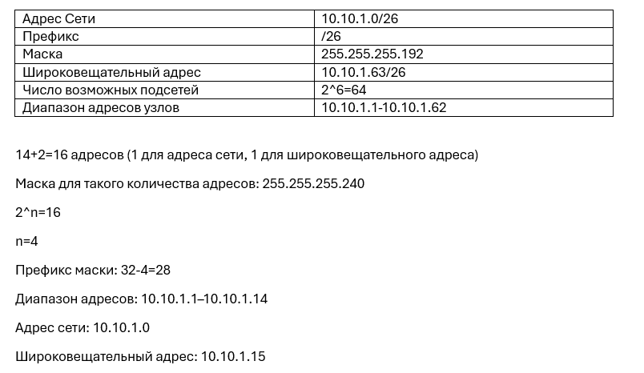{width=50%}

## Настройка динамической маршрутизации в сетях IPv4 и IPv6

msk-antoychubekova-gw-02. 

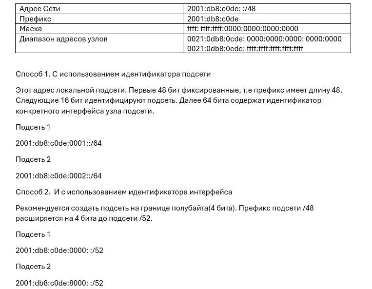{width=50%}

## Настройка динамической маршрутизации в сетях IPv4 и IPv6

msk-antoychubekova-gw-03. 

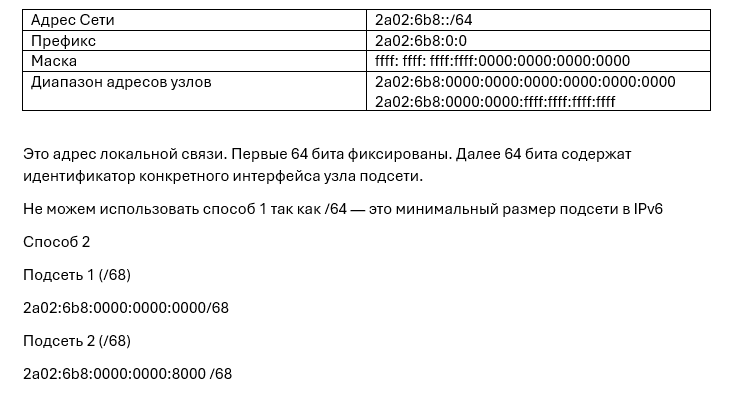{width=50%}

## Настройка динамической маршрутизации в сетях IPv4 и IPv6

msk-antoychubekova-gw-04. 

{width=50%}

## Настройка динамической маршрутизации в сетях IPv4 и IPv6

Присвоим IPv6-адреса оконечным устройствам PC1 и PC2. 

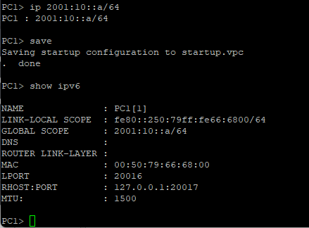{width=50%}

## Настройка динамической маршрутизации в сетях IPv4 и IPv6

{width=50%}

## Настройка динамической маршрутизации в сетях IPv4 и IPv6

Настроим IPv6-адреса на интерфейсах маршрутизаторов. 

msk-antoychubekova-gw-01. 

{width=50%}

## Настройка динамической маршрутизации в сетях IPv4 и IPv6

msk-antoychubekova-gw-02. 

{width=50%}

## Настройка динамической маршрутизации в сетях IPv4 и IPv6

msk-antoychubekova-gw-03. 

{width=50%}

## Настройка динамической маршрутизации в сетях IPv4 и IPv6

{width=50%}

## Настройка динамической маршрутизации в сетях IPv4 и IPv6

msk-antoychubekova-gw-04.  

{width=50%}

## Настройка динамической маршрутизации в сетях IPv4 и IPv6

RIP — это дистанционно-векторный протокол динамической маршрутизации, который использует в качестве метрики количество переходов (hops). Максимальная длина маршрута — 15 переходов, при 16 маршрут считается недоступным. По умолчанию маршруты обновляются каждые 30 секунд; если обновления не поступают 180 секунд — маршрут становится неактивным, а через 240 секунд удаляется.

RIPv1 — поддерживает только IPv4, не передает маску сети (классовая маршрутизация).
RIPv2 — улучшенная версия для IPv4, использует многоадресную рассылку 224.0.0.9 и передает маску (CIDR).
RIPng — версия для IPv6, использует multicast-адрес FF02::9. Маршрутизация включается на уровне интерфейсов, каждый RIPng-процесс имеет локальное имя и может быть несколько процессов на одном маршрутизаторе.

## Настройка динамической маршрутизации в сетях IPv4 и IPv6

На маршрутизаторах настроим RIP в качестве протокола динамической маршрутизации. 

msk-antoychubekova-gw-01. 

{width=50%}

## Настройка динамической маршрутизации в сетях IPv4 и IPv6

msk-antoychubekova-gw-02.   

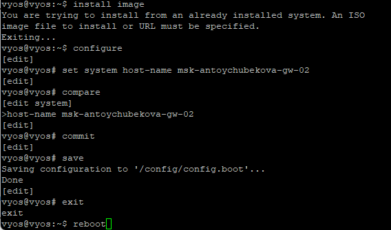{width=50%}

## Настройка динамической маршрутизации в сетях IPv4 и IPv6

msk-antoychubekova-gw-03. 

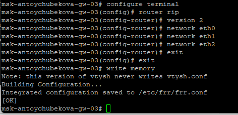{width=50%}

## Настройка динамической маршрутизации в сетях IPv4 и IPv6

msk-antoychubekova-gw-04. 

{width=50%}

## Настройка динамической маршрутизации в сетях IPv4 и IPv6

Убедимся, что маршрутизация по RIP настроена. 

msk-antoychubekova-gw-01.  

{width=50%}

## Настройка динамической маршрутизации в сетях IPv4 и IPv6

msk-antoychubekova-gw-02.

{width=50%}

## Настройка динамической маршрутизации в сетях IPv4 и IPv6

msk-antoychubekova-gw-03. 

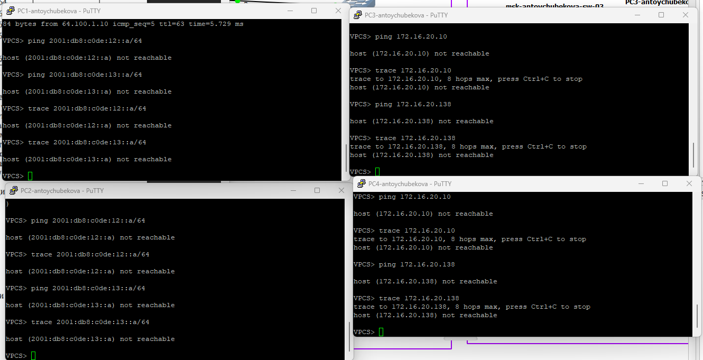{width=50%}

## Настройка динамической маршрутизации в сетях IPv4 и IPv6

msk-antoychubekova-gw-04. 

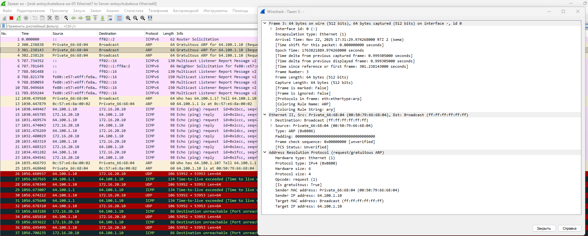{width=50%}

## Настройка динамической маршрутизации в сетях IPv4 и IPv6

Проверим пути прохождения пакетов. С PC1 пропингуем PC2 и определим путь следования пакетов. Мы видим, что у нас все успешно пингуется.   

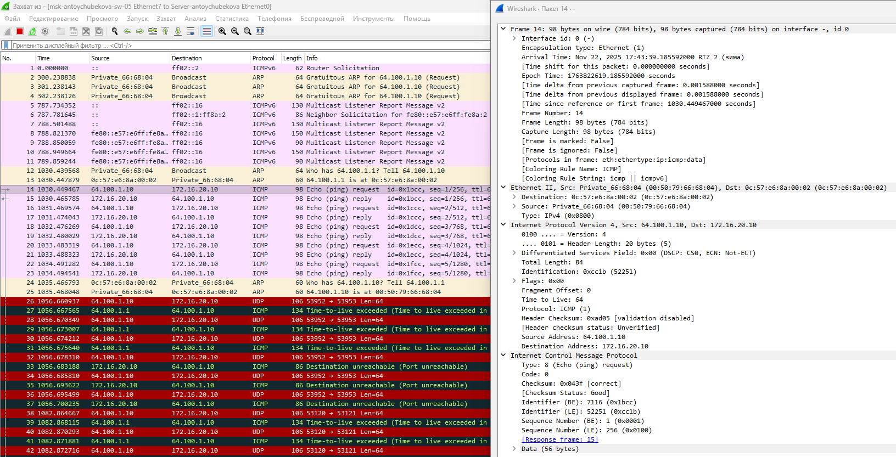{width=50%}

## Настройка динамической маршрутизации в сетях IPv4 и IPv6

Проверим метрики протокола RIP. В таблице видны как подключённые сети (C), так и изученные по RIP (R) маршруты. Указаны сети 10.0.1.0/24, 10.0.4.0/24 и 10.0.10.0/24 как напрямую подключённые, метрика — 1. Сети 10.0.2.0/24, 10.0.3.0/24 и 10.0.11.0/24 получены по RIP от соседних маршрутизаторов через следующий хоп 10.0.1.2 с метрикой 2–3. В колонке Time показано время с последнего обновления. Это подтверждает, что динамическая маршрутизация RIP настроена корректно и маршрутизатор успешно обменивается маршрутами с соседями. 

## Настройка динамической маршрутизации в сетях IPv4 и IPv6

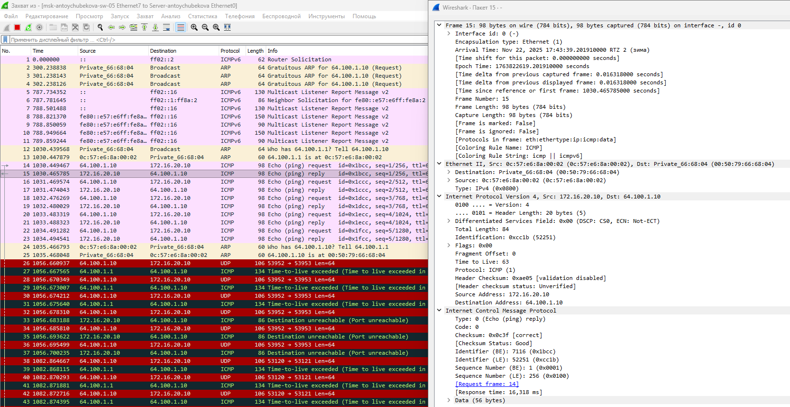{width=50%}

## Настройка динамической маршрутизации в сетях IPv4 и IPv6

Предположим, что пакет проходит через маршрутизатор msk-antoychubekova-gw-02. Отключим на маршрутизаторе msk-antoychubekova-gw-02 интерфейс.  

{width=50%}

## Настройка динамической маршрутизации в сетях IPv4 и IPv6

Проверим метрики протокола RIP. Мы видим, что в предыдущем выводе сети 10.0.2.0/24, 10.0.3.0/24 и 10.0.11.0/24 приходили на gw-01 через 10.0.1.2 (сосед gw-02). В новом выводе эти же маршруты теперь получаются через 10.0.4.1 (сосед gw-04). Метрики (2–3) при этом сохранились, обновилось только время получения маршрутов (таймеры).   

{width=50%}

## Настройка динамической маршрутизации в сетях IPv4 и IPv6

С PC1 пропингуйте PC2 и определим путь следования пакетов. Примерное время, за которое восстановится маршрут.  

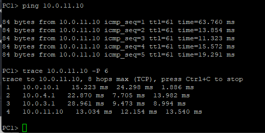{width=50%}

## Настройка динамической маршрутизации в сетях IPv4 и IPv6

Включим на маршрутизаторе msk-antoychubekova-gw-02 интерфейс. 

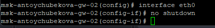{width=50%}

## Настройка динамической маршрутизации в сетях IPv4 и IPv6

С PC1 пропингуйте PC2 и определим путь следования пакетов.

{width=50%}

## Настройка динамической маршрутизации в сетях IPv4 и IPv6

Просмотрим захваченный трафик.

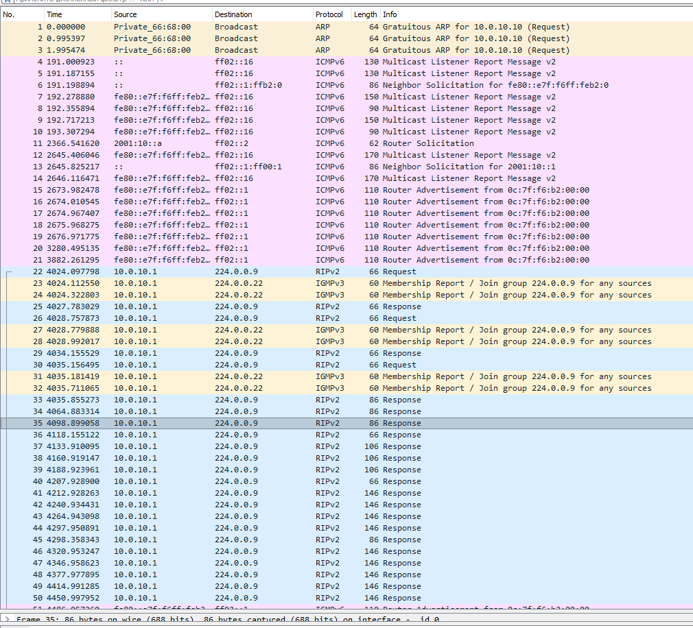{width=50%}

## Настройка динамической маршрутизации в сетях IPv4 и IPv6

{width=50%}

## Настройка динамической маршрутизации в сетях IPv4 и IPv6

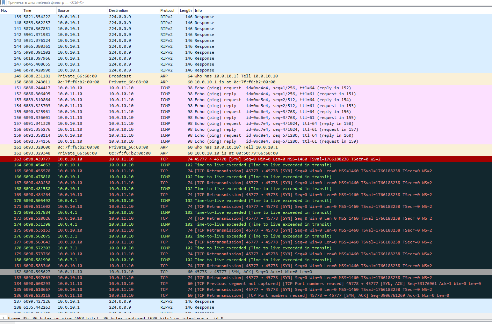{width=50%}

## Настройка динамической маршрутизации в сетях IPv4 и IPv6

{width=50%}

## Настройка динамической маршрутизации в сетях IPv4 и IPv6

{width=50%}

## Настройка динамической маршрутизации в сетях IPv4 и IPv6

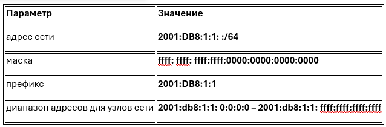{width=50%}

## Настройка динамической маршрутизации в сетях IPv4 и IPv6

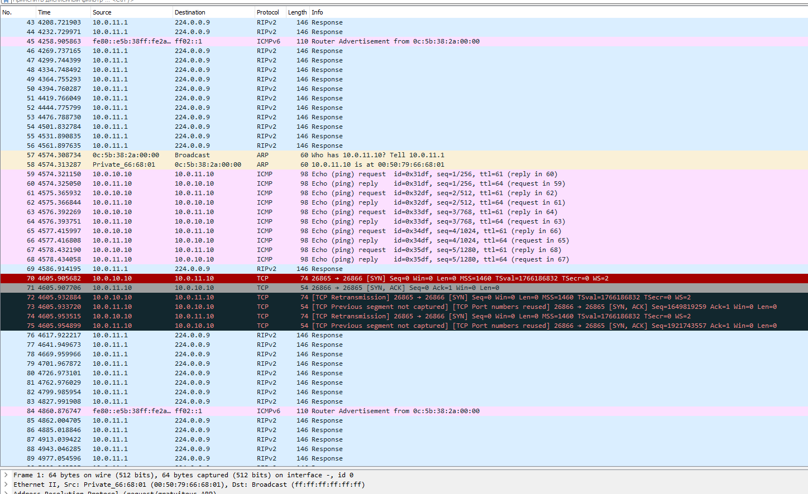{width=50%}

## Настройка динамической маршрутизации в сетях IPv4 и IPv6

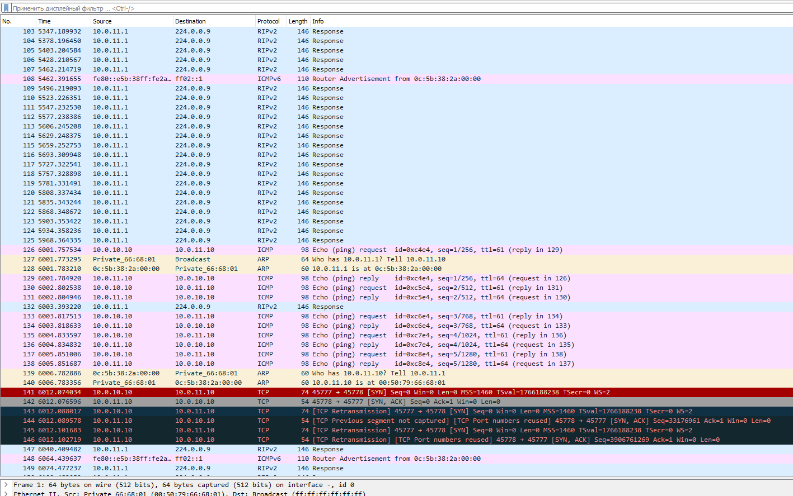{width=50%}

## Настройка динамической маршрутизации в сетях IPv4 и IPv6

{width=50%}

## Настройка динамической маршрутизации в сетях IPv4 и IPv6

На маршрутизаторах настроим RIPng для сетей IPv6. 

msk-antoychubekova-gw-01.  

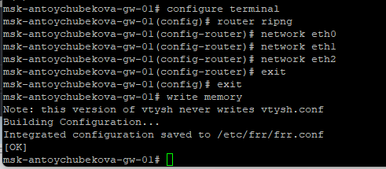{width=50%}

## Настройка динамической маршрутизации в сетях IPv4 и IPv6

msk-antoychubekova-gw-02.  

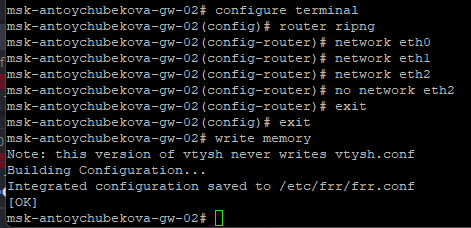{width=50%}

## Настройка динамической маршрутизации в сетях IPv4 и IPv6

msk-antoychubekova-gw-03.  

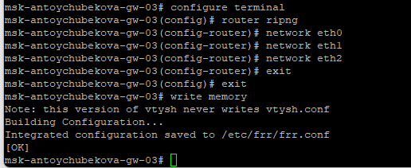{width=50%}

## Настройка динамической маршрутизации в сетях IPv4 и IPv6

msk-antoychubekova-gw-04. 

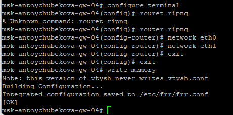{width=50%}

## Настройка динамической маршрутизации в сетях IPv4 и IPv6

Проверим пути прохождения пакетов. С PC1 пропингуем PC2 и определим путь следования пакетов. 

{width=50%}

## Настройка динамической маршрутизации в сетях IPv4 и IPv6

Проверим метрики протокола RIPng. Мы видим, что маршрутизатор имеет несколько подключённых (C) IPv6-сетей (2001:1::/64, 2001:4::/64, 2001:11::/64), а также обученные по RIPng (R) маршруты к удалённым подсетям (2001:2::/64, 2001:3::/64, 2001:6::/64, 2001:7::/64). Для удалённых сетей указаны следующие параметры:
— Next Hop — link-local адрес соседнего маршрутизатора;
— Via — интерфейс получения маршрута (eth1, eth2);
— Metric — стоимость маршрута;
— Time — время с момента последнего обновления.

## Настройка динамической маршрутизации в сетях IPv4 и IPv6

{width=50%}

## Настройка динамической маршрутизации в сетях IPv4 и IPv6

Предположим, что пакет проходит через маршрутизатор msk-antoychubekova-gw-02. Отключим на маршрутизаторе msk-antoychubekova-gw-02 интерфейс.   

{width=50%}

## Настройка динамической маршрутизации в сетях IPv4 и IPv6

Проверим метрики протокола RIPng. Мы видим, что по сравнению с предыдущим выводом изменились маршруты, полученные по RIPng и их параметры:

Для сетей 2001:2::/64 и 2001:3::/64 теперь next-hop идёт через другой соседний маршрутизатор
fe80::e36:caff:fea9:1 и интерфейс eth2 (раньше был другой link-local или интерфейс).

Изменились метрики маршрутов (стали 2 и 3), что говорит о том, что путь до них теперь рассчитывается иначе (возможно, изменился топология/доступность соседей).

Время (Time) обновилось — маршруты продолжают регулярно приниматься. 

## Настройка динамической маршрутизации в сетях IPv4 и IPv6

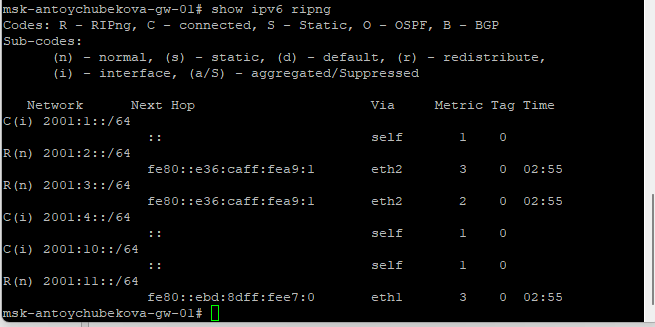{width=50%}

## Настройка динамической маршрутизации в сетях IPv4 и IPv6

С PC1 пропингуем PC2 и определим путь следования пакетов. Мы видим, что пакеты теперь идут по gw-04. Примерное время, за которое восстановливается маршрут равно 1 минуте.  

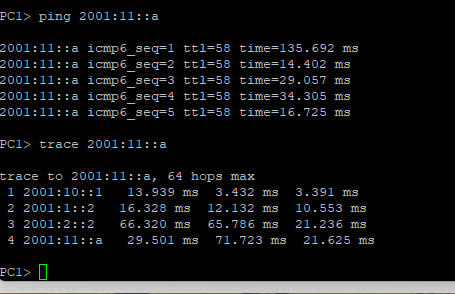{width=50%}

## Настройка динамической маршрутизации в сетях IPv4 и IPv6

Просмотрим захваченный трафик.

{width=50%}

## Настройка динамической маршрутизации в сетях IPv4 и IPv6

{width=50%}

## Настройка динамической маршрутизации в сетях IPv4 и IPv6

{width=50%}

## Настройка динамической маршрутизации в сетях IPv4 и IPv6

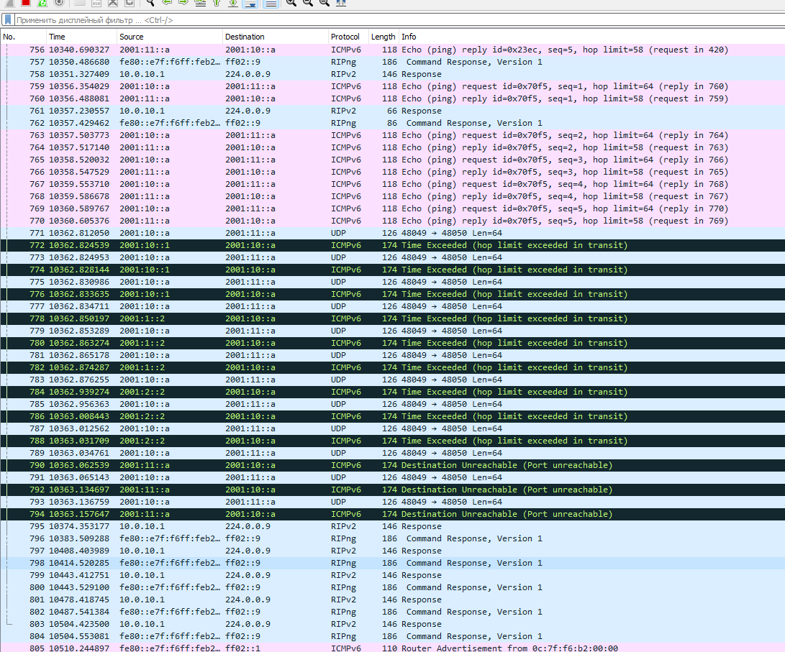{width=50%}

## Настройка динамической маршрутизации в сетях IPv4 и IPv6

{width=50%}

## Настройка динамической маршрутизации в сетях IPv4 и IPv6

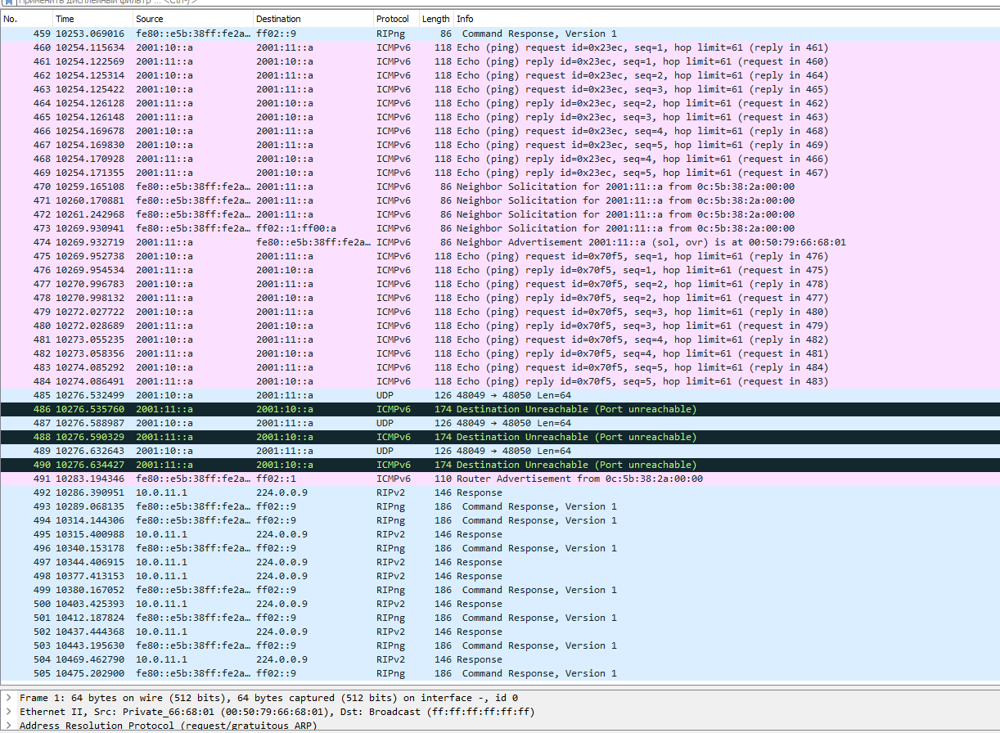{width=50%}

## Настройка динамической маршрутизации в сетях IPv4 и IPv6

OSPF — протокол динамической маршрутизации на основе состояния каналов. Поддерживает IPv4 (OSPFv2) и IPv6 (OSPFv3), работает на оборудовании разных производителей, поддерживает бесклассовую маршрутизацию, балансировку нагрузки и суммирование маршрутов. Метрика — стоимость, зависящая от скорости интерфейса, административное расстояние — 110.

Маршрутизаторы обмениваются Hello-пакетами (224.0.0.5 / FF02::5) для автоматического обнаружения соседей и формирования отношений соседства. OSPF использует три таблицы: соседей, топологии и маршрутизации. Передача обновлений ведётся по принципу SPF-алгоритма, который рассчитывает кратчайшие пути.

Сеть разделяется на области (area) для уменьшения таблиц и ускорения сходимости. Главная — область 0. Маршрутизаторы с несколькими областями — ABR, маршрутизаторы, соединяющие разные протоколы — ASBR. Для IPv6 используется OSPFv3, применяющий групповые адреса FF02::5 и FF02::6.

## Настройка динамической маршрутизации в сетях IPv4 и IPv6

На маршрутизаторах настроим OSPFv2 для сетей IPv4. 

msk-antoychubekova-gw-01.

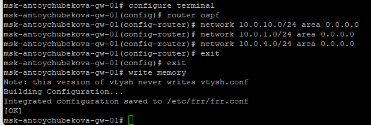{width=50%}

## Настройка динамической маршрутизации в сетях IPv4 и IPv6

msk-antoychubekova-gw-02.

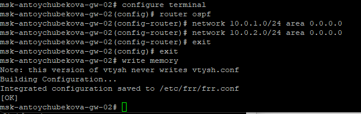{width=50%}

## Настройка динамической маршрутизации в сетях IPv4 и IPv6

msk-antoychubekova-gw-03.   

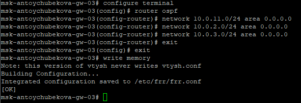{width=50%}

## Настройка динамической маршрутизации в сетях IPv4 и IPv6

msk-antoychubekova-gw-04. 

{width=50%}

## Настройка динамической маршрутизации в сетях IPv4 и IPv6

 C PC1 пропингуем PC2 и определим путь следования пакетов.  

{width=50%}

## Настройка динамической маршрутизации в сетях IPv4 и IPv6

Проверим таблицу маршрутизации протокола OSPFv2.  

{width=50%}

## Настройка динамической маршрутизации в сетях IPv4 и IPv6

Предположим, что пакет проходит через маршрутизатор msk-antoychubekova-gw-02. Отключим на маршрутизаторе msk-antoychubekova-gw-02 интерфейс.  

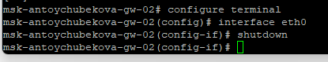{width=50%}

## Настройка динамической маршрутизации в сетях IPv4 и IPv6

Проверим таблицу маршрутизации протокола OSPFv2.  

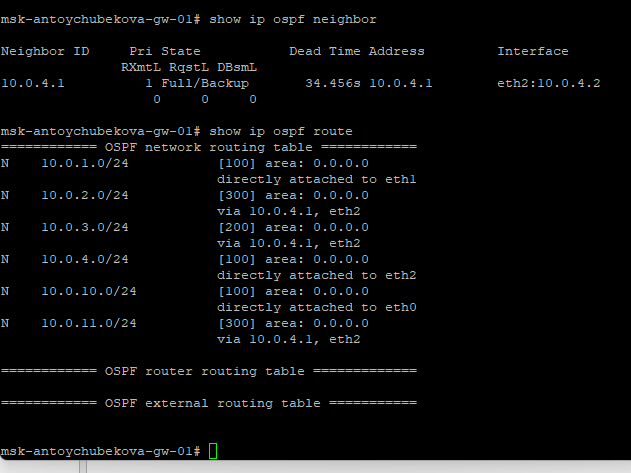{width=50%}

## Настройка динамической маршрутизации в сетях IPv4 и IPv6

С PC1 пропингуйте PC2 и определим путь следования пакетов. Примерное время, за которое восстановится маршрут равняется 1 минуте. 

{width=50%}

## Настройка динамической маршрутизации в сетях IPv4 и IPv6

Включим на маршрутизаторе msk-antoychubekova-gw-02 интерфейс.   

{width=50%}

## Настройка динамической маршрутизации в сетях IPv4 и IPv6

С PC1 пропингуйте PC2 и определим путь следования пакетов.

{width=50%}

## Настройка динамической маршрутизации в сетях IPv4 и IPv6

Просмотрим захваченный трафик. 

{width=50%}

## Настройка динамической маршрутизации в сетях IPv4 и IPv6

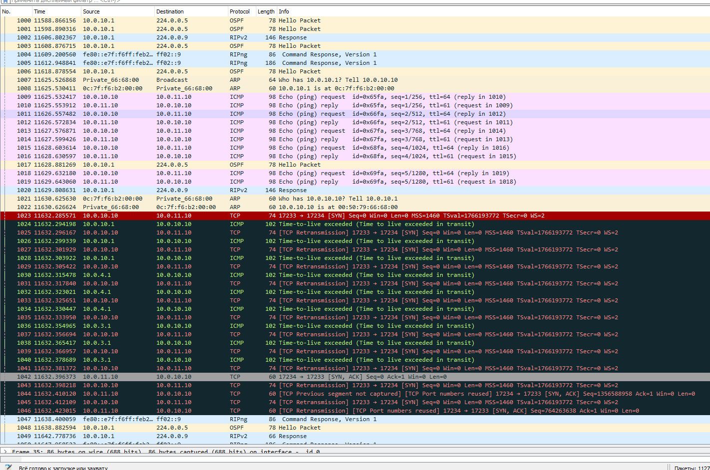{width=50%}

## Настройка динамической маршрутизации в сетях IPv4 и IPv6

{width=50%}

## Настройка динамической маршрутизации в сетях IPv4 и IPv6

{width=50%}

## Настройка динамической маршрутизации в сетях IPv4 и IPv6

На маршрутизаторах настроим OSPFv3 для сетей IPv6.

msk-antoychubekova-gw-01.  

{width=50%}

## Настройка динамической маршрутизации в сетях IPv4 и IPv6

msk-antoychubekova-gw-02.   

{width=50%}

## Настройка динамической маршрутизации в сетях IPv4 и IPv6

msk-antoychubekova-gw-03.  

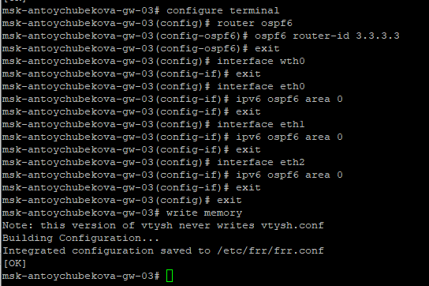{width=50%}

## Настройка динамической маршрутизации в сетях IPv4 и IPv6

msk-antoychubekova-gw-04.   

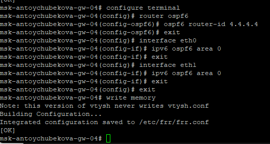{width=50%}

## Настройка динамической маршрутизации в сетях IPv4 и IPv6

С PC1 пропингуем PC2 и определим путь следования пакетов.  

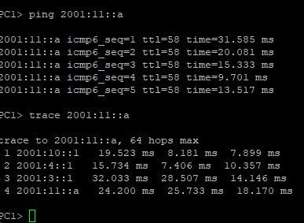{width=50%}

## Настройка динамической маршрутизации в сетях IPv4 и IPv6

Проверим таблицу маршрутизации протокола OSPFv3.  

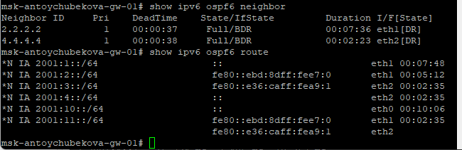{width=50%}

## Настройка динамической маршрутизации в сетях IPv4 и IPv6

Предположим, что пакет проходит через маршрутизатор msk-antoychubekova-gw-02. Отключим на маршрутизаторе msk-antoychubekova-gw-02 интерфейс.   

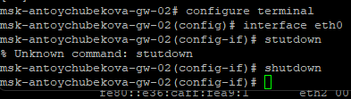{width=50%}

## Настройка динамической маршрутизации в сетях IPv4 и IPv6

Проверим таблицу маршрутизации протокола OSPFv3.

{width=50%}

## Настройка динамической маршрутизации в сетях IPv4 и IPv6

С PC1 пропингуем PC2 и определим путь следования пакетов. Примерное время, за которое восстановится маршрут равно минуте.  

{width=50%}

## Настройка динамической маршрутизации в сетях IPv4 и IPv6

Включим на маршрутизаторе msk-antoychubekova-gw-02 интерфейс. 

{width=50%}

## Настройка динамической маршрутизации в сетях IPv4 и IPv6

С PC1 пропингуем PC2 и определим путь следования пакетов. 

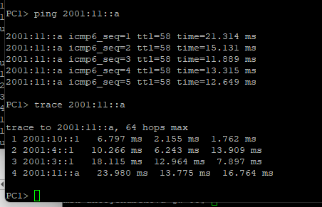{width=50%}

## Настройка динамической маршрутизации в сетях IPv4 и IPv6

Просмотрим захваченный трафик.  

{width=50%}

## Настройка динамической маршрутизации в сетях IPv4 и IPv6

{width=50%}

## Настройка динамической маршрутизации в сетях IPv4 и IPv6

{width=50%}

## Настройка динамической маршрутизации в сетях IPv4 и IPv6

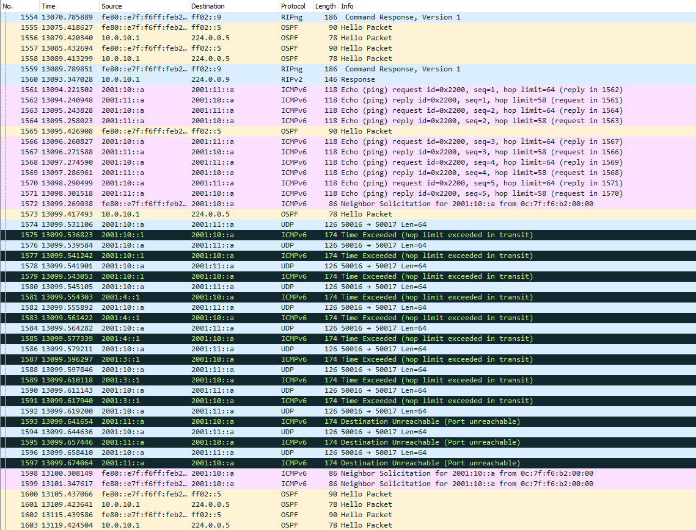{width=50%}

## Построение туннеля IPv6–IPv4

Создадим новый проект в GNS3. В рабочем пространстве разместим и соединим устройства в соответствии с топологией, приведенной в лабораторной работе. Используем маршрутизаторы VyOS. Изменим отображаемые названия устройств. На соединении между первым и третьим маршрутизаторами подключим анализатор трафика.

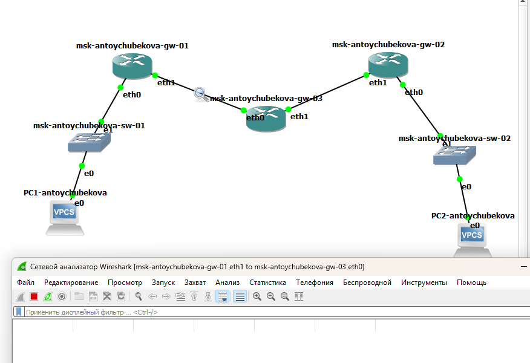{width=50%}

## Построение туннеля IPv6–IPv4

Присвойте адреса оконечным устройствам PC1 и PC2

{width=50%}

## Построение туннеля IPv6–IPv4

{width=50%}

## Построение туннеля IPv6–IPv4

Установим систему на маршрутизаторы VyOS. На маршрутизаторах перейдем в режим конфигурирования, изменим имя каждого устройства.

{width=50%}

## Построение туннеля IPv6–IPv4

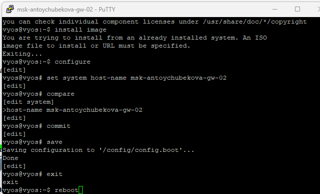{width=50%}

## Построение туннеля IPv6–IPv4

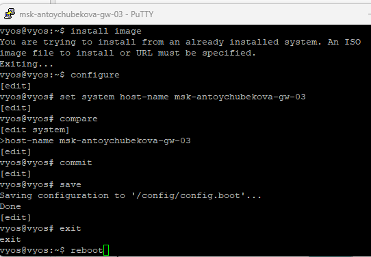{width=50%}

## Построение туннеля IPv6–IPv4

Настроим адреса на интерфейсах маршрутизаторов. 

msk-antoychubekova-gw-01.  

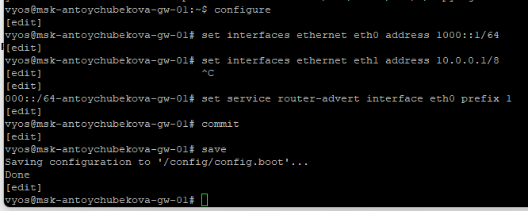{width=50%}

## Построение туннеля IPv6–IPv4

msk-antoychubekova-gw-02. 

{width=50%}

## Построение туннеля IPv6–IPv4

msk-antoychubekova-gw-03.  

{width=50%}

## Построение туннеля IPv6–IPv4

Убедимся, что на PC появились адреса ближайших к ним маршрутизаторов.   

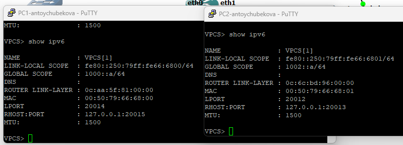{width=50%}

## Построение туннеля IPv6–IPv4

Проверим маршруты с маршрутизатора R1. Мы видим, что пингуется только первый адрес.   

{width=50%}

## Построение туннеля IPv6–IPv4

Просмотрим анализ трафика. 

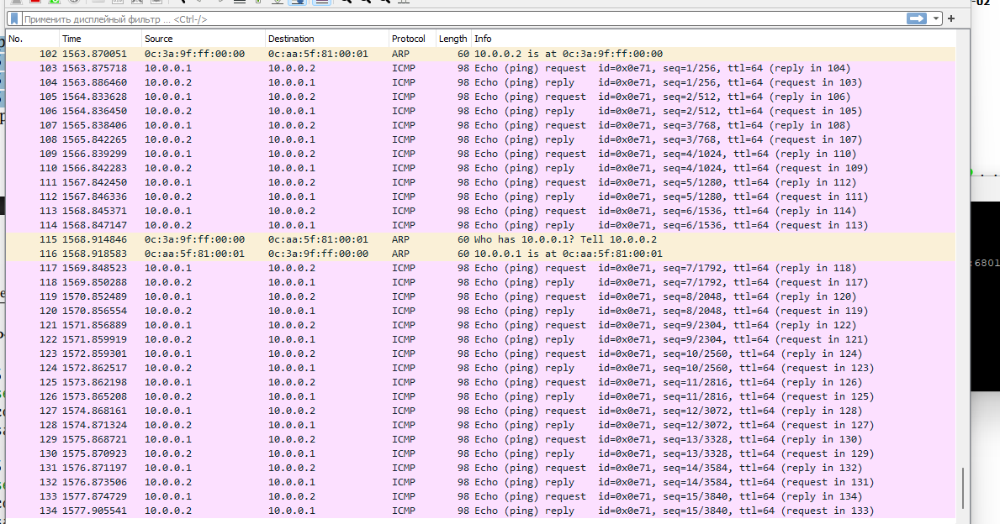{width=50%}

## Построение туннеля IPv6–IPv4

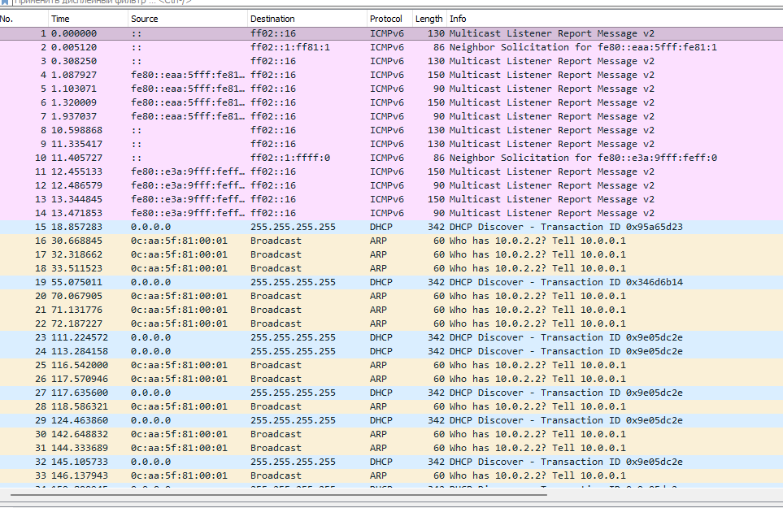{width=50%}

## Построение туннеля IPv6–IPv4

Настроим маршрутизацию IPv4. 

msk-antoychubekova-gw-01. 

{width=50%}

## Построение туннеля IPv6–IPv4

msk-antoychubekova-gw-02.  

{width=50%}

## Построение туннеля IPv6–IPv4

msk-antoychubekova-gw-03.   

{width=50%}

## Построение туннеля IPv6–IPv4

Проверим маршруты. Мы видим, что все адреса пингуются.  

{width=50%}

## Построение туннеля IPv6–IPv4

Просмотрим анализ трафика. 

{width=50%}

## Построение туннеля IPv6–IPv4

{width=50%}

## Построение туннеля IPv6–IPv4

Создадим туннель IPv6 через сеть IPv4. 

msk-antoychubekova-gw-01. 

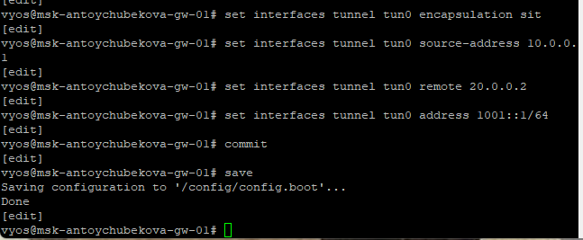{width=50%}

## Построение туннеля IPv6–IPv4

msk-antoychubekova-gw-02.  

{width=50%}

## Построение туннеля IPv6–IPv4

Настроим статическую маршрутизацию IPv6. 

msk-antoychubekova-gw-01. 

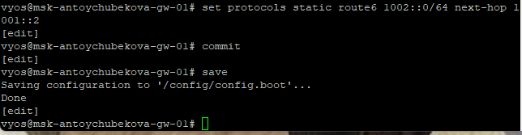{width=50%}

## Построение туннеля IPv6–IPv4

msk-antoychubekova-gw-02.

{width=50%}

## Построение туннеля IPv6–IPv4

Проверим доступность оконечных устройств. Мы видим, что все корректно обрабатывается.  

{width=50%}

## Построение туннеля IPv6–IPv4

{width=50%}

## Построение туннеля IPv6–IPv4

Просмотрим анализ трафика.  

{width=50%}

## Построение туннеля IPv6–IPv4

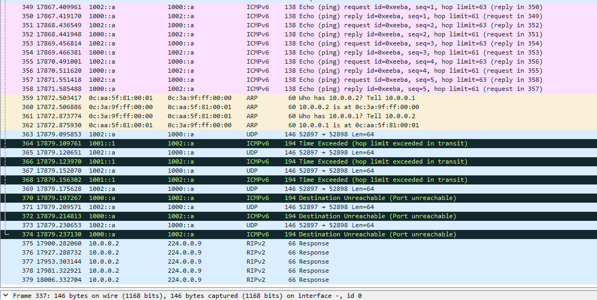{width=50%}

## Построение туннеля IPv6–IPv4

Пакеты, проходящие по туннелю, имеют одновременно поля IPv4 и IPv6. 

{width=50%}

## Построение туннеля IPv6–IPv4

{width=50%}

## Задание для самостоятельного выполнения

У нас задана топология сети, адреса сегментов сети, адреса, назначаемые интерфейсам устройств 

{width=50%}

## Задание для самостоятельного выполнения

{width=50%}

## Задание для самостоятельного выполнения

{width=50%}

## Задание для самостоятельного выполнения

Присвоим IPv4 и IPv6-адресов оконечному устройству PC1 в соответствии с таблицей 

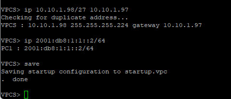{width=50%}

## Задание для самостоятельного выполнения

Присвоим IPv4 и IPv6-адресов оконечному устройству PC2 в соответствии с таблицей 

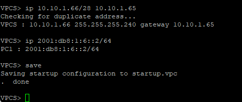{width=50%}

## Задание для самостоятельного выполнения

Настроим IPv4-адреса на интерфейсах маршрутизатора msk-antoychubekova-gw-01. 

{width=50%}

## Задание для самостоятельного выполнения

Настроим IPv4-адреса на интерфейсах маршрутизатора msk-antoychubekova-gw-02. 

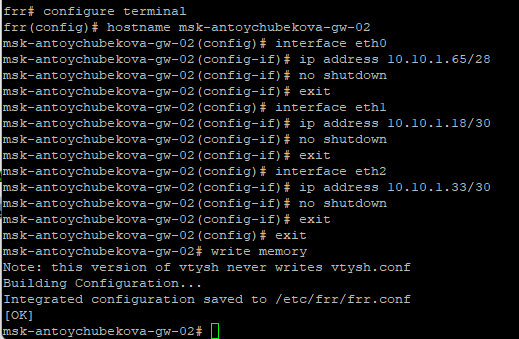{width=50%}

## Задание для самостоятельного выполнения

Настроим IPv4-адреса на интерфейсах маршрутизатора msk-antoychubekova-gw-03. 

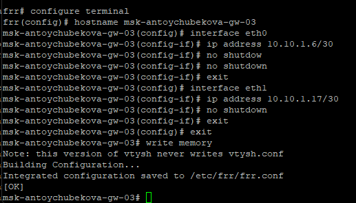{width=50%}

## Задание для самостоятельного выполнения

Настроим IPv4-адреса на интерфейсах маршрутизатора msk-antoychubekova-gw-04.

{width=50%}

## Задание для самостоятельного выполнения

Настроим IPv6-адреса на интерфейсах маршрутизатора msk-antoychubekova-gw-01. 

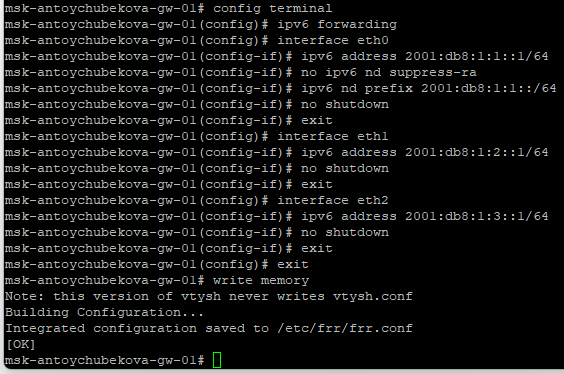{width=50%}

## Задание для самостоятельного выполнения

Настроим IPv6-адреса на интерфейсах маршрутизатора msk-antoychubekova-gw-02.

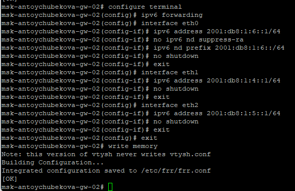{width=50%}

## Задание для самостоятельного выполнения

Настроим IPv6-адреса на интерфейсах маршрутизатора msk-antoychubekova-gw-03. 

{width=50%}

## Задание для самостоятельного выполнения

Настроим IPv6-адреса на интерфейсах маршрутизатора msk-antoychubekova-gw-04. 

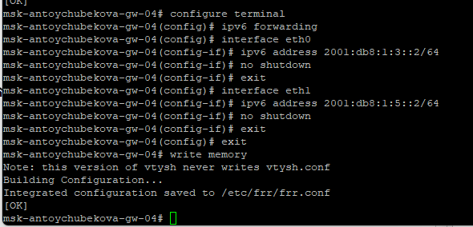{width=50%}

## Задание для самостоятельного выполнения

На маршрутизаторах настроим RIP для сетей IPv4.

msk-antoychubekova-gw-01.  

{width=50%}

## Задание для самостоятельного выполнения

msk-antoychubekova-gw-02.

{width=50%}

## Задание для самостоятельного выполнения

msk-antoychubekova-gw-03.  

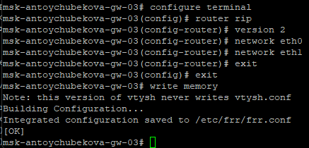{width=50%}

## Задание для самостоятельного выполнения

msk-antoychubekova-gw-04.  

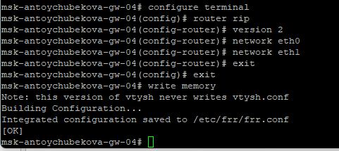{width=50%}

## Задание для самостоятельного выполнения

Убедимся, что маршрутизация по RIP настроена.   

{width=50%}

## Задание для самостоятельного выполнения

С PC1 пропингуем PC2. Пакет проходит через маршрутизатор msk-antoychubekova-gw-03.  

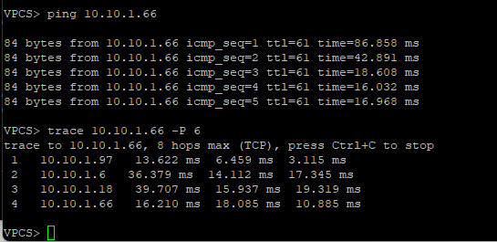{width=50%}

## Задание для самостоятельного выполнения

Отключим интерфейс msk-antoychubekova-gw-03.   

{width=50%}

## Задание для самостоятельного выполнения

Проверим метрики протокола RIP.  

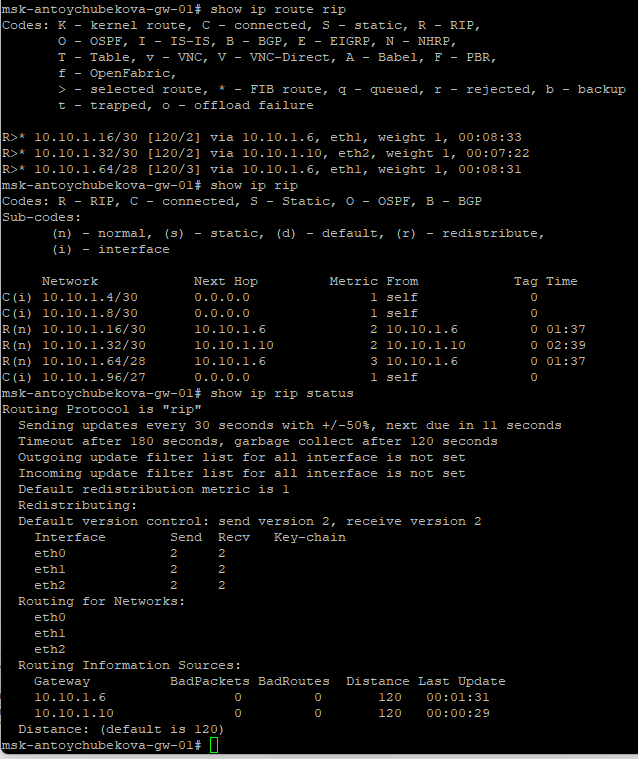{width=50%}

## Задание для самостоятельного выполнения

С PC1 пропинговали PC2. Теперь пакет проходит через маршрутизатор msk-antoychubekova-gw-04.  

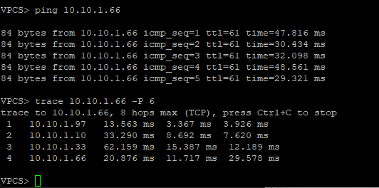{width=50%}

## Задание для самостоятельного выполнения

На маршрутизаторах настроим RIPng для сетей IPv6. 

msk-antoychubekova-gw-01.  

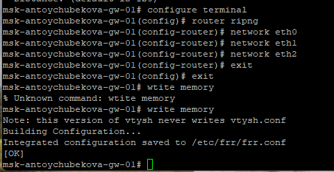{width=50%}

## Задание для самостоятельного выполнения

msk-antoychubekova-gw-02. 

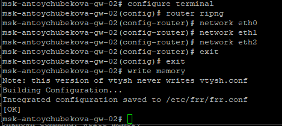{width=50%}

## Задание для самостоятельного выполнения

msk-antoychubekova-gw-03. 

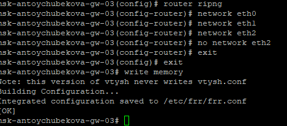{width=50%}

## Задание для самостоятельного выполнения

msk-antoychubekova-gw-04. 

{width=50%}

## Задание для самостоятельного выполнения

Проверим метрики протокола RIPng. 

{width=50%}

## Задание для самостоятельного выполнения

С PC1 пропинговали PC2. Пакет проходит через маршрутизатор msk-antoychubekova-gw-03.   

{width=50%}

## Задание для самостоятельного выполнения

Отключим интерфейс msk-antoychubekova-gw-03. 

{width=50%}

## Задание для самостоятельного выполнения

Проверим метрики протокола RIPng.  

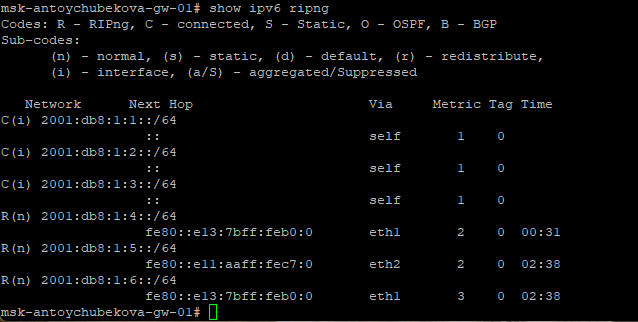{width=50%}

## Задание для самостоятельного выполнения

С PC1 пропингум PC2.Мы видим, что путь не восстановился.   

{width=50%}

## Задание для самостоятельного выполнения

На маршрутизаторах настроили OSPFv2 для сетей IPv4. 

msk-antoychubekova-gw-01. 

{width=50%}

## Задание для самостоятельного выполнения

msk-antoychubekova-gw-02.   

{width=50%}

## Задание для самостоятельного выполнения

msk-antoychubekova-gw-03. 

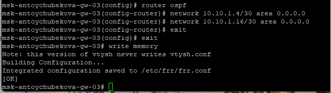{width=50%}

## Задание для самостоятельного выполнения

msk-antoychubekova-gw-04.   

{width=50%}

## Задание для самостоятельного выполнения

С PC1 пропингум PC2. Пакет проходит через маршрутизатор msk-antoychubekova-gw-04. 

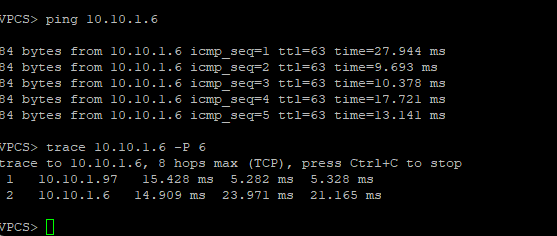{width=50%}

## Задание для самостоятельного выполнения

Проверим таблицу маршрутизации протокола OSPFv2.  

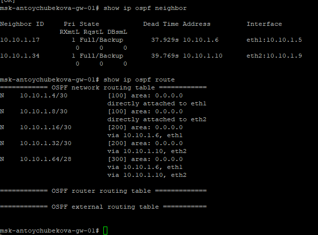{width=50%}

## Задание для самостоятельного выполнения

Отключим интерфейс на msk-antoychubekova-gw-04.   

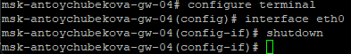{width=50%} 

## Задание для самостоятельного выполнения

Проверим таблицу маршрутизации протокола OSPFv2.   

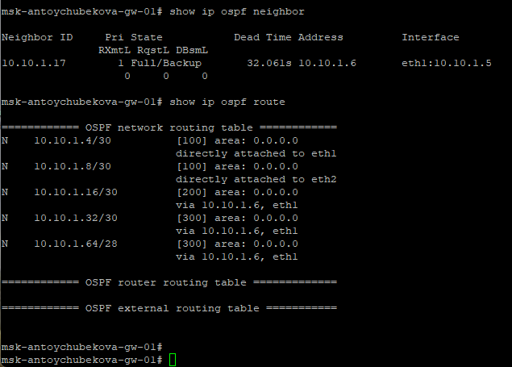{width=50%} 

## Задание для самостоятельного выполнения

С PC1 пропинговали PC2. Теперь пакет проходит через маршрутизатор msk-antoychubekova-gw-03.    

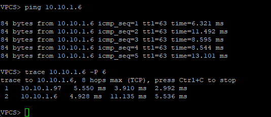{width=50%} 

## Задание для самостоятельного выполнения

На маршрутизаторах настроим OSPFv3 для сетей IPv6.

msk-antoychubekova-gw-01. 

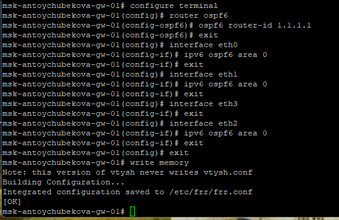{width=50%}

## Задание для самостоятельного выполнения

msk-antoychubekova-gw-02.

{width=50%}

## Задание для самостоятельного выполнения

msk-antoychubekova-gw-03. 

{width=50%}

## Задание для самостоятельного выполнения

msk-antoychubekova-gw-04.   

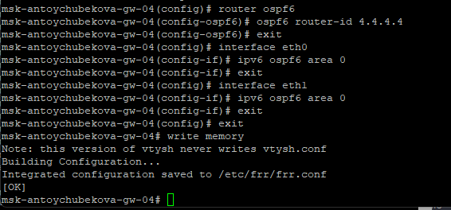{width=50%}

## Задание для самостоятельного выполнения

С PC1 пропингуем PC2. Пакет проходит через маршрутизатор msk-antoychubekova-gw-03. 

{width=50%}

## Задание для самостоятельного выполнения

Проверим таблицу маршрутизации протокола OSPFv3.  

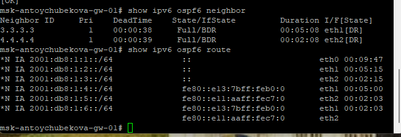{width=50%}

## Задание для самостоятельного выполнения

Отключим интерфейс msk-antoychubekova-gw-03. 

{width=50%}

## Задание для самостоятельного выполнения

Проверим таблицу маршрутизации протокола OSPFv3. 

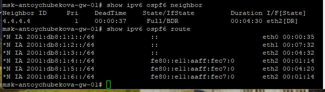{width=50%}

## Задание для самостоятельного выполнения

С PC1 пропингуем PC2. Теперь пакет проходит через маршрутизатор msk-antoychubekova-gw-04. 

{width=50%} 

# Выводы

## Выводы

В ходе выполнения лабораторной работы №8 я изучила принципов маршрутизации в IPv4- и IPv6-сетях и принципов настройки сетевого оборудования.

