---
## Author
author:
  name: Тойчубекова Асель Нурлановна
  degrees: DSc
  orcid: 0000-0002-0877-7063
  email: kulyabov-ds@rudn.ru
  affiliation:
    - name: Российский университет дружбы народов
      country: Российская Федерация
      postal-code: 117198
      city: Москва
      address: ул. Миклухо-Маклая, д. 6

## Title
title: "Сетевые технологии"
subtitle: "Лабораторная работа №8"
license: "CC BY"
---

# Цель работы

Целью данной лабораторной работы является изучение принципов маршрутизации в IPv4- и IPv6-сетях и принципов настройки сетевого оборудования.

# Задание

1. Требуется настроить динамическую маршрутизацию по протоколам RIP OSPF.

2. Требуется организовать туннель IPv6 поверх IPv4, позволяющий передавать данные из одной IPv6-сети в другую IPv6-сеть через сеть IPv4.

3. Выполнить задание для самостоятельного выполнения.

# Теоретическое введение

При организации сетей передачи данных важную роль играет корректное понимание функций и различий между устройствами DTE (Data Terminal Equipment) и DCE (Data Circuit-terminating Equipment), а также принципов синхронизации и правил планирования сетевой инфраструктуры.

Оконечное оборудование данных (DTE) представляет собой устройства, обеспечивающие интерфейс с пользователем и выполняющие прикладные программы. К ним относятся персональные компьютеры, терминалы, сетевые узлы, которые формируют и обрабатывают информационные потоки. Оконечное оборудование канала данных (DCE) служит для подключения DTE к каналам связи, обеспечивая преобразование, усиление и передачу сигналов. В современных сетях маршрутизаторы с последовательными интерфейсами могут выполнять функции как DTE, так и DCE, поэтому корректнее говорить о типе интерфейса, а не устройства.

Важным аспектом является организация сигнальных цепей. Для интерфейсов типа DTE передающий сигнал TxD является выходным, а принимающий RxD — входным; для DCE — наоборот. Это определяет особенности соединения устройств: при связке DTE–DCE сигналы соединяются напрямую, а при соединениях однотипных устройств — перекрёстно.

Режимы передачи могут быть асинхронными и синхронными. В асинхронном режиме синхронизация обеспечивается старт-битами, тогда как в синхронном используется внешняя синхронизация с отдельными сигналами для передачи и приёма данных (ST и RT). Источником синхронизации обычно выступает устройство DCE, однако возможны различные варианты организации синхросигналов, включая использование сигнала TT и компенсацию фазовых перекосов.

Наряду с вопросами интерфейсов и синхронизации ключевым этапом построения сетевой инфраструктуры является её планирование и документирование. Проектирование сети предполагает разработку схем трёх уровней модели OSI: физического (L1), канального (L2) и сетевого (L3). Необходимо определить топологию подключения, структуру VLAN, схему адресации и план назначения интерфейсов. Чёткое и детализированное документирование обеспечивает корректную эксплуатацию сети, упрощает администрирование и позволяет эффективно решать задачи модернизации и диагностики.

# Выполнение лабораторной работы

## Настройка динамической маршрутизации в сетях IPv4 и IPv6

У нас задана сеть ([рис. @fig-001]), адреса сегментов сети ([рис. @fig-002]), адреса, назначаемые интерфейсам устройств ([рис. @fig-003]). 

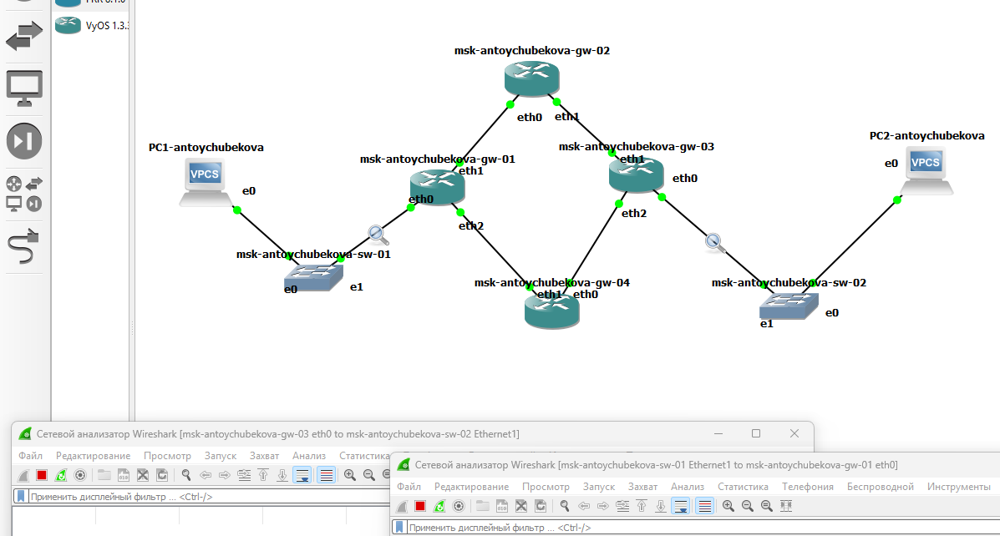{#fig-001 width=70%}

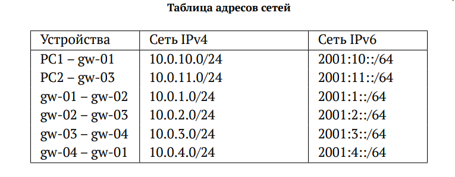{#fig-002 width=70%}

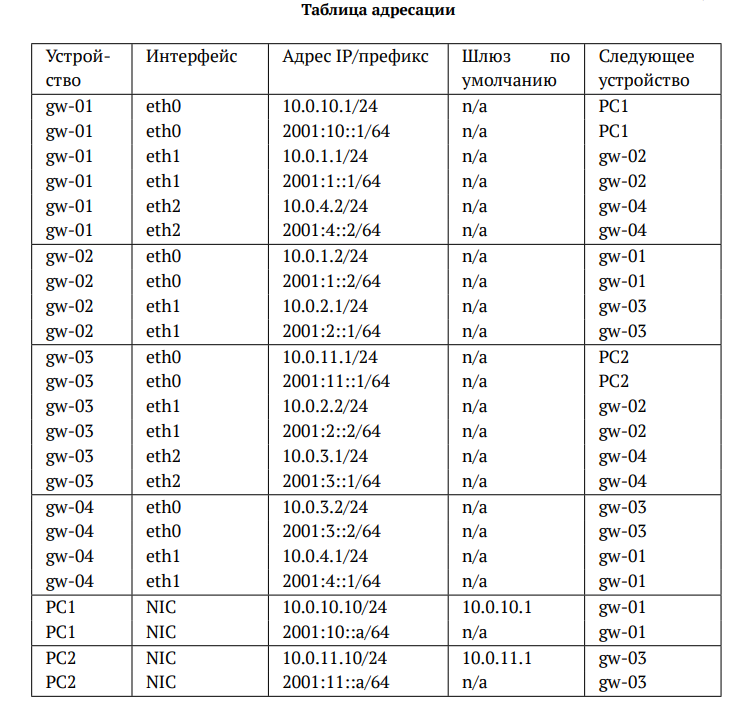{#fig-003 width=70%}

Изобразим схематично моделируемую сеть. Построим схемы L1 ([рис. @fig-004]) и L3 ([рис. @fig-005]). 

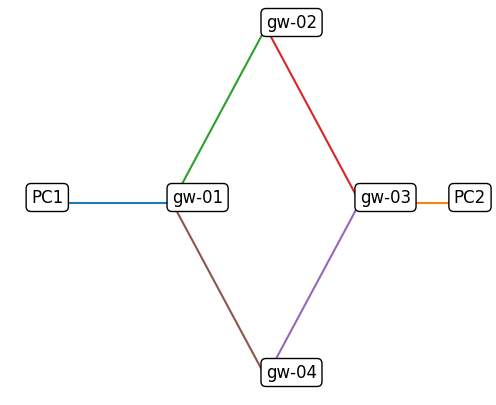{#fig-004 width=70%}

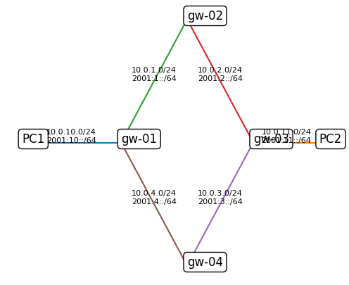{#fig-005 width=70%}

Запустим GNS3 VM и GNS3. Создадим новый проект. В рабочем пространстве разместим и соедините устройства в соответствии с топологией, указанной в лабораторной работе. Используем маршрутизаторы FRR. Измените отображаемые названия устройств.
Включим захват трафика на соединении между коммутатором sw-01 и маршрутизатором gw-01, а также между коммутатором sw-02 и маршрутизатором gw-03. ([рис. @fig-001]). 

Присвоим IPv4-адреса оконечным устройствам PC1 ([рис. @fig-006])  и PC2 ([рис. @fig-007]) в соответствии с данными в  ([рис. @fig-003]).  

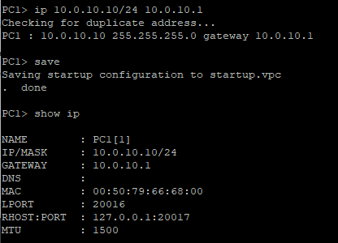{#fig-006 width=70%}

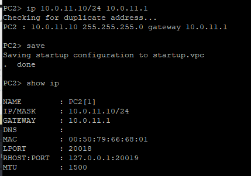{#fig-007 width=70%}

Настроим IPv4-адреса на интерфейсах маршрутизаторов. 

msk-antoychubekova-gw-01. ([рис. @fig-008]).  

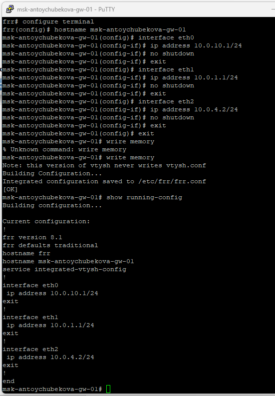{#fig-008 width=70%}

msk-antoychubekova-gw-02. ([рис. @fig-009]).  

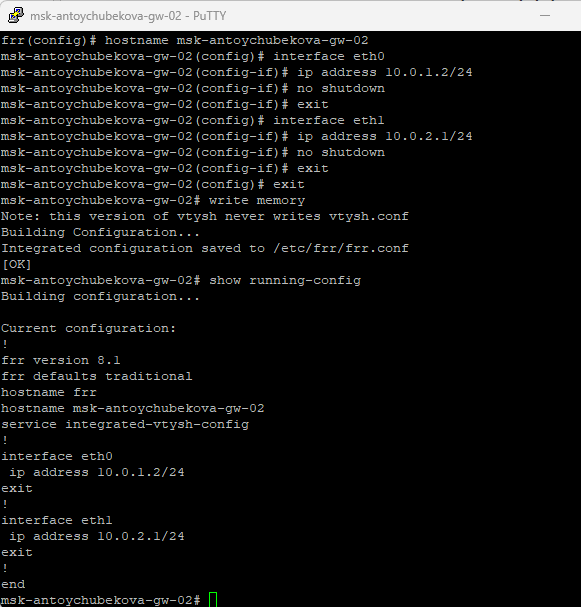{#fig-009 width=70%}

msk-antoychubekova-gw-03. ([рис. @fig-010]).  

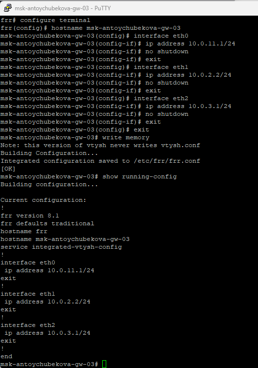{#fig-010 width=70%}

msk-antoychubekova-gw-04. ([рис. @fig-011]).  

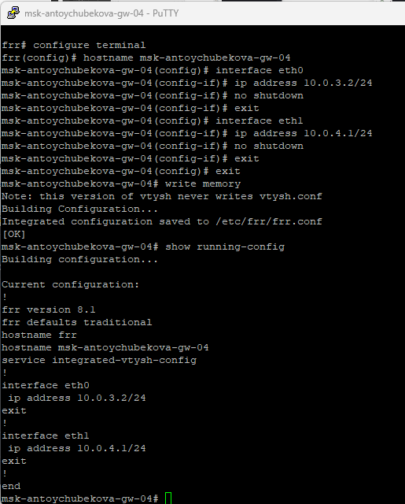{#fig-011 width=70%}

Присвоим IPv6-адреса оконечным устройствам PC1 ([рис. @fig-012]) и PC2 ([рис. @fig-013]) в соответствии с данными в ([рис. @fig-003]). 

{#fig-012 width=70%}

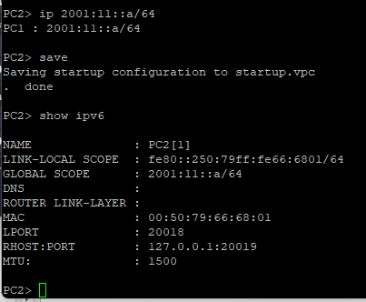{#fig-013 width=70%}

Настроим IPv6-адреса на интерфейсах маршрутизаторов. 

msk-antoychubekova-gw-01. ([рис. @fig-014]).  

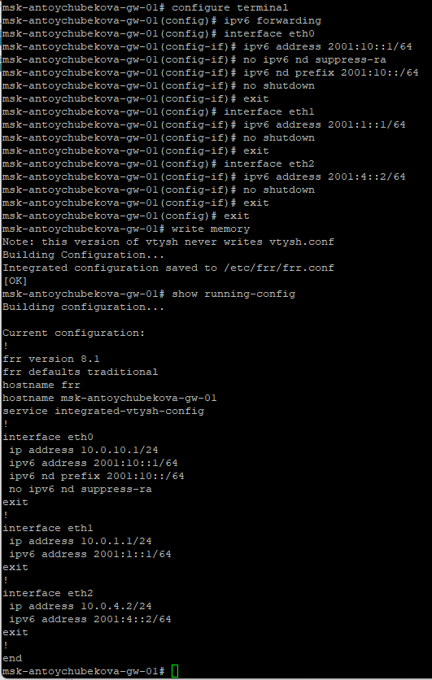{#fig-014 width=70%}

msk-antoychubekova-gw-02. ([рис. @fig-015]).  

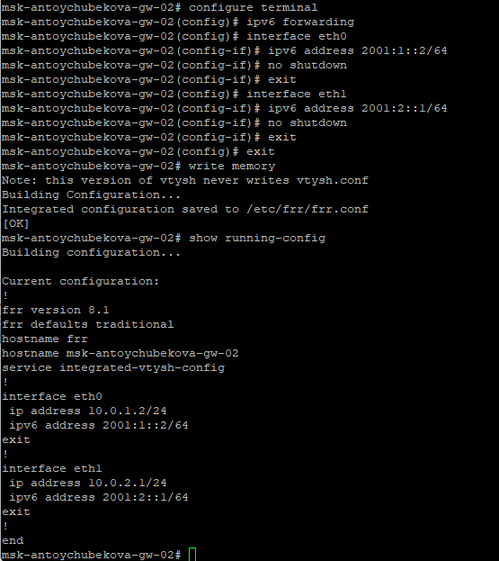{#fig-015 width=70%}

msk-antoychubekova-gw-03. ([рис. @fig-016]).  

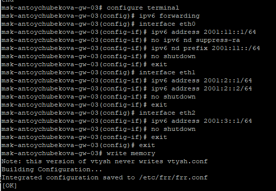{#fig-016 width=70%}

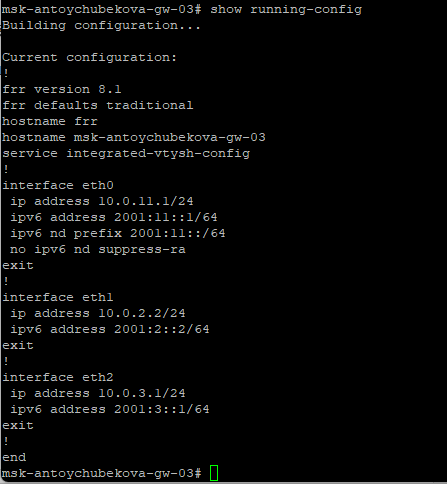{#fig-017 width=70%}

msk-antoychubekova-gw-04. ([рис. @fig-018]).  

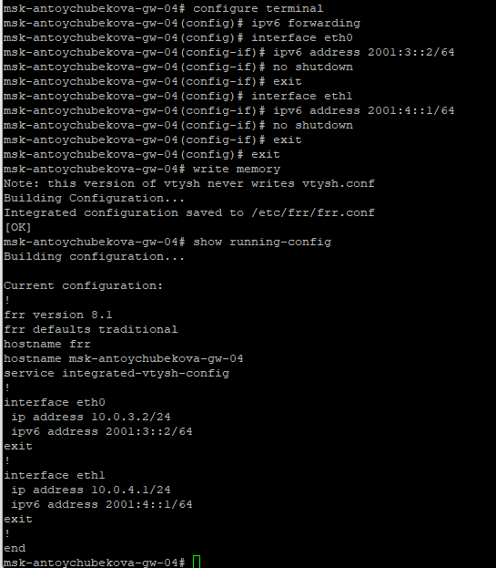{#fig-018 width=70%}

RIP — это дистанционно-векторный протокол динамической маршрутизации, который использует в качестве метрики количество переходов (hops). Максимальная длина маршрута — 15 переходов, при 16 маршрут считается недоступным. По умолчанию маршруты обновляются каждые 30 секунд; если обновления не поступают 180 секунд — маршрут становится неактивным, а через 240 секунд удаляется.

RIPv1 — поддерживает только IPv4, не передает маску сети (классовая маршрутизация).
RIPv2 — улучшенная версия для IPv4, использует многоадресную рассылку 224.0.0.9 и передает маску (CIDR).
RIPng — версия для IPv6, использует multicast-адрес FF02::9. Маршрутизация включается на уровне интерфейсов, каждый RIPng-процесс имеет локальное имя и может быть несколько процессов на одном маршрутизаторе.

На маршрутизаторах настроим RIP в качестве протокола динамической маршрутизации. 

msk-antoychubekova-gw-01. ([рис. @fig-019]).  

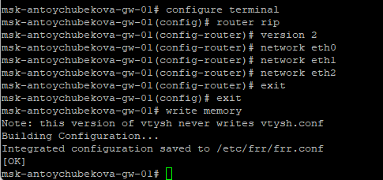{#fig-019 width=70%}

msk-antoychubekova-gw-02. ([рис. @fig-020]).  

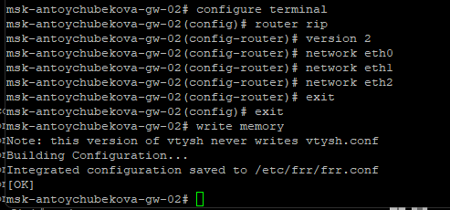{#fig-020 width=70%}

msk-antoychubekova-gw-03. ([рис. @fig-021]).  

{#fig-021 width=70%}

msk-antoychubekova-gw-04. ([рис. @fig-022]).  

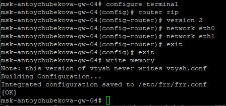{#fig-022 width=70%}

Убедимся, что маршрутизация по RIP настроена. 

msk-antoychubekova-gw-01. ([рис. @fig-023]).  

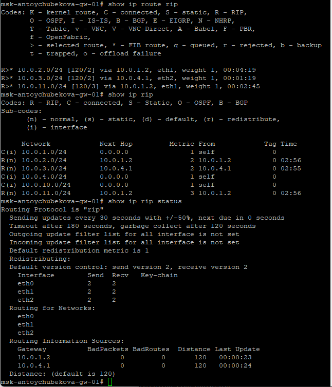{#fig-023 width=70%}

msk-antoychubekova-gw-02. ([рис. @fig-024]).  

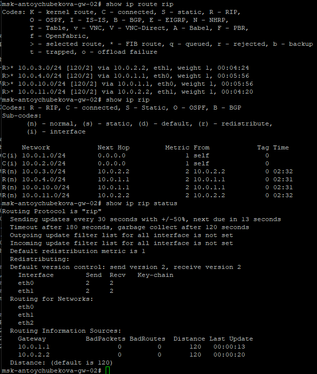{#fig-024 width=70%}

msk-antoychubekova-gw-03. ([рис. @fig-025]).  

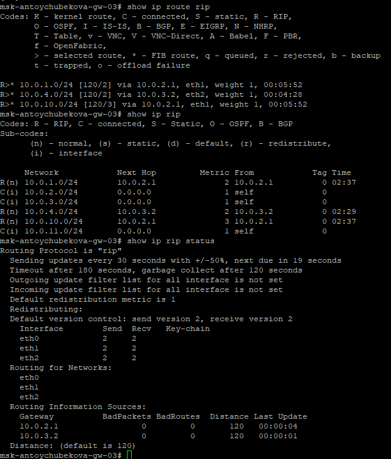{#fig-025 width=70%}

msk-antoychubekova-gw-04. ([рис. @fig-026]).  

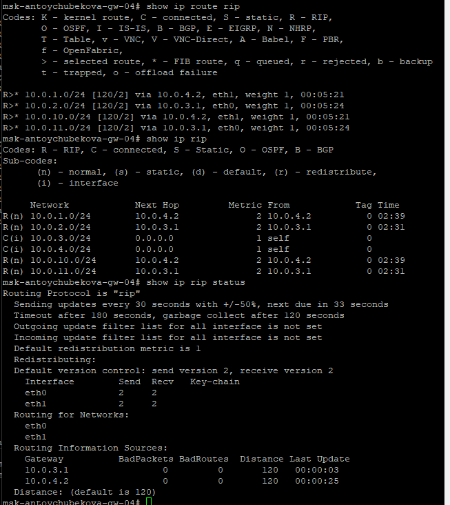{#fig-026 width=70%}

Проверим пути прохождения пакетов. С PC1 пропингуем PC2 и определим путь следования пакетов. Мы видим, что у нас все успешно пингуется. ([рис. @fig-027]).  

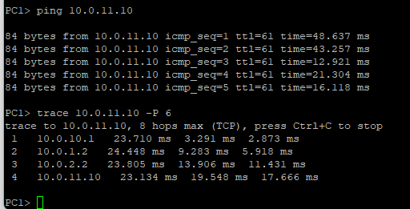{#fig-027 width=70%}

Проверим метрики протокола RIP. В таблице видны как подключённые сети (C), так и изученные по RIP (R) маршруты. Указаны сети 10.0.1.0/24, 10.0.4.0/24 и 10.0.10.0/24 как напрямую подключённые, метрика — 1. Сети 10.0.2.0/24, 10.0.3.0/24 и 10.0.11.0/24 получены по RIP от соседних маршрутизаторов через следующий хоп 10.0.1.2 с метрикой 2–3. В колонке Time показано время с последнего обновления. Это подтверждает, что динамическая маршрутизация RIP настроена корректно и маршрутизатор успешно обменивается маршрутами с соседями. ([рис. @fig-028]).  

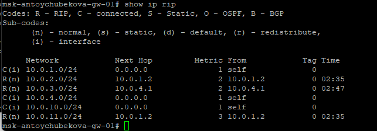{#fig-028 width=70%}

Предположим, что пакет проходит через маршрутизатор msk-antoychubekova-gw-02. Отключим на маршрутизаторе msk-antoychubekova-gw-02 интерфейс. ([рис. @fig-029]).  

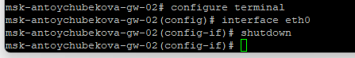{#fig-029 width=70%}

Проверим метрики протокола RIP. Мы видим, что в предыдущем выводе сети 10.0.2.0/24, 10.0.3.0/24 и 10.0.11.0/24 приходили на gw-01 через 10.0.1.2 (сосед gw-02). В новом выводе эти же маршруты теперь получаются через 10.0.4.1 (сосед gw-04). Метрики (2–3) при этом сохранились, обновилось только время получения маршрутов (таймеры). ([рис. @fig-030]).  

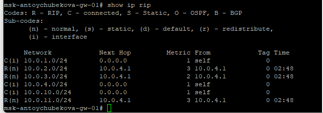{#fig-030 width=70%}

С PC1 пропингуйте PC2 и определим путь следования пакетов. Примерное время, за которое восстановится маршрут. ([рис. @fig-031]).  

{#fig-031 width=70%}

Включим на маршрутизаторе msk-antoychubekova-gw-02 интерфейс. ([рис. @fig-032]).  

{#fig-032 width=70%}

С PC1 пропингуйте PC2 и определим путь следования пакетов.([рис. @fig-033]).  

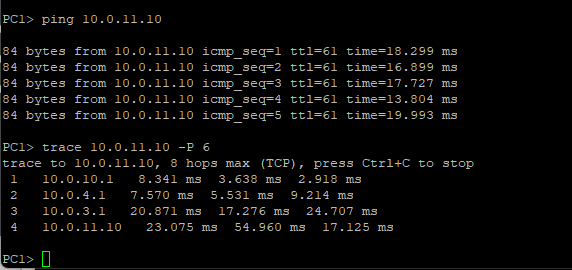{#fig-033 width=70%}

Просмотрим захваченный трафик. Сетевые адреса и топология: видны IP-адреса узлов (10.0.10.10, 10.0.11.10, 10.0.11.11, 10.0.1.1 и др.), MAC-адреса, что позволяет определить, какие устройства участвуют в обмене и как они связаны.

Протоколы в сети: фиксируются ARP, ICMP (ping), TCP, а также маршрутизационные и мультикаст-протоколы (RIPv2, IGMPv3, IPv6-служебные сообщения) — по ним видно, что сеть динамически обменивается маршрутами и есть мультикаст-группы (например, 224.0.0.9).

ARP-обмен: присутствуют запросы “кто имеет IP…”, gratuitous ARP — это позволяет понять, какие узлы объявляют свои адреса и кто кого пытается обнаружить в локальном сегменте.

ICMP-трафик: видно выполнение ping — запросы и ответы, а также сообщения “Time to live exceeded”, что указывает на прохождение пакетов через несколько узлов/маршрутизаторов и возможные проблемы с маршрутизацией.

TCP-соединения: фиксируются SYN, SYN-ACK, повторные передачи (Retransmission), “previous segment not captured” — можно увидеть попытки установления соединений, потери пакетов, задержки, повторные передачи.

Работа маршрутизации: регулярные ответы RIPv2 показывают распределение маршрутной информации в сети.

Общее состояние сети: по логам видно активность, наличие обмена маршрутами, диагностический трафик (ping), попытки установления TCP-соединений, то есть сеть функционирует, но местами наблюдаются задержки/повторные передачи. ([рис. @fig-034] и [рис. @fig-035] и [рис. @fig-036] и [рис. @fig-037] и [рис. @fig-038] и [рис. @fig-039] и [рис. @fig-040] и [рис. @fig-041] и [рис. @fig-042]).  

{#fig-034 width=70%}

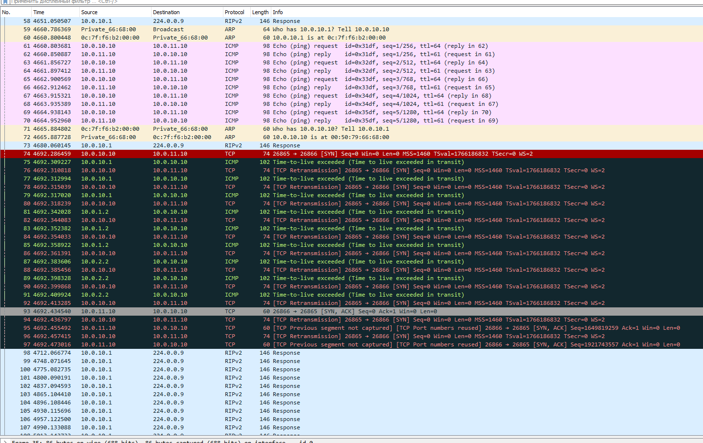{#fig-035 width=70%}

{#fig-036 width=70%}

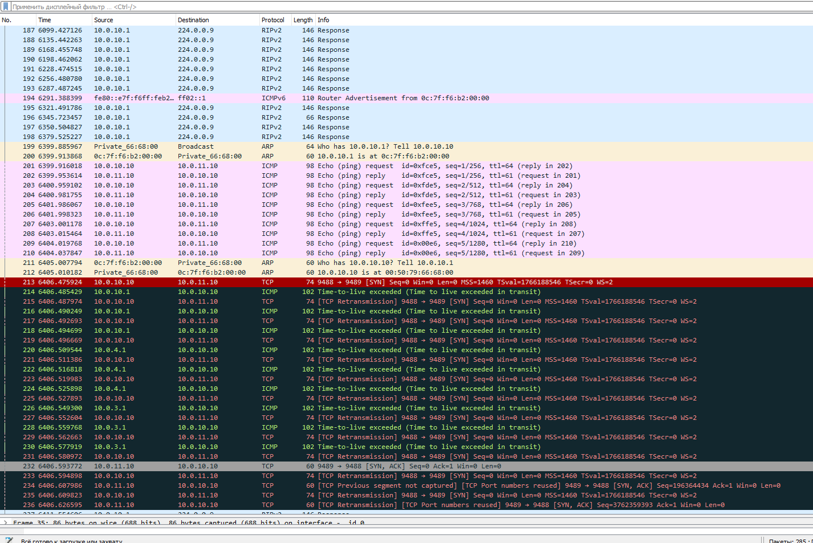{#fig-037 width=70%}

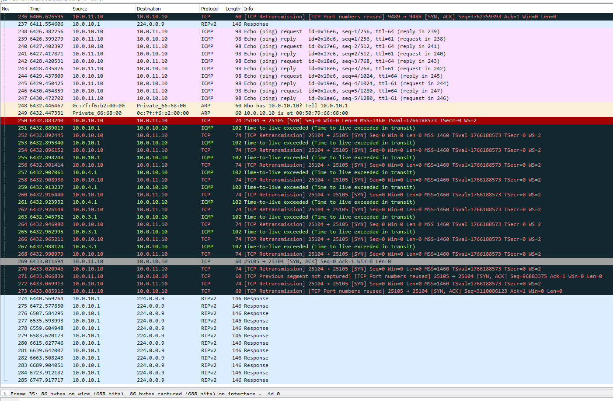{#fig-038 width=70%}

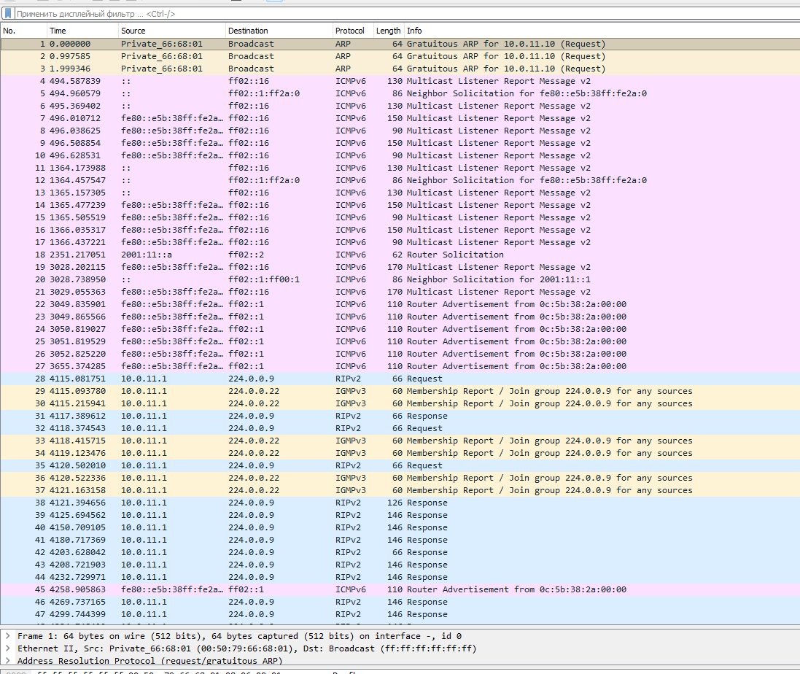{#fig-039 width=70%}

{#fig-040 width=70%}

{#fig-041 width=70%}

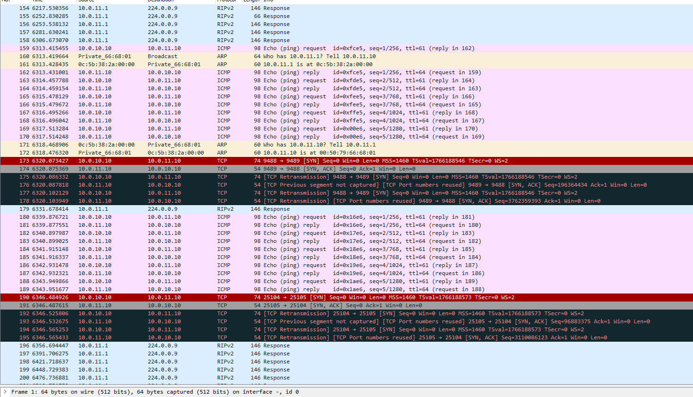{#fig-042 width=70%}

На маршрутизаторах настроим RIPng для сетей IPv6. 

msk-antoychubekova-gw-01. ([рис. @fig-043]).  

{#fig-043 width=70%}

msk-antoychubekova-gw-02. ([рис. @fig-044]).  

{#fig-044 width=70%}

msk-antoychubekova-gw-03. ([рис. @fig-045]).  

{#fig-045 width=70%}

msk-antoychubekova-gw-04. ([рис. @fig-046]).  

{#fig-046 width=70%}

Проверим пути прохождения пакетов. С PC1 пропингуем PC2 и определим путь следования пакетов. ([рис. @fig-047]).  

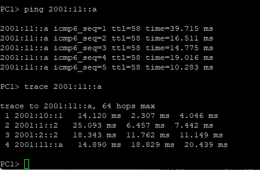{#fig-047 width=70%}

Проверим метрики протокола RIPng. Мы видим, что маршрутизатор имеет несколько подключённых (C) IPv6-сетей (2001:1::/64, 2001:4::/64, 2001:11::/64), а также обученные по RIPng (R) маршруты к удалённым подсетям (2001:2::/64, 2001:3::/64, 2001:6::/64, 2001:7::/64). Для удалённых сетей указаны следующие параметры:
— Next Hop — link-local адрес соседнего маршрутизатора;
— Via — интерфейс получения маршрута (eth1, eth2);
— Metric — стоимость маршрута;
— Time — время с момента последнего обновления.  ([рис. @fig-048]).  

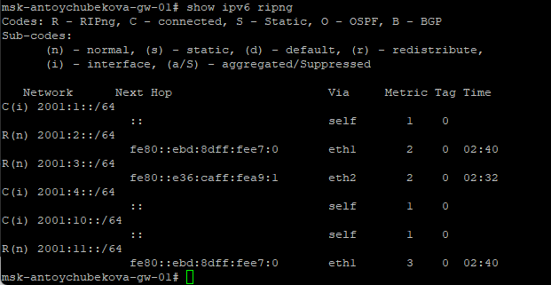{#fig-048 width=70%}

Предположим, что пакет проходит через маршрутизатор msk-antoychubekova-gw-02. Отключим на маршрутизаторе msk-antoychubekova-gw-02 интерфейс.  ([рис. @fig-049]).  

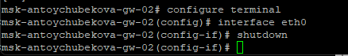{#fig-049 width=70%}

Проверим метрики протокола RIPng. Мы видим, что по сравнению с предыдущим выводом изменились маршруты, полученные по RIPng и их параметры:

Для сетей 2001:2::/64 и 2001:3::/64 теперь next-hop идёт через другой соседний маршрутизатор
fe80::e36:caff:fea9:1 и интерфейс eth2 (раньше был другой link-local или интерфейс).

Изменились метрики маршрутов (стали 2 и 3), что говорит о том, что путь до них теперь рассчитывается иначе (возможно, изменился топология/доступность соседей).

Время (Time) обновилось — маршруты продолжают регулярно приниматься. ([рис. @fig-050]).  

{#fig-050 width=70%}

С PC1 пропингуем PC2 и определим путь следования пакетов. Мы видим, что пакеты теперь идут по gw-04. Примерное время, за которое восстановливается маршрут равно 1 минуте.  ([рис. @fig-051]).  

{#fig-051 width=70%}

Просмотрим захваченный трафик. В захваченных трассах видно служебный и диагностический трафик сетей IPv4/IPv6. Передаются периодические обновления динамической маршрутизации RIPv2 (мультикаст 224.0.0.9, UDP 520) и RIPng (FF02::9, UDP 521), содержащие маршруты и метрики до сетей. Также фиксируются ICMPv6 Echo-request / Echo-reply (ping), сообщения Time Exceeded (превышение hop-limit, характерно при трассировке маршрута) и Destination/Port Unreachable (нет маршрута или сервис недоступен на узле). Видны Neighbor Solicitation/Advertisement и Router Advertisement, отражающие работу механизмов обнаружения соседей и автоконфигурации IPv6. Таким образом, по перехваченным пакетам можно определить используемые протоколы маршрутизации, структуру сети, наличие доступности/недоступности узлов и поведение устройств при передаче трафика.([рис. @fig-052] и [рис. @fig-053] и [рис. @fig-054] и [рис. @fig-055] и [рис. @fig-056] и [рис. @fig-057]). 

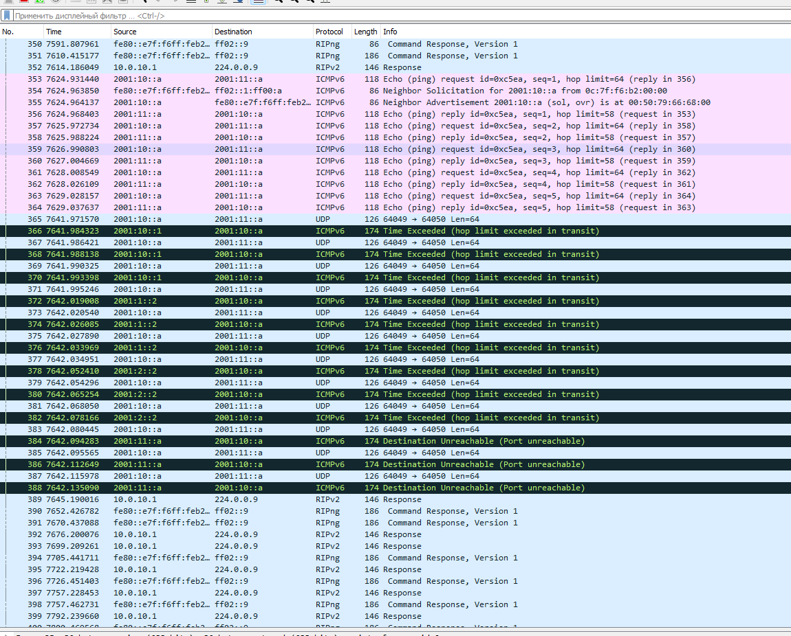{#fig-052 width=70%}

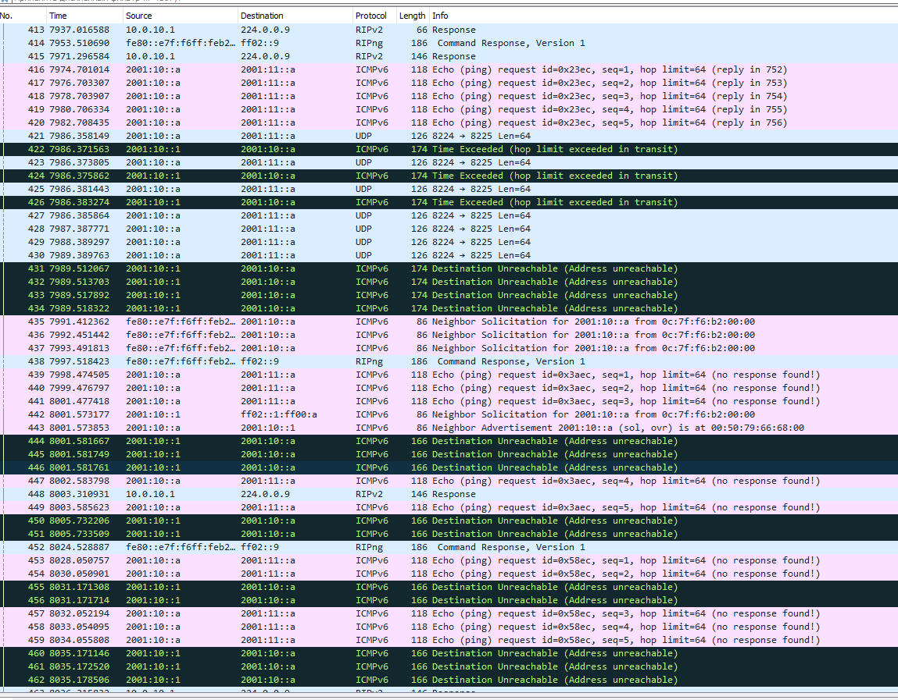{#fig-053 width=70%}

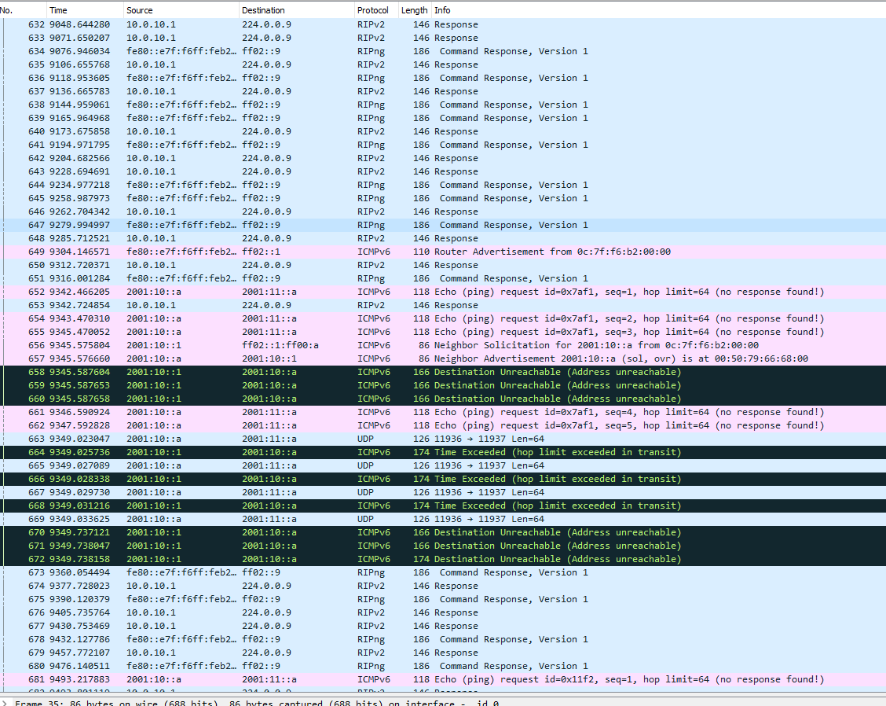{#fig-054 width=70%}

{#fig-055 width=70%}

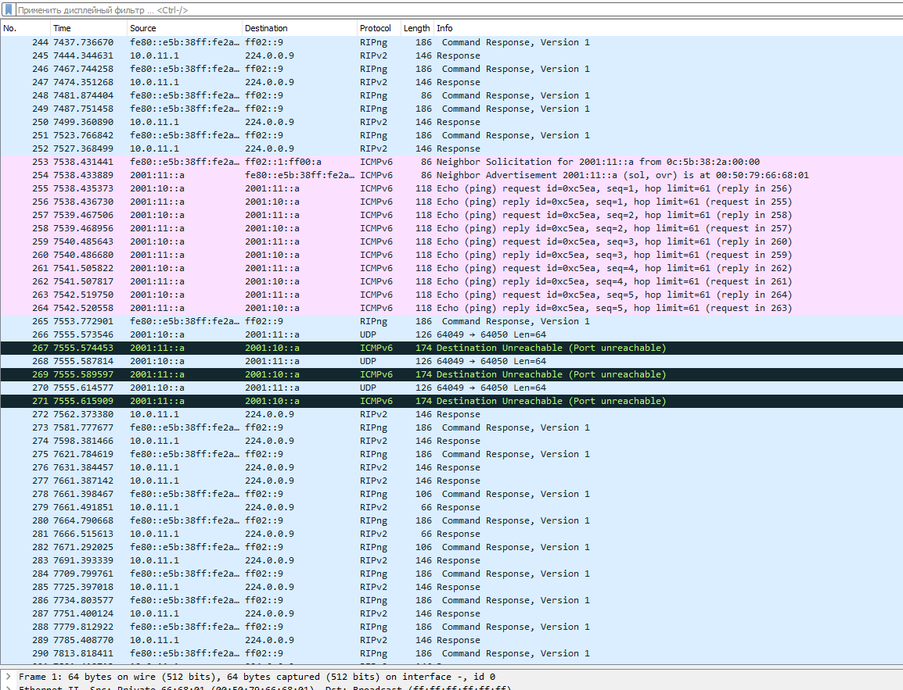{#fig-056 width=70%}

{#fig-057 width=70%}

OSPF — протокол динамической маршрутизации на основе состояния каналов. Поддерживает IPv4 (OSPFv2) и IPv6 (OSPFv3), работает на оборудовании разных производителей, поддерживает бесклассовую маршрутизацию, балансировку нагрузки и суммирование маршрутов. Метрика — стоимость, зависящая от скорости интерфейса, административное расстояние — 110.

Маршрутизаторы обмениваются Hello-пакетами (224.0.0.5 / FF02::5) для автоматического обнаружения соседей и формирования отношений соседства. OSPF использует три таблицы: соседей, топологии и маршрутизации. Передача обновлений ведётся по принципу SPF-алгоритма, который рассчитывает кратчайшие пути.

Сеть разделяется на области (area) для уменьшения таблиц и ускорения сходимости. Главная — область 0. Маршрутизаторы с несколькими областями — ABR, маршрутизаторы, соединяющие разные протоколы — ASBR. Для IPv6 используется OSPFv3, применяющий групповые адреса FF02::5 и FF02::6.

На маршрутизаторах настроим OSPFv2 для сетей IPv4. 

msk-antoychubekova-gw-01. ([рис. @fig-058]).  

{#fig-058 width=70%}

msk-antoychubekova-gw-02. ([рис. @fig-059]).  

{#fig-059 width=70%}

msk-antoychubekova-gw-03. ([рис. @fig-060]).  

{#fig-060 width=70%}

msk-antoychubekova-gw-04. ([рис. @fig-061]).  

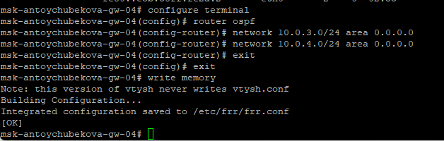{#fig-061 width=70%}

 C PC1 пропингуем PC2 и определим путь следования пакетов.  ([рис. @fig-062]).  

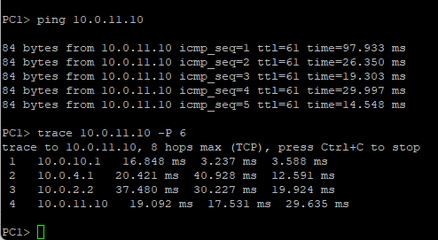{#fig-062 width=70%}

Проверим таблицу маршрутизации протокола OSPFv2. ([рис. @fig-063]).  

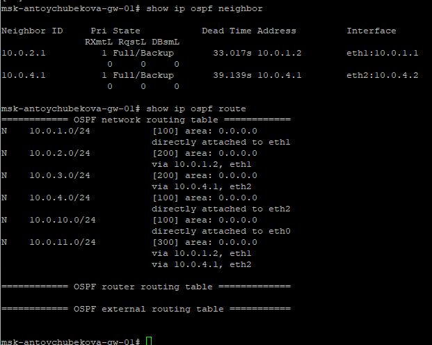{#fig-063 width=70%}

Предположим, что пакет проходит через маршрутизатор msk-antoychubekova-gw-02. Отключим на маршрутизаторе msk-antoychubekova-gw-02 интерфейс. ([рис. @fig-064]).  

{#fig-064 width=70%}

Проверим таблицу маршрутизации протокола OSPFv2. ([рис. @fig-065]).  

{#fig-065 width=70%}

С PC1 пропингуйте PC2 и определим путь следования пакетов. Примерное время, за которое восстановится маршрут равняется 1 минуте. ([рис. @fig-066]).  

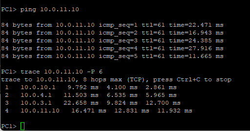{#fig-066 width=70%}

Включим на маршрутизаторе msk-antoychubekova-gw-02 интерфейс.  ([рис. @fig-067]).  

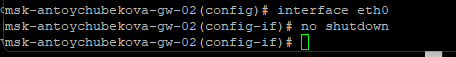{#fig-067 width=70%}

С PC1 пропингуйте PC2 и определим путь следования пакетов. ([рис. @fig-068]).  

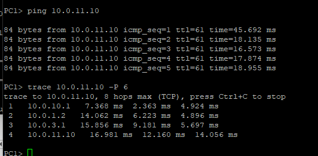{#fig-068 width=70%}

Просмотрим захваченный трафик. В ходе анализа перехваченного трафика видно, что в сети активно работают протоколы маршрутизации OSPF/RIPv2 и RIPng для IPv6 — фиксируются Hello-сообщения, обмен маршрутной информацией и поддержание соседства маршрутизаторов. Также присутствуют ICMP/ICMPv6-пакеты (Echo Request/Reply), по которым можно оценить доступность узлов, задержки, TTL и возможные ошибки (Time Exceeded, Destination Unreachable), что позволяет выявлять проблемы маршрутизации и прохождения пакетов. В захвате виден ARP/Neighbor Discovery — по ним определяется сопоставление IP-адресов с MAC-адресами. Наблюдаются TCP-соединения с флагами SYN/SYN-ACK и ретрансляциями — по ним можно судить об установлении соединений, потерях пакетов и стабильности канала.([рис. @fig-069] и [рис. @fig-070] и [рис. @fig-071] и [рис. @fig-072]).

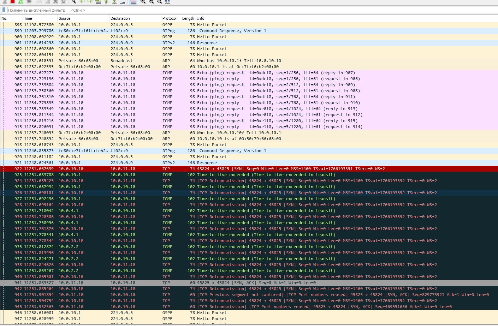{#fig-069 width=70%}

{#fig-070 width=70%}

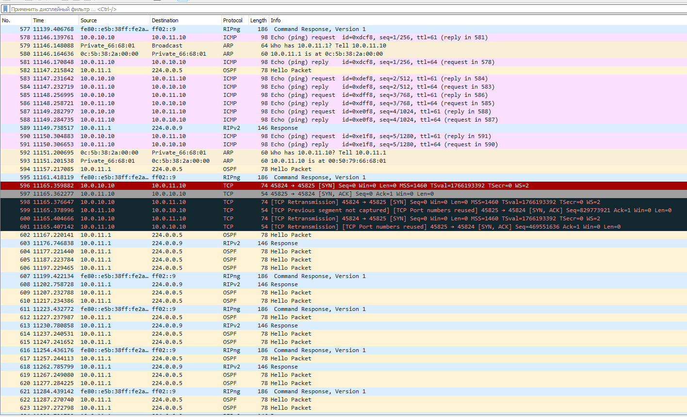{#fig-071 width=70%}

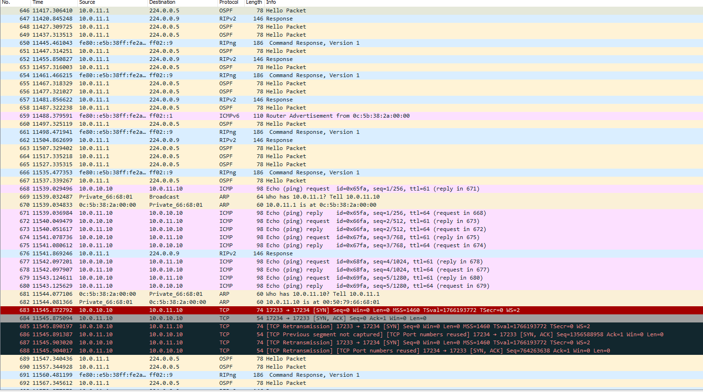{#fig-072 width=70%}

На маршрутизаторах настроим OSPFv3 для сетей IPv6.

msk-antoychubekova-gw-01. ([рис. @fig-073]).  

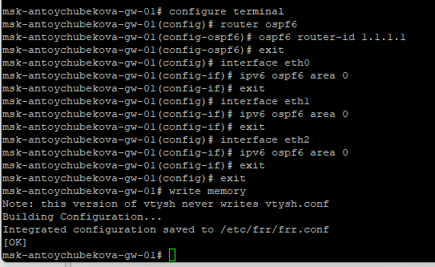{#fig-073 width=70%}

msk-antoychubekova-gw-02. ([рис. @fig-074]).  

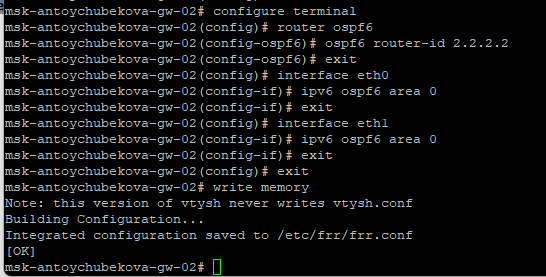{#fig-074 width=70%}

msk-antoychubekova-gw-03. ([рис. @fig-075]).  

{#fig-075 width=70%}

msk-antoychubekova-gw-04. ([рис. @fig-076]).  

{#fig-076 width=70%}

С PC1 пропингуем PC2 и определим путь следования пакетов. ([рис. @fig-077]).  

{#fig-077 width=70%}

Проверим таблицу маршрутизации протокола OSPFv3. ([рис. @fig-078]).  

{#fig-078 width=70%}

Предположим, что пакет проходит через маршрутизатор msk-antoychubekova-gw-02. Отключим на маршрутизаторе msk-antoychubekova-gw-02 интерфейс.  ([рис. @fig-079]).  

{#fig-079 width=70%}

Проверим таблицу маршрутизации протокола OSPFv3. ([рис. @fig-080]).  

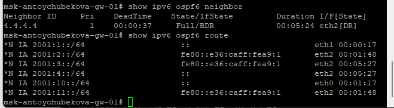{#fig-080 width=70%}

С PC1 пропингуем PC2 и определим путь следования пакетов. Примерное время, за которое восстановится маршрут равно минуте.  ([рис. @fig-081]).  

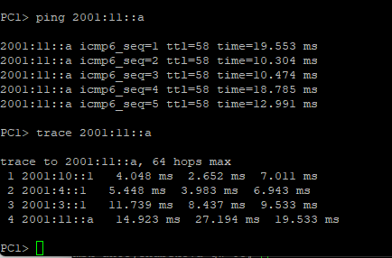{#fig-081 width=70%}

Включим на маршрутизаторе msk-antoychubekova-gw-02 интерфейс. ([рис. @fig-082]).  

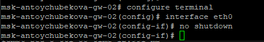{#fig-082 width=70%}

С PC1 пропингуем PC2 и определим путь следования пакетов. ([рис. @fig-083]).  

{#fig-083 width=70%}

Просмотрим захваченный трафик. 

Структура сети: видны IP-адреса источников и получателей, MAC-адреса устройств, наличие IPv4 и IPv6, что позволяет определить топологию и активные узлы.

Работа маршрутизации: присутствуют пакеты OSPF, RIP/RIPng — можно понять, какие маршрутизаторы обмениваются маршрутной информацией и что сети динамически маршрутизируются.

Диагностика связности: ICMP-эхо-запросы/ответы (ping), ICMP Time Exceeded — показывают проверку доступности, наличие ограничений TTL и возможные проблемы маршрутизации.

TCP-соединения: просматриваются SYN, SYN-ACK, Retransmission — можно увидеть установление соединений, задержки, повторные передачи, ошибки портов.

UDP-трафик: присутствуют пакеты UDP, включая ICMP Port Unreachable — можно выявить недоступные сервисы или неправильные назначения портов.

Сетевые сервисы: видно периодические Hello-пакеты протоколов — подтверждение стабильной работы сетевых протоколов.

Общее состояние сети: по таймингам, потерям и типам ICMP-сообщений оцениваются задержки, перегрузки или ошибки в пути передачи. ([рис. @fig-084] и [рис. @fig-085] и [рис. @fig-086] и [рис. @fig-087]).  

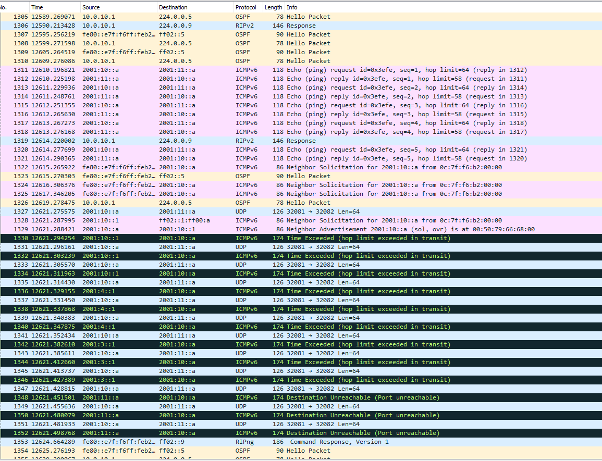{#fig-084 width=70%}

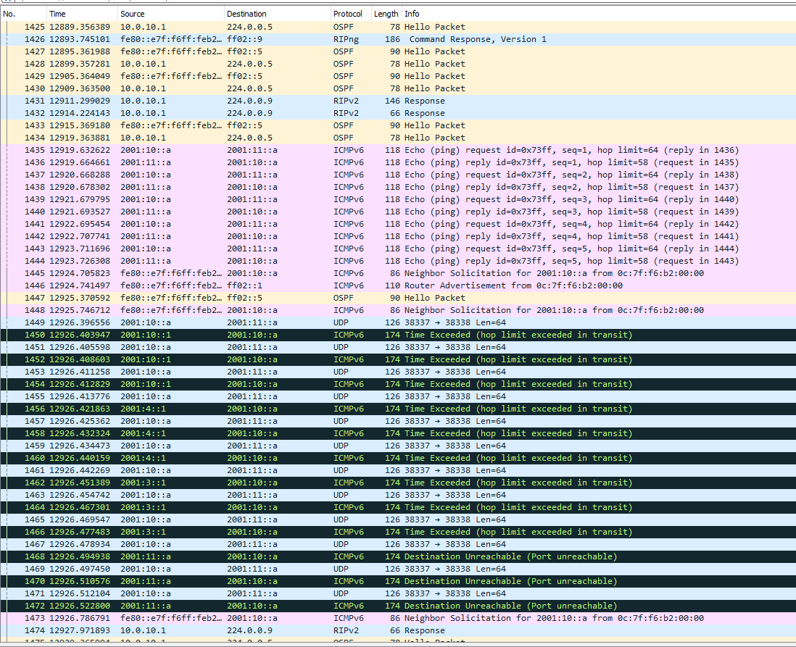{#fig-085 width=70%}

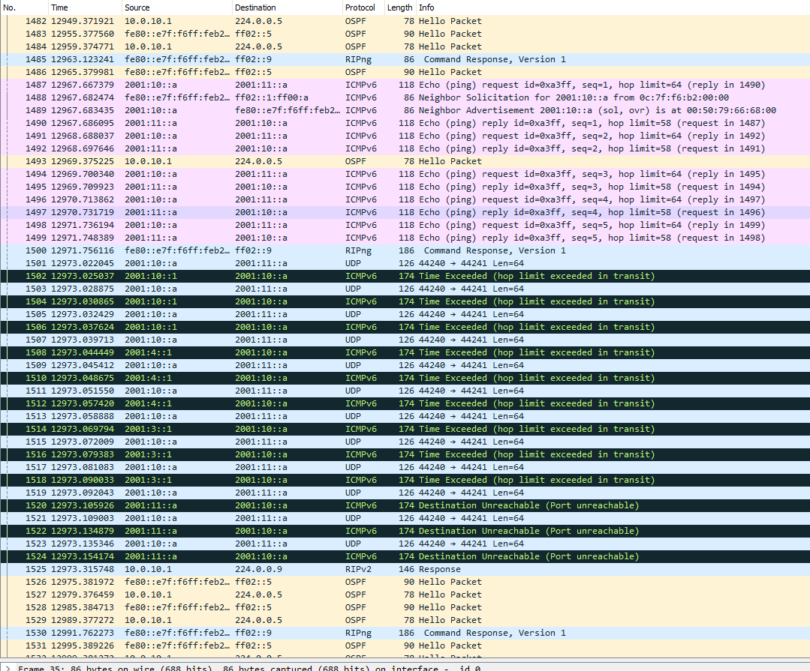{#fig-086 width=70%}

{#fig-087 width=70%}

## Построение туннеля IPv6–IPv4

Создадим новый проект в GNS3. В рабочем пространстве разместим и соединим устройства в соответствии с топологией, приведенной в лабораторной работе. Используем маршрутизаторы VyOS. Изменим отображаемые названия устройств. На соединении между первым и третьим маршрутизаторами подключим анализатор трафика. ([рис. @fig-088]).  

{#fig-088 width=70%}

Присвойте адреса оконечным устройствам PC1 и PC2 ([рис. @fig-089])в соответствии с данными в ([рис. @fig-091]).

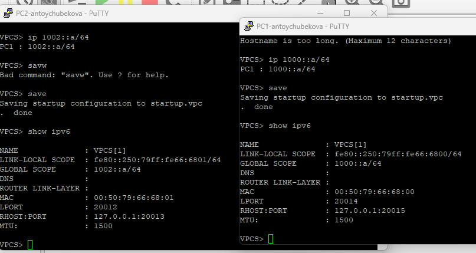{#fig-089 width=70%}

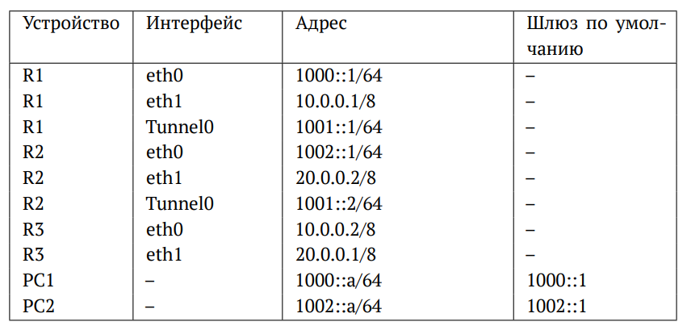{#fig-090 width=70%}

Установим систему на маршрутизаторы VyOS. На маршрутизаторах перейдем в режим конфигурирования, изменим имя каждого устройства. ([рис. @fig-091] и [рис. @fig-092] и [рис. @fig-093]).

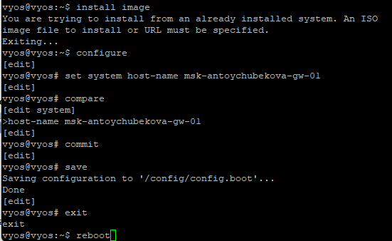{#fig-091 width=70%}

{#fig-092 width=70%}

{#fig-093 width=70%}

Настроим адреса на интерфейсах маршрутизаторов. 

msk-antoychubekova-gw-01. ([рис. @fig-094]).  

{#fig-094 width=70%}

msk-antoychubekova-gw-02. ([рис. @fig-095]).  

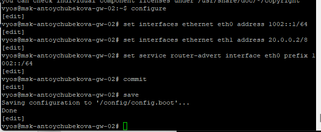{#fig-095 width=70%}

msk-antoychubekova-gw-03. ([рис. @fig-096]).  

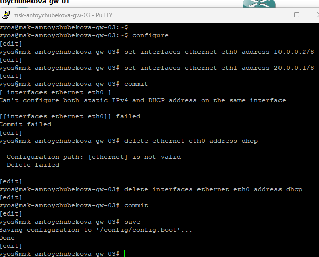{#fig-096 width=70%}

Убедимся, что на PC появились адреса ближайших к ним маршрутизаторов. ([рис. @fig-097]).  

{#fig-097 width=70%}

Проверим маршруты с маршрутизатора R1. Мы видим, что пингуется только первый адрес. ([рис. @fig-098]).  

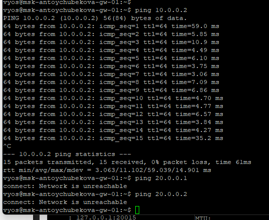{#fig-098 width=70%}

Просмотрим анализ трафика. Эхо запросы проходят только до 10.0.0.2 - адрес интерфейса eth0
маршутизатора gw-03, который находится в той же сети. Два остальных адреса не доступны, так как находятся в других подсетях. ([рис. @fig-99] и [рис. @fig-100]).  

{#fig-99 width=70%}

{#fig-100 width=70%}

Настроим маршрутизацию IPv4. 

msk-antoychubekova-gw-01. ([рис. @fig-101]).  

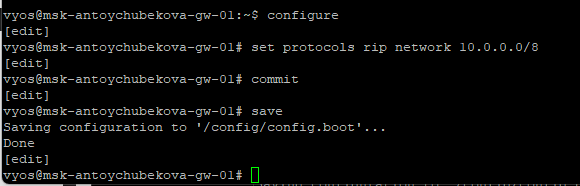{#fig-101 width=70%}

msk-antoychubekova-gw-02. ([рис. @fig-102]).  

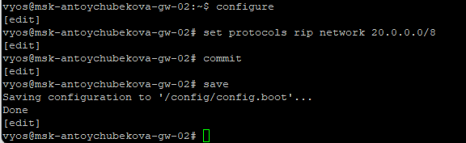{#fig-102 width=70%}

msk-antoychubekova-gw-03. ([рис. @fig-103]).  

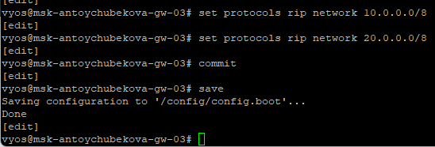{#fig-103 width=70%}

Проверим маршруты. Мы видим, что все адреса пингуются. ([рис. @fig-104]).  

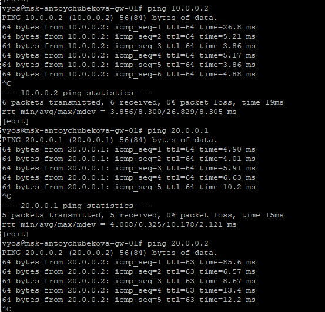{#fig-104 width=70%}

Просмотрим анализ трафика. После настройки динамическлой маршрутизации по протоколу RIP
эхо-запросы доставляются до всех адресов. ([рис. @fig-106] и [рис. @fig-106]).  

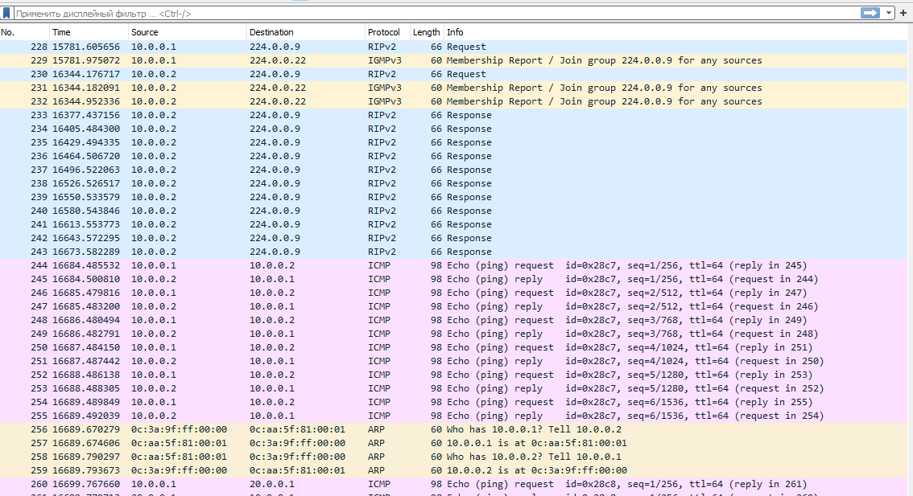{#fig-105 width=70%}

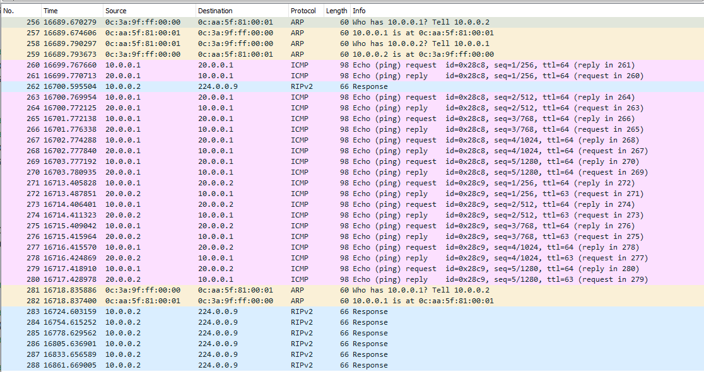{#fig-106 width=70%}

Создадим туннель IPv6 через сеть IPv4. 

msk-antoychubekova-gw-01. ([рис. @fig-107]).  

{#fig-107 width=70%}

msk-antoychubekova-gw-02. ([рис. @fig-108]).  

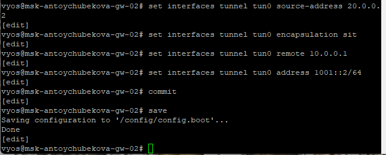{#fig-108 width=70%}

Настроим статическую маршрутизацию IPv6. 

msk-antoychubekova-gw-01. ([рис. @fig-109]).  

{#fig-109 width=70%}

msk-antoychubekova-gw-02. ([рис. @fig-110]).  

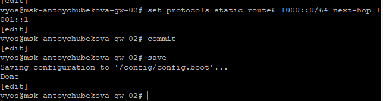{#fig-110 width=70%}

Проверим доступность оконечных устройств. Мы видим, что все корректно обрабатывается. ([рис. @fig-111] и [рис. @fig-112]).  

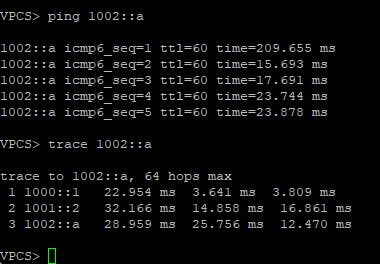{#fig-111 width=70%}

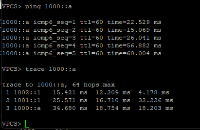{#fig-112 width=70%}

Просмотрим анализ трафика. В перехваченном трафике видно служебный обмен маршрутизационными сообщениями (RIPv2 для IPv4 и ICMPv6/OSPF-сообщения для IPv6), а также работу диагностики. Пакеты ICMP Echo (ping) показывают успешную проверку доступности узлов, а сообщения Time Exceeded и Destination Unreachable подтверждают прохождение пакетов по маршрутам и корректную обработку ошибок (превышение hop-limit, недостижимость порта). Также присутствуют ARP-запросы/ответы, по которым можно определить соответствие IP- и MAC-адресов узлов в сети. ([рис. @fig-113] и [рис. @fig-114]).  

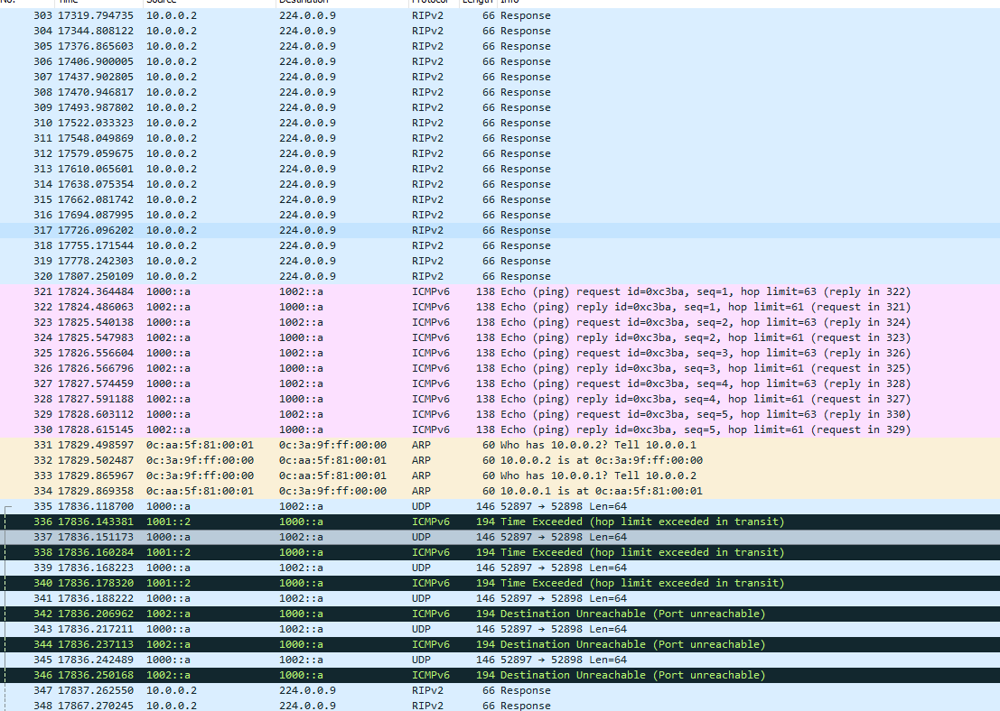{#fig-113 width=70%}

{#fig-114 width=70%}

Пакеты, проходящие по туннелю, имеют одновременно поля IPv4 и IPv6. ([рис. @fig-115] и [рис. @fig-116]).  

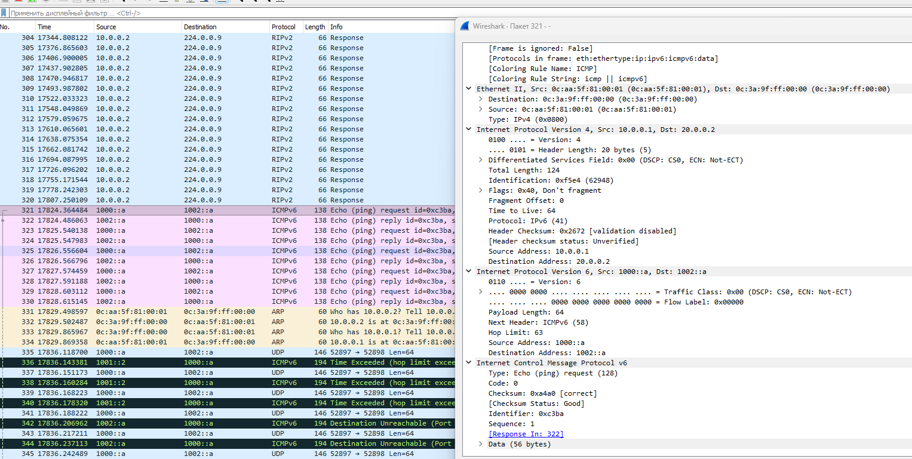{#fig-115 width=70%}

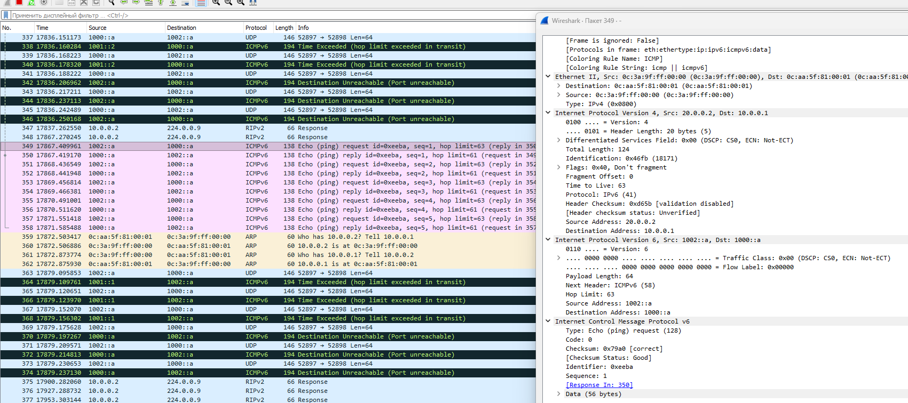{#fig-116 width=70%}

## Задание для самостоятельного выполнения

У нас задана топология сети ([рис. @fig-117]), адреса сегментов сети ([рис. @fig-118]), адреса, назначаемые интерфейсам устройств ([рис. @fig-119])

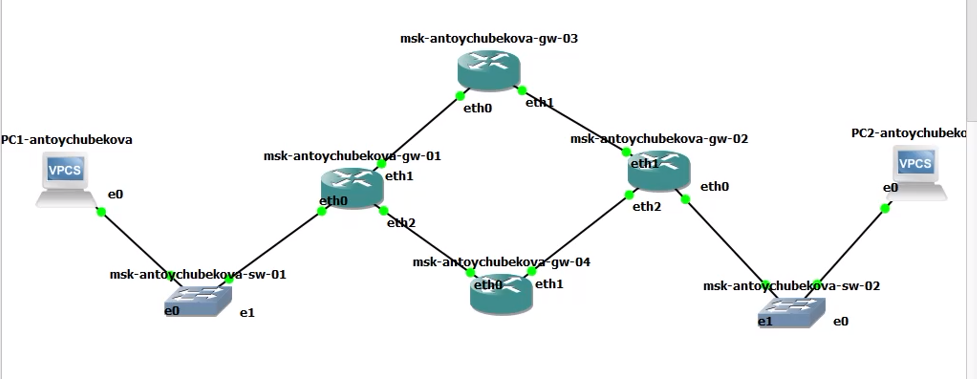{#fig-117 width=70%}

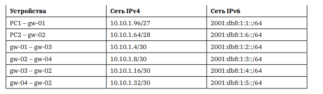{#fig-118 width=70%}

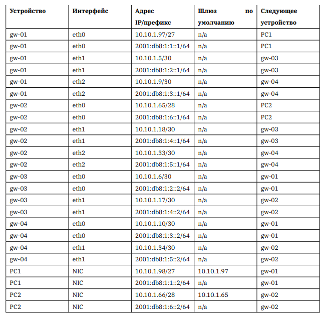{#fig-119 width=70%}

Присвоим IPv4 и IPv6-адресов оконечному устройству PC1 в соответствии с таблицей ([рис. @fig-120])

{#fig-120 width=70%}

Присвоим IPv4 и IPv6-адресов оконечному устройству PC2 в соответствии с таблицей ([рис. @fig-121])

{#fig-121 width=70%}

Настроим IPv4-адреса на интерфейсах маршрутизатора msk-antoychubekova-gw-01. ([рис. @fig-122])

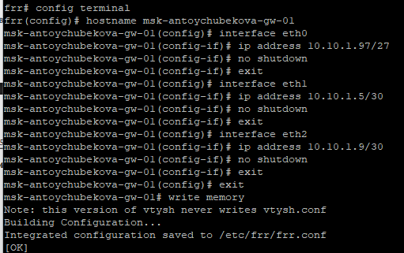{#fig-122 width=70%}

Настроим IPv4-адреса на интерфейсах маршрутизатора msk-antoychubekova-gw-02. ([рис. @fig-123])

{#fig-123 width=70%}

Настроим IPv4-адреса на интерфейсах маршрутизатора msk-antoychubekova-gw-03. ([рис. @fig-124])

{#fig-124 width=70%}

Настроим IPv4-адреса на интерфейсах маршрутизатора msk-antoychubekova-gw-04. ([рис. @fig-125])

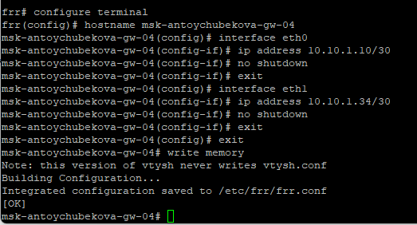{#fig-125 width=70%}

Настроим IPv6-адреса на интерфейсах маршрутизатора msk-antoychubekova-gw-01. ([рис. @fig-126])

{#fig-126 width=70%}

Настроим IPv6-адреса на интерфейсах маршрутизатора msk-antoychubekova-gw-02. ([рис. @fig-127])

{#fig-127 width=70%}

Настроим IPv6-адреса на интерфейсах маршрутизатора msk-antoychubekova-gw-03. ([рис. @fig-128])

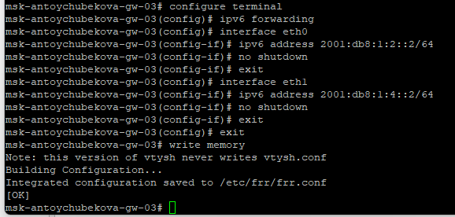{#fig-128 width=70%}

Настроим IPv6-адреса на интерфейсах маршрутизатора msk-antoychubekova-gw-04. ([рис. @fig-129])

{#fig-129 width=70%}

На маршрутизаторах настроим RIP для сетей IPv4.

msk-antoychubekova-gw-01. ([рис. @fig-130]).  

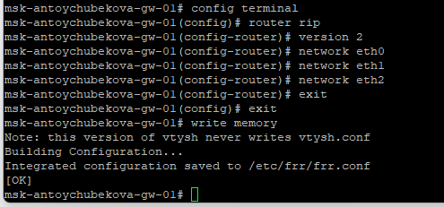{#fig-130 width=70%}

msk-antoychubekova-gw-02. ([рис. @fig-131]).  

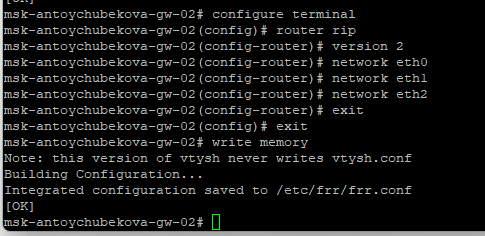{#fig-131 width=70%}

msk-antoychubekova-gw-03. ([рис. @fig-132]).  

{#fig-132 width=70%}

msk-antoychubekova-gw-04. ([рис. @fig-133]).  

{#fig-133 width=70%}

Убедимся, что маршрутизация по RIP настроена. ([рис. @fig-134]).  

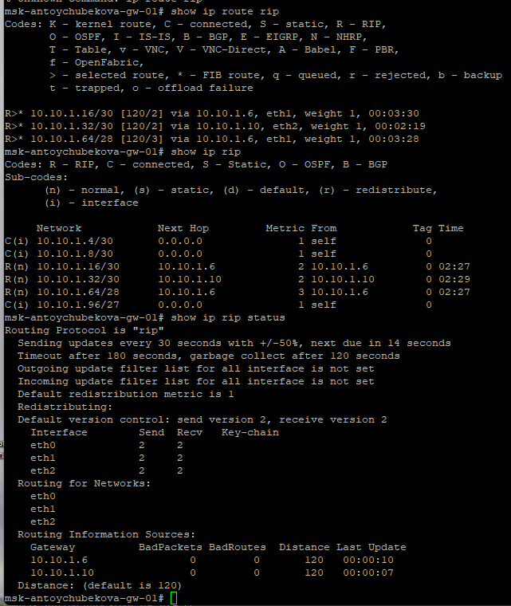{#fig-134 width=70%}

С PC1 пропингуем PC2. Пакет проходит через маршрутизатор msk-antoychubekova-gw-03. ([рис. @fig-135]).  

{#fig-135 width=70%}

Отключим интерфейс msk-antoychubekova-gw-03. ([рис. @fig-136]).  

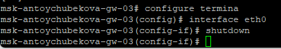{#fig-136 width=70%}

Проверим метрики протокола RIP. ([рис. @fig-137]).  

{#fig-137 width=70%}

С PC1 пропинговали PC2. Теперь пакет проходит через маршрутизатор msk-antoychubekova-gw-04. ([рис. @fig-138]).  

{#fig-138 width=70%}

На маршрутизаторах настроим RIPng для сетей IPv6. 

msk-antoychubekova-gw-01. ([рис. @fig-139]).  

{#fig-139 width=70%}

msk-antoychubekova-gw-02. ([рис. @fig-140]).  

{#fig-140 width=70%}

msk-antoychubekova-gw-03. ([рис. @fig-141]).  

{#fig-141 width=70%}

msk-antoychubekova-gw-04. ([рис. @fig-142]).  

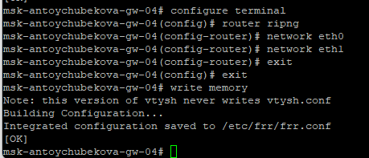{#fig-142 width=70%}

Проверим метрики протокола RIPng. ([рис. @fig-143]).  

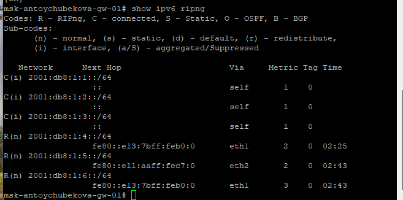{#fig-143 width=70%}

С PC1 пропинговали PC2. Пакет проходит через маршрутизатор msk-antoychubekova-gw-03. ([рис. @fig-144]).  

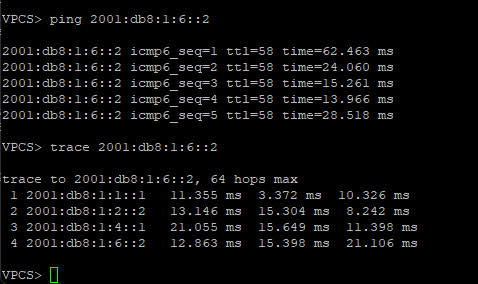{#fig-144 width=70%}

Отключим интерфейс msk-antoychubekova-gw-03. ([рис. @fig-145]).  

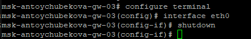{#fig-145 width=70%}

Проверим метрики протокола RIPng. ([рис. @fig-146]).  

{#fig-146 width=70%}

С PC1 пропингум PC2.Мы видим, что путь не восстановился. ([рис. @fig-147]).  

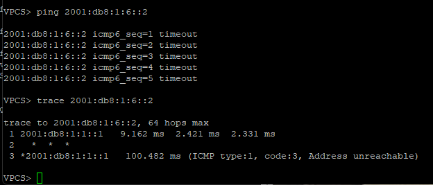{#fig-147 width=70%}

На маршрутизаторах настроили OSPFv2 для сетей IPv4. 

msk-antoychubekova-gw-01. ([рис. @fig-148]).  

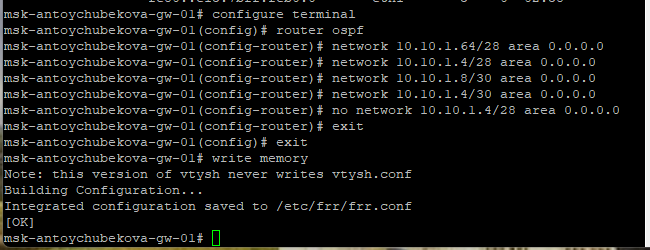{#fig-148 width=70%}

msk-antoychubekova-gw-02. ([рис. @fig-149]).  

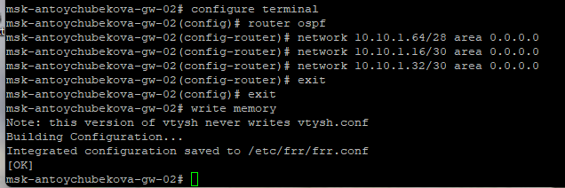{#fig-149 width=70%}

msk-antoychubekova-gw-03. ([рис. @fig-150]).  

{#fig-150 width=70%}

msk-antoychubekova-gw-04. ([рис. @fig-151]).  

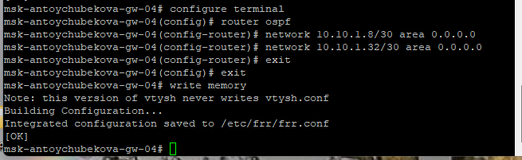{#fig-151 width=70%}

С PC1 пропингум PC2. Пакет проходит через маршрутизатор msk-antoychubekova-gw-04. ([рис. @fig-152]).  

{#fig-152 width=70%} 

Проверим таблицу маршрутизации протокола OSPFv2. ([рис. @fig-153]).  

{#fig-153 width=70%} 

Отключим интерфейс на msk-antoychubekova-gw-04. ([рис. @fig-154]).  

{#fig-154 width=70%} 

Проверим таблицу маршрутизации протокола OSPFv2. ([рис. @fig-155]).  

{#fig-155 width=70%} 

С PC1 пропинговали PC2. Теперь пакет проходит через маршрутизатор msk-antoychubekova-gw-03.  ([рис. @fig-156]).  

{#fig-156 width=70%} 

На маршрутизаторах настроим OSPFv3 для сетей IPv6.

msk-antoychubekova-gw-01. ([рис. @fig-157]).  

{#fig-157 width=70%}

msk-antoychubekova-gw-02. ([рис. @fig-158]).  

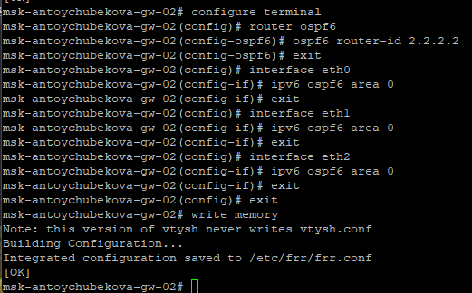{#fig-158 width=70%}

msk-antoychubekova-gw-03. ([рис. @fig-159]).  

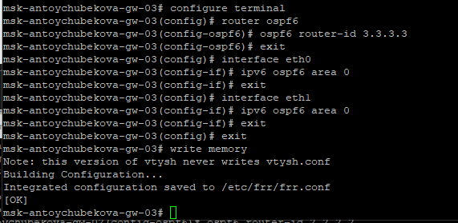{#fig-159 width=70%}

msk-antoychubekova-gw-04. ([рис. @fig-160]).  

{#fig-160 width=70%}

С PC1 пропингуем PC2. Пакет проходит через маршрутизатор msk-antoychubekova-gw-03. ([рис. @fig-161]).  

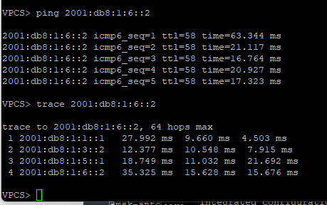{#fig-161 width=70%}

Проверим таблицу маршрутизации протокола OSPFv3. ([рис. @fig-162]).  

{#fig-162 width=70%}

Отключим интерфейс msk-antoychubekova-gw-03. ([рис. @fig-163]).  

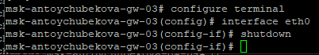{#fig-163 width=70%}

Проверим таблицу маршрутизации протокола OSPFv3. ([рис. @fig-164]).  

{#fig-164 width=70%}

С PC1 пропингуем PC2. Теперь пакет проходит через маршрутизатор msk-antoychubekova-gw-04.  ([рис. @fig-165]).  

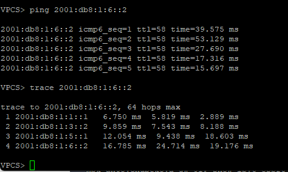{#fig-165 width=70%} 

# Выводы

В ходе выполнения лабораторной работы №8 я изучила принципов маршрутизации в IPv4- и IPv6-сетях и принципов настройки сетевого оборудования.

